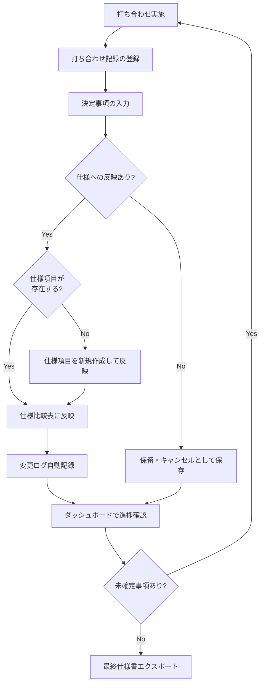
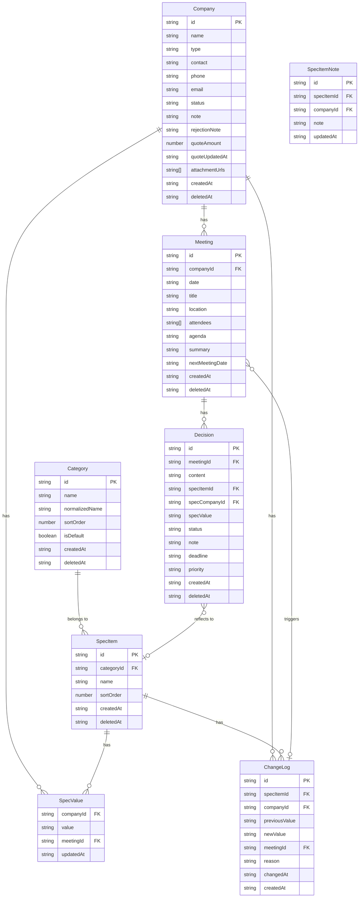
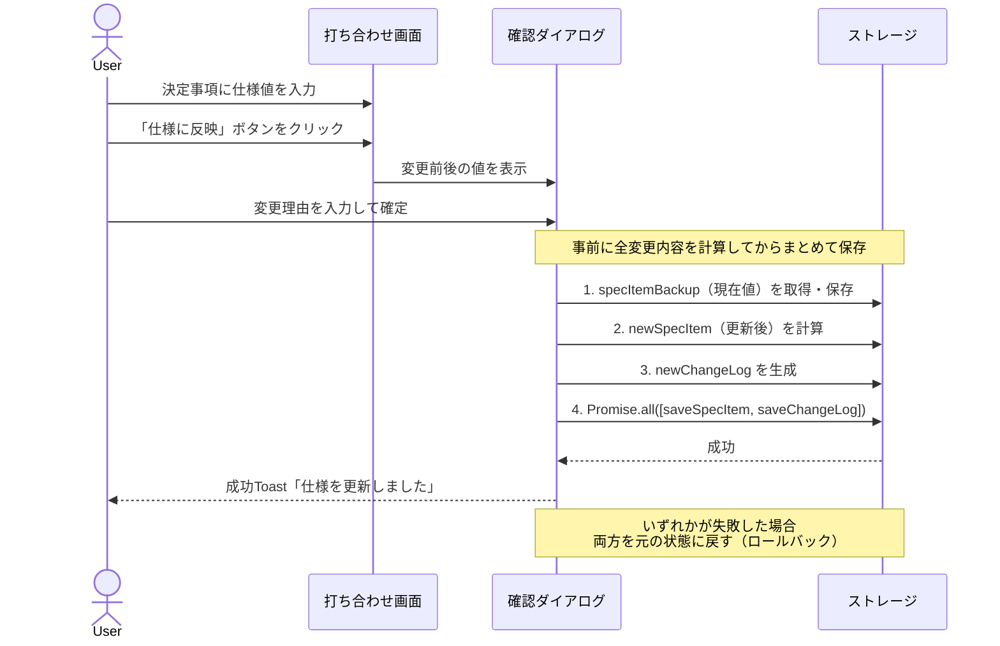
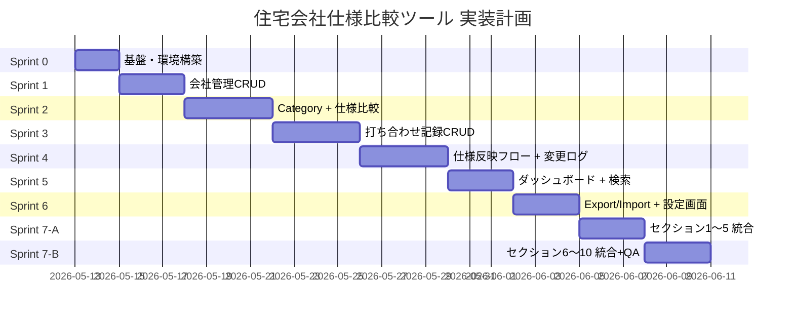

設計した後、Claude Codeへ実装依頼するため、設計資料はドキュメントにまとめてください。
Claude Codeへの指示用のClaude.mdの作成もお願いします。
実装に時間がかかることが予想されるため、フェーズを分けてSprint0から順に実装計画も立ててください。

# 住宅会社仕様比較ツール 完全設計仕様書 v3.0

以下の成果物を生成します：
1. **設計仕様書（v3.0）** — フィードバック反映済み完全版
2. **CLAUDE.md** — Claude Code実装指示書（更新版）

---

# 📄 設計仕様書 v3.0

## 目次

1. [プロジェクト概要](#1-プロジェクト概要)
2. [技術仕様](#2-技術仕様)
3. [データモデル](#3-データモデル)
4. [機能要件](#4-機能要件)
5. [非機能要件](#5-非機能要件)
6. [画面仕様](#6-画面仕様)
7. [エッジケース対応](#7-エッジケース対応)
8. [実装計画（Sprint）](#8-実装計画sprint)
9. [設計ドキュメント一覧](#9-設計ドキュメント一覧)

---

## 1. プロジェクト概要

### 1-1. 背景と課題

注文住宅の建築検討において、以下の課題が生じる。

| 課題 | 詳細 |
|------|------|
| 比較場所の欠如 | 複数社（ハウスメーカー・工務店）の仕様を並べて比較するための場所がない |
| 変更追跡の困難 | 打ち合わせのたびに仕様が変更され、初期決定内容が埋もれる |
| 経緯記録の欠如 | 「いつ・どの打ち合わせで・何を決めたか」の経緯が記録されない |
| 管理の分断 | 仕様書と打ち合わせメモが別管理となり整合性が取れなくなる |

### 1-2. スコープ定義

| 項目 | 方針 |
|------|------|
| 対象プロジェクト数 | 1アプリ＝1建築プロジェクト（複数プロジェクト管理はスコープ外） |
| Phase 1 MVP | 本仕様書が対象。打ち合わせ記録・仕様比較・変更ログの一体管理 |
| Phase 2（予約のみ） | 見積管理・添付ファイル・期限アラート（実装対象外・型定義のみ） |
| スコープ外 | マルチデバイスリアルタイム同期・複数ユーザー権限管理・断り連絡管理 |

### 1-3. 解決方針

打ち合わせ記録（議事録）と仕様比較を**一体型で統合管理**するブラウザアプリを構築する。打ち合わせで決まった事項を、そのまま仕様比較表に反映できる一貫したフローを提供する。

**分離型を採用しない理由：** 「仕様は打ち合わせから生まれる」という構造上、分離すると二重入力が発生し管理が崩れる。また、仕様の変更経緯を後から参照できないという問題が起きる。

### 1-4. システム全体フロー



---

## 2. 技術仕様

### 2-1. 技術スタック

| 項目 | 内容 |
|------|------|
| フレームワーク | React 18（JSX） |
| スタイリング | Tailwind CSS コアユーティリティクラス |
| アイコン | lucide-react |
| データ永続化 | `window.storage`（Artifact Storage API） |
| 動作環境 | Claude.ai Artifact（ブラウザ内） |
| ファイル構成 | 単一JSXファイル（app.jsx） |
| エクスポート | JSON ダウンロード／インポート対応、CSV エクスポート対応 |

### 2-2. ストレージ設計

```javascript
const STORAGE_KEYS = {
  META:        "meta",         // { schemaVersion, migratedAt, saveCount }
  COMPANIES:   "companies",    // Company[]
  CATEGORIES:  "categories",   // Category[]
  SPEC_ITEMS:  "spec_items",   // SpecItem[]
  MEETINGS:    "meetings",     // Meeting[]
  DECISIONS:   "decisions",    // Decision[]
  CHANGE_LOGS: "change_logs",  // ChangeLog[]
};
```

- セッションをまたいでデータを保持するため `window.storage` を使用
- `localStorage` / `sessionStorage` は使用禁止（Artifact環境で動作しない）
- `window.storage` が存在しない場合は `localStorage` にフォールバック
- フォールバックも失敗した場合は「書き込み不能モード」として動作（詳細は §5-4）

#### ストレージ容量管理

```javascript
const STORAGE_WARNING_BYTES  = 400_000;  // 400KB（警告閾値）
const STORAGE_BACKUP_SAVE_COUNT = 50;    // 50回保存ごとにバックアップ推奨通知

async function saveWithCapacityCheck(key, data) {
  const str = JSON.stringify(data);
  if (str.length > STORAGE_WARNING_BYTES) {
    showToast("warning",
      "データ量が多くなっています。JSONエクスポートでバックアップを推奨します。");
  }
  await storage.setItem(key, str);
  await incrementSaveCount(); // 保存回数カウンターをインクリメント
}

async function incrementSaveCount() {
  const meta = await loadMeta();
  const count = (meta.saveCount ?? 0) + 1;
  if (count % STORAGE_BACKUP_SAVE_COUNT === 0) {
    showToast("info",
      `${count}回保存しました。JSONエクスポートでバックアップをお勧めします。`);
  }
  await storage.setItem(STORAGE_KEYS.META, JSON.stringify({ ...meta, saveCount: count }));
}
```

> **window.storage 上限について：** Artifact Storage API の正確な上限容量は公式ドキュメントに明記されていないため、400KB を保守的な警告閾値として設定する。実運用での上限超過はエラーキャッチ（`QuotaExceededError`）で検知する。

#### Sprint 0 最優先：API動作確認

```javascript
async function verifyStorageAPI() {
  try {
    await window.storage.setItem("__test__", JSON.stringify({ ok: true }));
    const result = await window.storage.getItem("__test__");
    const parsed = JSON.parse(result);
    await window.storage.removeItem("__test__");
    if (parsed.ok) console.log("✅ window.storage API 正常動作確認");

    // 容量テスト（100KB書き込み）
    const dummy = "x".repeat(100_000);
    await window.storage.setItem("__capacity_test__", dummy);
    await window.storage.removeItem("__capacity_test__");
    console.log("✅ 100KB書き込み成功");

    return "window.storage";
  } catch (e) {
    console.warn("⚠️ window.storage 利用不可。localStorage にフォールバック:", e);
    try {
      localStorage.setItem("__fb_test__", "1");
      localStorage.removeItem("__fb_test__");
      return "localStorage";
    } catch (e2) {
      console.error("❌ localStorage も利用不可:", e2);
      return "none"; // 書き込み不能モード
    }
  }
}
```

### 2-3. 単一ファイル構成戦略

Sprint 0〜6 はセクション単位で独立生成し、Sprint 7-A / 7-B で統合する。

```javascript
// ===== 1. 型定義・定数 =====
// ===== 2. ストレージユーティリティ =====
// ===== 3. 共通UIコンポーネント =====
// ===== 4. 会社管理コンポーネント =====
// ===== 5. 仕様比較コンポーネント =====
// ===== 6. 打ち合わせコンポーネント =====
// ===== 7. 変更ログコンポーネント =====
// ===== 8. ダッシュボード =====
// ===== 9. 設定・Import/Export =====
// ===== 10. メインApp・ルーティング =====
```

**推定行数と対策：**

| 懸念事項 | 内容 | 対策 |
|---------|------|------|
| Artifact出力が途中で切断 | 全コード出力が1レスポンスで不可 | Sprint単位で別Artifactとして生成 → 最終Sprintで統合 |
| Sprint 7 の出力量超過 | 統合Sprintが1レスポンス内に収まらない可能性が高い | Sprint 7-A（セクション1〜5統合）/ Sprint 7-B（セクション6〜10統合＋テスト）に事前分割 |
| コンポーネントの見通し悪化 | 1ファイル1万行超になる可能性 | セクションコメントで論理ブロックを明示 |
| Sprint間での全体書き換え | 前Sprintのコードへの追記 | 「前のコードを引数に受け取り拡張する」形式で指示 |
| 1コンポーネント肥大化 | 可読性低下 | 1コンポーネント200行を超えないよう分割 |

---

## 3. データモデル

### 3-1. エンティティ関連図



### 3-2. 全型定義

```typescript
// 共通基底型
interface Entity {
  id: string;           // crypto.randomUUID()
  createdAt: string;    // new Date().toISOString()
  deletedAt?: string;   // 論理削除（undefinedは未削除）
}

// 会社
interface Company extends Entity {
  name: string;
  type: "maker" | "builder" | "other";
  contact: string;
  phone?: string;
  email?: string;
  status: "considering" | "candidate" | "rejected" | "contracted";
  note?: string;
  rejectionNote?: string;           // 断り連絡メモ
  // Phase2予約フィールド（実装対象外）
  quoteAmount?: number;             // 見積金額（円・税込）
  quoteUpdatedAt?: string;          // 見積更新日（ISO文字列）
  attachmentUrls?: string[];        // 外部URLリンク（図面等、バリデーション不要）
}

// カテゴリ（マスタ）
interface Category extends Entity {
  name: string;
  normalizedName: string;   // name.trim().toLowerCase()（重複チェック用）
  sortOrder: number;
  isDefault: boolean;       // テンプレート由来か
}

// 仕様項目
interface SpecItem extends Entity {
  categoryId: string;       // Category.id
  name: string;
  sortOrder: number;        // カテゴリ内の表示順（矢印ボタンで変更可能）
  values: SpecValue[];
}

// 仕様値（各社ごとの値）
interface SpecValue {
  companyId: string;
  value: string;
  meetingId?: string;
  updatedAt: string;        // ISO文字列
}

// 仕様項目メモ（各社・各項目ごとの評価メモ）
interface SpecItemNote extends Entity {
  specItemId: string;       // SpecItem.id
  companyId: string;        // Company.id
  note: string;             // 例: 「A社が優れている」「要確認」
  updatedAt: string;        // ISO文字列
}

// 打ち合わせ
interface Meeting extends Entity {
  companyId: string;
  date: string;             // YYYY-MM-DD
  title?: string;           // 省略時: `{date} {会社名}` で自動生成（例: "2026-05-13 A社"）
  location?: string;
  attendees: string[];      // カンマ区切り入力をパース後に配列格納
  agenda: string;
  summary?: string;
  // Phase2予約フィールド（実装対象外）
  nextMeetingDate?: string; // ISO文字列（Date型として扱う）
}

// 決定事項
interface Decision extends Entity {
  meetingId: string;
  content: string;
  specItemId?: string;
  specCompanyId?: string;
  specValue?: string;
  status: "confirmed" | "pending" | "cancelled";
  note?: string;
  // Phase2予約フィールド（実装対象外）
  deadline?: string;        // ISO文字列（Date型として扱う）
  priority?: "high" | "medium" | "low";
}

// 変更ログ（削除不可）
interface ChangeLog {
  id: string;
  specItemId: string;
  companyId: string;
  previousValue: string;
  newValue: string;
  meetingId?: string;
  reason?: string;
  changedAt: string;        // ISO文字列
  createdAt: string;        // ISO文字列
  // deletedAt は存在しない（削除・論理削除ともに不可）
}
```

> **Phase2予約フィールドについて：** `deadline`・`nextMeetingDate` は Date型（ISO文字列）として扱う。`quoteAmount` は円・税込固定。`attachmentUrls` はURLバリデーション不要。これらは型定義に含めるが実装しない。

> **SpecValue の設計注記：** Phase 1 MVP では `SpecItem.values` 配列として格納する。Phase 2 以降で会社数増加によるデータ肥大化が問題になる場合は、`SpecValue` を独立エンティティ（`STORAGE_KEYS.SPEC_VALUES`）に分離するリファクタリングを検討すること。

### 3-3. ステータス定数定義

```typescript
const COMPANY_STATUS = {
  CONSIDERING: "considering",
  CANDIDATE:   "candidate",
  REJECTED:    "rejected",
  CONTRACTED:  "contracted",
} as const;

const DECISION_STATUS = {
  CONFIRMED:  "confirmed",
  PENDING:    "pending",
  CANCELLED:  "cancelled",
} as const;

const COMPANY_TYPE = {
  MAKER:   "maker",
  BUILDER: "builder",
  OTHER:   "other",
} as const;

const COMPANY_STATUS_LABEL: Record<string, string> = {
  considering: "検討中",
  candidate:   "候補",
  rejected:    "落選",
  contracted:  "契約済",
};

const DECISION_STATUS_LABEL: Record<string, string> = {
  confirmed:  "確定",
  pending:    "保留",
  cancelled:  "キャンセル",
};

const PRIORITY_LABEL: Record<string, string> = {
  high:   "高",
  medium: "中",
  low:    "低",
};
```

### 3-4. 削除ポリシー

| 削除対象 | 関連データ | ポリシー | 理由 |
|---------|-----------|---------|------|
| Company | SpecValue, Meeting, Decision, ChangeLog | 論理削除（deletedAt） | 打ち合わせ記録・変更履歴は資産 |
| Category | SpecItem | 論理削除 | 仕様項目の文脈を保持 |
| SpecItem | SpecValue, ChangeLog | 論理削除 | 変更経緯を失わない |
| Meeting | Decision | 論理削除（Meetingに追従） | 決定事項の文脈を保持 |
| Decision | 単体 | 物理削除（確認ダイアログ必須） | 誤入力訂正を許容 |
| SpecItemNote | 単体 | 物理削除（確認ダイアログ必須） | メモは軽量データ |
| ChangeLog | — | **削除不可** | 改ざん防止（UIから削除操作を提供しない） |

論理削除レコードは通常表示から除外し、設定画面の「アーカイブ表示」から参照可能とする。削除済みデータへの参照が残る場合は「[削除済み]」ラベルを表示する（会社・仕様項目ともに適用）。

### 3-5. SpecItem 名称変更ルール

`SpecItem.name` の編集は許可する。変更した場合、既存の `ChangeLog` の `specItemId` は変更しない。変更ログ一覧では**現在の仕様項目名**で表示する（旧名称は保持しない設計）。

### 3-6. スキーママイグレーション

```javascript
const SCHEMA_VERSION = "1.0.0";

async function migrateV0toV1(data) {
  // V0 → V1: Category に normalizedName を追加、SpecItem に sortOrder を追加
  const categories = (data.categories ?? []).map(c => ({
    ...c,
    normalizedName: c.normalizedName ?? c.name.trim().toLowerCase(),
  }));
  const specItems = (data.spec_items ?? []).map((s, i) => ({
    ...s,
    sortOrder: s.sortOrder ?? i,
  }));
  return { ...data, categories, spec_items: specItems };
}

async function runMigrations() {
  const metaRaw = await storage.getItem(STORAGE_KEYS.META);
  const meta = metaRaw ? JSON.parse(metaRaw) : { schemaVersion: "0.0.0" };
  if (meta.schemaVersion === SCHEMA_VERSION) return;

  const migrations = {
    "0.0.0->1.0.0": migrateV0toV1,
  };

  await applyMigrations(meta.schemaVersion, SCHEMA_VERSION, migrations);

  await storage.setItem(STORAGE_KEYS.META, JSON.stringify({
    ...meta,
    schemaVersion: SCHEMA_VERSION,
    migratedAt: new Date().toISOString(),
  }));
}
```

---

## 4. 機能要件

### 4-1. バリデーションルール

```typescript
const VALIDATION = {
  Company: {
    name:    { required: true,  maxLength: 50 },
    contact: { required: true,  maxLength: 30 },
    phone:   { required: false, maxLength: 15,
               pattern: /^[\d\-\+\(\)\s]*$/ },
    email:   { required: false, maxLength: 100,
               pattern: /^[^\s@]+@[^\s@]+\.[^\s@]+$/ },
    note:    { required: false, maxLength: 500 },
  },
  Meeting: {
    date:      { required: true,  format: "YYYY-MM-DD" },
    agenda:    { required: true,  maxLength: 1000 },
    summary:   { required: false, maxLength: 2000 },
    attendees: { required: false, maxItems: 20, itemMaxLength: 30 },
    location:  { required: false, maxLength: 100 },
  },
  Decision: {
    content:   { required: true,  maxLength: 1000 },
    specValue: { required: false, maxLength: 200 },
    note:      { required: false, maxLength: 500 },
  },
  SpecItem: {
    name:  { required: true,  maxLength: 50 },
    value: { required: false, maxLength: 200 }, // セル崩れ防止
  },
  Category: {
    name: { required: true, maxLength: 30,
            unique: true,
            normalize: "trim + toLowerCase + 重複チェック" },
  },
  SpecItemNote: {
    note: { required: true, maxLength: 200 },
  },
};
```

**エラー表示ルール：**
- フィールド直下にインラインエラー（赤文字）
- フォーム送信時に未入力必須項目をすべてハイライト
- 文字数制限はリアルタイムカウンター（残り〇文字）
- エラーメッセージは `aria-live="polite"` でスクリーンリーダーに通知

### 4-2. 仕様項目の並び替え

`SpecItem.sortOrder` フィールドで表示順を管理する。UIは矢印ボタン（▲上へ / ▼下へ）で順序変更を行う。ドラッグ＆ドロップは Phase 2 以降で検討する。

```typescript
// sortOrder 更新ロジック
function moveSpecItem(items: SpecItem[], id: string, direction: "up" | "down"): SpecItem[] {
  const idx = items.findIndex(i => i.id === id);
  if (idx === -1) return items;
  const swapIdx = direction === "up" ? idx - 1 : idx + 1;
  if (swapIdx < 0 || swapIdx >= items.length) return items;
  const result = [...items];
  [result[idx].sortOrder, result[swapIdx].sortOrder] =
    [result[swapIdx].sortOrder, result[idx].sortOrder];
  return result.sort((a, b) => a.sortOrder - b.sortOrder);
}
```

### 4-3. 仕様項目メモ（A社が優れている等の評価メモ）

仕様比較テーブルの各セルに評価メモ（`SpecItemNote`）を付与できる。

| 項目 | 仕様 |
|------|------|
| 格納先 | `STORAGE_KEYS.SPEC_ITEM_NOTES`（`spec_item_notes`） |
| 表示 | セル右下に 📝 アイコン。クリックでメモ表示／編集ポップオーバー |
| 文字数上限 | 200文字 |
| 削除 | 物理削除（確認ダイアログ必須） |

> **追加ストレージキー：** `STORAGE_KEYS.SPEC_ITEM_NOTES = "spec_item_notes"` を定数に追加すること。

### 4-4. ページネーション設計

| 対象リスト | 方式 | 件数 |
|-----------|------|------|
| 打ち合わせ一覧 | ページング（前/次） | 20件/ページ |
| 変更ログ | 無限スクロール | 初期30件 + 追加20件 |
| 決定事項（打ち合わせ内） | 全件表示 | 上限20件/回 |
| 会社一覧 | 全件表示 | 上限50社想定 |
| 仕様比較テーブル | 全件表示 + カテゴリ折りたたみ | — |
| 打ち合わせ一覧（会社詳細内） | summary を先頭100文字で省略表示 | — |

### 4-5. 全文検索設計

```typescript
const SearchTargets = {
  Meeting:  ["agenda", "summary", "location"],
  Decision: ["content", "note", "specValue"],
  SpecItem: ["name"],
  Company:  ["name", "contact", "note"],
};

const SearchSpec = {
  method:      "フロントエンドフィルタリング",
  trigger:     "300ms debounce入力",
  highlight:   "マッチ箇所のハイライト表示",
  scope:       "グローバル検索バー（ヘッダー常設）",
  emptyResult: "「〇〇に一致する記録が見つかりません」",
};
```

### 4-6. 仕様反映フロー（アトミック処理）



**アトミック処理の実装方針：**

```javascript
async function reflectToSpec(decision, reason) {
  const specItemBackup = deepClone(await loadSpecItem(decision.specItemId));
  const newSpecItem    = computeNewSpecItem(specItemBackup, decision);
  const newChangeLog   = buildChangeLog(specItemBackup, decision, reason);
  let changeLogSaved   = false;

  try {
    await Promise.all([
      saveSpecItem(newSpecItem),
      (async () => { await saveChangeLog(newChangeLog); changeLogSaved = true; })(),
    ]);
  } catch (e) {
    // 両方を元の状態に戻す
    await saveSpecItem(specItemBackup);
    if (changeLogSaved) await deleteChangeLog(newChangeLog.id);
    showToast("error", "仕様の反映に失敗しました。元の状態に戻しました。");
    throw e;
  }
}
```

**後勝ちルール：** 同一打ち合わせで同一仕様項目を2回更新した場合、後の値で上書きする。ChangeLog は2件記録される（1回目の値→2回目の値）。

### 4-7. 決定事項から仕様反映する際の仕様項目新規作成フロー

打ち合わせ記録中に仕様項目として未登録の内容を決定した場合、インラインで仕様項目を新規作成できる。

```
仕様反映設定フィールドの仕様項目選択セレクトボックスに
「+ 新規仕様項目を作成して反映」オプションを追加する。

選択時の動作：
1. 仕様項目名の入力フィールドを展開
2. カテゴリの選択セレクトボックスを展開（「+ 新規カテゴリ作成」も選択可）
3. 確定後に SpecItem を新規作成し、そのまま仕様反映フローへ進む
```

### 4-8. 打ち合わせタイトル自動生成

```typescript
function generateMeetingTitle(date: string, companyName: string): string {
  // 例: "2026-05-13 A社"
  return `${date} ${companyName}`;
}
// 同一会社・同一日付で複数件ある場合は末尾に連番付与
// 例: "2026-05-13 A社 (2)"
```

### 4-9. 印刷・PDF出力

`@media print` スタイルを定義し、ブラウザの印刷機能（Ctrl+P）でそのまま印刷できるようにする。

| 印刷対象 | 対応 |
|---------|------|
| 仕様比較テーブル | ナビゲーション・ボタン類を非表示、テーブル全体を印刷 |
| 打ち合わせ詳細 | 同上 |
| 変更ログ | 同上 |

```css
@media print {
  /* ナビゲーション・Toast・ボタン類を非表示 */
  header, nav, .no-print { display: none !important; }
  /* テーブルのページ跨ぎ防止 */
  table { page-break-inside: auto; }
  tr    { page-break-inside: avoid; page-break-after: auto; }
}
```

### 4-10. エクスポート・インポート

#### JSONエクスポート（全件）

```json
{
  "version": "1.0",
  "exportedAt": "2026-05-13T00:00:00Z",
  "companies": [],
  "categories": [],
  "specItems": [],
  "specItemNotes": [],
  "meetings": [],
  "decisions": [],
  "changeLogs": []
}
```

#### JSONインポート

- マージ（既存データに追加）/ 上書き（既存データを置換）を選択
- **アトミックインポート：** 全件をメモリ上でバリデーション・変換してから一括保存。途中例外でデータ状態が壊れないようにする
- インポートバリデーション失敗時はエラーメッセージを表示
- バージョン不一致時は警告Toast表示後に続行

```typescript
async function importAll(json, mode: "merge" | "overwrite") {
  const error = validateImportFile(json);
  if (error) { showToast("error", error); return; }

  // 1. メモリ上で全エンティティをバリデーション・ID衝突解決
  const existing = await loadAllEntities();
  const resolved = resolveAllIdConflicts(json, existing, mode);

  // 2. バリデーション完了後に一括保存（ここで例外が出た場合は既存データは未変更）
  try {
    await Promise.all(
      Object.entries(resolved).map(([key, val]) =>
        storage.setItem(key, JSON.stringify(val))
      )
    );
    showToast("success", "インポートが完了しました");
  } catch (e) {
    showToast("error", "インポートに失敗しました。データは変更されていません");
    throw e;
  }
}

function resolveIdConflict(importedItem, existingIds) {
  if (existingIds.has(importedItem.id)) {
    return { ...importedItem, id: crypto.randomUUID() };
  }
  return importedItem;
}

function validateImportFile(json) {
  if (!json || typeof json !== "object")
    return "JSONの形式が不正です";
  if (json.version !== "1.0")
    return `バージョン不一致: インポートファイル(${json.version}) / 現在(1.0)\n互換性のないデータは無視されます`;
  return null;
}
```

#### CSVエクスポート（RFC 4180準拠）

- 対象会社と確定済み/全件を選択してCSVダウンロード
- 値にカンマ・ダブルクォート・改行が含まれる場合はダブルクォートで囲む
- ダブルクォート自体は `""` にエスケープ

```typescript
function escapeCsvValue(value: string): string {
  if (/[,"\n\r]/.test(value)) {
    return `"${value.replace(/"/g, '""')}"`;
  }
  return value;
}
```

### 4-11. 標準仕様テンプレート

初回起動時に以下のカテゴリ・項目を初期データとして投入する。

| カテゴリ | 項目 |
|---------|------|
| 断熱 | 断熱工法、断熱材の種類、断熱等性能等級（UA値）、床断熱材 |
| 開口部（窓） | サッシの種類、ガラスの種類、玄関ドアの種類 |
| 構造 | 工法、耐震等級、基礎の種類、地盤保証 |
| 設備（水回り） | キッチン、浴室、洗面台、トイレ（各グレード・メーカー） |
| 保証・アフターサービス | 初期保証年数、長期保証の条件、定期点検の頻度 |

---

## 5. 非機能要件

### 5-1. パフォーマンス要件

以下の計測条件を前提とする：**会社10社・打ち合わせ100件・仕様項目50件・ChangeLog 500件**

| 操作 | 目標時間 | 計測ポイント |
|------|---------|------------|
| 初回ロード（ストレージ読込） | 3秒以内 | アプリ起動〜最初の画面表示 |
| タブ切り替え | 500ms以内 | クリック〜コンテンツ表示 |
| CRUD操作（保存） | 1秒以内 | ボタンクリック〜成功Toast |
| 仕様反映フロー | 2秒以内 | 確定〜ChangeLog書き込み完了 |
| JSONエクスポート | 3秒以内 | ダウンロード開始まで |

### 5-2. アクセシビリティ（WCAG AA準拠）

| 項目 | 対応内容 |
|------|---------|
| カラーコントラスト | テキスト4.5:1以上、大テキスト3:1以上 |
| キーボード操作 | Tab/Shift+Tab でフォーカス移動、Enter/Space でアクション |
| フォーカスインジケーター | `focus-visible` リングを全インタラクティブ要素に適用 |
| ARIAラベル | アイコンのみのボタンに `aria-label`、モーダルに `role="dialog" aria-modal="true" aria-labelledby` |
| エラー通知 | `aria-live="polite"` でスクリーンリーダーに通知 |
| 画像代替テキスト | Empty Stateイラストに `alt` 属性 |
| フォームラベル | 全入力に `<label>` 明示的紐付け（`htmlFor`） |

### 5-3. ブラウザ対応・オフライン動作

| ブラウザ | バージョン | 対応 |
|---------|-----------|------|
| Chrome | 最新2バージョン | ✅ 主要対象 |
| Edge | 最新2バージョン | ✅ |
| Safari | 最新2バージョン | ✅（iOS含む） |
| Firefox | — | 対象外（Artifact環境の制約） |

**ブラウザ履歴操作：** Artifact 環境のブラウザ戻るボタン操作は禁止（`window.history` API は使用しない）。アプリ内ナビゲーションは独自のタブ状態管理で制御する。

**オフライン動作：**
- Artifactがロード済みであれば、ネットワーク切断後もCRUD操作は継続可能
- `navigator.onLine` でオフライン状態を検知し、ヘッダー直下に黄色バナーを表示
- 未接続時にJSONエクスポートで手動バックアップを推奨

### 5-4. エラーハンドリング方針

```typescript
const StorageError = {
  QUOTA_EXCEEDED:  "容量上限に達しました。JSONエクスポートで容量を確保してください",
  READ_FAILED:     "データの読み込みに失敗しました。ページを再読み込みしてください",
  WRITE_FAILED:    "保存に失敗しました。しばらく待ってから再試行してください",
  PARSE_ERROR:     "データ形式が不正です。インポートファイルを確認してください",
  STORAGE_UNAVAILABLE: "ストレージが利用できません。データは保存されません",
};
```

**書き込み不能モード（`window.storage` と `localStorage` の両方が利用不可の場合）：**
1. ヘッダーに赤色バナー「データを保存できません。ブラウザの設定を確認してください」を表示
2. CRUD の保存ボタンを `disabled` に設定
3. 操作継続は可能だが「セッション終了でデータが失われる」旨を表示

```typescript
async function safeStorageOperation(operation) {
  try {
    return await operation();
  } catch (e) {
    if (e.name === "QuotaExceededError") {
      showToast("error", StorageError.QUOTA_EXCEEDED);
    } else {
      showToast("error", StorageError.WRITE_FAILED);
    }
    throw e;
  }
}
```

---

## 6. 画面仕様

### 6-1. 共通レイアウト

```
// デスクトップ（769px〜）
┌─────────────────────────────────────────────────────────┐
│ 🏠 住宅会社仕様比較ツール   [🔍 検索バー]      [⚙ 設定] │
├─────────────────────────────────────────────────────────┤
│ [ダッシュボード][会社管理][仕様比較][打ち合わせ][変更ログ]│
├─────────────────────────────────────────────────────────┤
│                                                         │
│                  メインコンテンツエリア                   │
│                                                         │
└─────────────────────────────────────────────────────────┘

// モバイル（〜768px）: ヘッダー2行 + ボトムナビゲーション6項目
┌──────────────────────────┐
│ 🏠 住宅会社仕様比較ツール [⚙設定]│
│ [🔍 会社・打ち合わせ・仕様項目を検索 ]│
├──────────────────────────┤
│    メインコンテンツ        │
│                          │
├──────────────────────────┤
│[🏠][🏢][📋][📅][📜][⚙]   │
└──────────────────────────┘
```

#### ヘッダーレイアウト詳細

| 領域 | デスクトップ (sm: 640px〜) | モバイル (< 640px) |
|------|-------------------------|------------------|
| タイトル | 左端、`text-xl jp-serif` | 左端、同一 |
| 全体検索バー | 中央 flex-1、最大 `max-w-xl`、🔍 アイコン内蔵 | **ヘッダー 2 行目に全幅で表示** (`w-full sm:flex-1` でレスポンシブ) |
| 設定ボタン | 右端、「⚙ 設定」ラベル付きピル型 (border-rule) | 右端、⚙ アイコンのみ (ボーダー付きで視認性確保) |

#### ボトムナビゲーション（モバイル専用）

- `md:hidden fixed bottom-0` で画面下部に固定
- **6 項目 grid-cols-6**: ダッシュボード・会社管理・仕様比較・打ち合わせ・変更ログ・**設定**
- 設定タブを 6 つ目に追加して親指リーチを重視（iOS / Material ベストプラクティス準拠）
- ラベルは `text-[10px]` + `truncate` で長いラベルも省略可能

#### 共通UIコンポーネント

| コンポーネント | 仕様 |
|-------------|------|
| Toast通知 | 右上固定、3秒後自動消去、success/error/warning/info の4種 |
| 確認ダイアログ | モーダル中央、削除内容の説明 + キャンセル/確定ボタン |
| ローディングスピナー | コンテンツ中央オーバーレイ |
| Empty State | アイコン + 説明テキスト + CTAボタン |
| ステータスバッジ | Pill形状、ステータス別カラー |
| オフラインバナー | ヘッダー直下、黄色背景「オフラインで動作中」 |
| ストレージ不能バナー | ヘッダー、赤色背景「データを保存できません」 |

#### Empty State 一覧

| 画面 | メッセージ | CTAボタン |
|-----|----------|----------|
| ダッシュボード | 「まず会社を登録してはじめましょう」 | 「会社を登録する」→会社管理タブ |
| 会社管理 | 「検討中の会社を登録してください」 | 「+ 会社を追加」 |
| ダッシュボード（全社落選時） | 「現在候補会社がありません」 | 「会社を登録する」 |
| 仕様比較（会社0件） | 「比較する会社を先に登録してください」 | 「会社を登録する」 |
| 仕様比較（項目0件） | 「仕様項目がありません。テンプレートを読み込みますか？」 | 「テンプレートを読み込む」 |
| 打ち合わせ | 「打ち合わせ記録がありません」 | 「+ 打ち合わせを記録」 |
| 変更ログ | 「まだ仕様の変更がありません」 | — |

### 6-2. ダッシュボード

```
┌─────────────────────────────────────────────────────────┐
│ 📊 概要サマリー                                          │
│ ┌──────────┐ ┌──────────┐ ┌──────────┐ ┌──────────┐  │
│ │検討中     │ │候補       │ │打ち合わせ │ │未確定事項 │  │
│ │  3社      │ │  2社      │ │  12回    │ │  4件     │  │
│ └──────────┘ └──────────┘ └──────────┘ └──────────┘  │
├─────────────────────────────────────────────────────────┤
│ ⚠️ アクションが必要な項目（pending決定事項）              │
│ ┌───────────────────────────────────────────────────┐  │
│ │ 🟡 [A社] 断熱等級の最終確認  2026-04-20 [確定する] │  │
│ │ 🟡 [B社] 基礎仕様の回答待ち  2026-04-18 [確定する] │  │
│ └───────────────────────────────────────────────────┘  │
├────────────────────────┬────────────────────────────────┤
│ 📅 直近の打ち合わせ(5件)│ ✅ 直近の決定事項(5件)        │
│ 04/20 A社 第3回        │ 断熱材→高性能GW 24K [A社]     │
│ 04/18 B社 第1回        │ 耐震等級3を要求 [B社]         │
│ ...                    │ ...                           │
│ [全件を見る→]          │ [全件を見る→]                 │
└────────────────────────┴────────────────────────────────┘
```

**インタラクション：**
- サマリーカードクリック → 該当タブへ遷移（フィルター適用済み）
- pending決定事項の「確定する」→ ステータス変更モーダル表示

### 6-3. 会社管理

**一覧：** カード表示 + ステータスフィルター + 契約済み会社の折りたたみ機能  
**登録・編集：** モーダルフォーム（バリデーション + 残り文字数カウンター）  
**会社詳細：** 会社情報 + その会社の打ち合わせ一覧（summary先頭100文字で省略）+ その会社の仕様値一覧（タブ切り替え）

### 6-4. 仕様比較

**比較テーブル：**
- カテゴリ別に折りたたみ可能
- 会社列の表示/非表示トグル（2社絞り込み比較に対応）
- 「未入力のみ表示」フィルター
- 値なし = 「—」表示 + 「[入力+]」ボタン
- **両方向スクロール対応**: ラッパーは `overflow-auto` + `maxHeight: calc(100vh - 180px)` で内部スクロール。横スクロールで多数の会社、縦スクロールで多数の仕様項目に対応
- **会社名ヘッダ (thead) は sticky 固定**: 縦スクロール中も常に画面上部に貼り付き、どの会社の値を見ているか見失わない（`position: sticky; top: 0; z-index: 20`。左上角の「項目」セルは `z-index: 30` で交差点を最前面）
- 仕様項目の並び替え（▲▼矢印ボタン）
- 各セルに評価メモ（📝）付与可能

**仕様値セルのインライン編集（クリック時）：**
```
┌──────────────────────────────────┐
│ A社 / 断熱材の種類         [×]   │
│ 現在の値: [高性能GW 24K      ]   │
│ 残り200文字                      │
│ 打ち合わせと紐付け（省略可）:    │
│ [2026-04-20 第3回 ▼]             │
│ 変更理由（ChangeLog用）:         │
│ [                            ]   │
│           [キャンセル] [保存]    │
└──────────────────────────────────┘
```

**meetingId リンクポップオーバー（🔗クリック時）：**
- 「この値を決めた打ち合わせ」の概要を表示
- 「打ち合わせ詳細を見る →」リンクへ遷移

### 6-5. 打ち合わせ記録

**一覧：** 日付降順 + 会社フィルター + 期間フィルター + 検索 + ページング  
**登録・編集フォーム（主要フィールド）：**
- 日付、会社、場所、参加者（カンマ区切り入力 → `attendees.map(a => a.trim()).filter(Boolean)` でパース）
- 議題、まとめ
- 「前回の打ち合わせを参照 →」リンク（選択会社の直前打ち合わせを折りたたみパネルで表示）
- 決定事項（複数追加可）+ 仕様反映設定（「+ 新規仕様項目を作成して反映」含む）

**仕様反映確認ダイアログ：**
```
┌──────────────────────────────────┐
│ 仕様を更新しますか？        [×]  │
│ 仕様項目: 断熱材の種類           │
│ 変更前: グラスウール 16K         │
│ 変更後: 高性能グラスウール 24K   │
│ 変更理由: [                  ]   │
│          [キャンセル][✅ 反映する]│
└──────────────────────────────────┘
```

**打ち合わせ詳細：** 登録情報の全表示 + 決定事項一覧（ステータスバッジ + 仕様リンク）

### 6-6. 変更ログ

**タイムライン表示：** 日付降順、無限スクロール  
**フィルター：** 会社 / カテゴリ / 期間  
**各エントリ：** 変更前後の値、変更理由、打ち合わせへのリンク

### 6-7. 設定画面

```
// ヘッダーの⚙️アイコンからアクセス
- データ管理:
  - JSONでエクスポート（全件）
  - JSONからインポート（マージ/上書き選択）
  - 特定会社の仕様CSVエクスポート（確定済み/全件選択）
- 印刷:
  - 「印刷プレビューを開く」ボタン（@media print 対応）
- アーカイブ: 削除済みデータの表示
- ストレージ使用量: キー別の容量プログレスバー
- 保存回数: 累積保存回数の表示
```

---

## 7. エッジケース対応

| # | エッジケース | 対応実装 |
|---|------------|---------|
| E1 | 会社0件で仕様比較タブ | Empty State + 「会社を登録する」ボタン表示 |
| E2 | 同一打ち合わせで同一仕様項目を2回決定 | 後勝ち上書き + ChangeLog2件記録 |
| E3 | 会社削除後のSpecValue・ChangeLog | 論理削除 + 表示時に「[削除済み会社]」ラベル |
| E4 | ImportでIDが衝突する場合 | 新UUID発行 + 参照整合性を再マッピング |
| E5 | 仕様値が非常に長い文字列 | セル `max-height: 96px` + 省略 + 「全文を見る」展開ボタン |
| E6 | カテゴリ名の大文字小文字違い | `normalizedName = name.trim().toLowerCase()` で重複判定 |
| E7 | Sprintをまたいだスキーマ変更 | 起動時マイグレーション処理で自動変換 |
| E8 | `window.storage` が存在しない | `localStorage` にフォールバック |
| E9 | インポートファイルのスキーマバージョン不一致 | 警告Toast表示後に続行 |
| E10 | 仕様項目0件状態で反映フロー起動 | モーダルで「仕様項目を先に追加するか新規作成してください」案内 |
| E11 | 同一会社名の重複登録 | 警告Toast表示（ブロックしない、確認を促す） |
| E12 | 仕様反映フローの途中失敗 | 全操作をロールバックしToastで通知 |
| E13 | 全社落選/キャンセルした状態でのダッシュボード | 「現在候補会社がありません」Empty State を表示 |
| E14 | 削除済み仕様項目への Decision 参照 | 「[削除済み仕様項目]」ラベルを表示 |
| E15 | 打ち合わせ日付が未来日 | 警告Toast「未来の日付が設定されています。予定として登録しますか？」（続行可） |
| E16 | attendees のカンマ区切りパース | `attendees.map(a => a.trim()).filter(Boolean)` でパース。空要素は除去 |
| E17 | CSVエクスポートでカンマ・改行を含む値 | RFC 4180準拠（ダブルクォートエスケープ） |
| E18 | ブラウザの戻るボタン操作 | Artifact 環境では `window.history` を使用しない。戻るボタン操作は禁止 |
| E19 | 長大な summary が多数ある場合 | 打ち合わせ一覧では summary を先頭100文字に省略して表示 |
| E20 | window.storage も localStorage も不可 | 「書き込み不能モード」：赤バナー + Saveボタン無効化 |

---

## 8. 実装計画（Sprint）

### Sprint全体スケジュール



### Sprint 0: 基盤構築

**目的：** 全Sprintの土台となるアーキテクチャを確立する

```
□ Sprint0最優先：verifyStorageAPI() の実行と動作確認
□ window.storage フォールバック（localStorage → none）の実装
□ 書き込み不能モードの実装（赤バナー + Saveボタン無効化）
□ ストレージユーティリティ関数（loadXxx / saveXxx / saveWithCapacityCheck）
□ 保存回数カウンター（50回ごとのバックアップ推奨通知）
□ データモデルの型定義・ステータス定数（全Entity）
□ スキーママイグレーション基盤（SCHEMA_VERSION + migrateV0toV1）
□ 共通UIコンポーネント
  - Toast通知（success/error/warning/info）
  - 確認ダイアログ
  - ローディングスピナー
  - Empty State コンポーネント
□ アプリシェル（ヘッダー + タブナビゲーション + ボトムナビ）
□ 標準仕様テンプレートの初期データ定義・投入ロジック
□ オフライン検知（navigator.onLine + 黄色バナー表示）
□ セクションコメント構造の確立
□ @media print スタイルの基本定義

【動作確認チェックリスト】
□ verifyStorageAPI() のコンソールログを確認
□ Toast の4種が表示される
□ 確認ダイアログが表示・キャンセルできる
□ タブナビゲーションが動作する
```

### Sprint 1: 会社管理

**目的：** 最初に必要な会社データを管理できるようにする

```
□ CompanyList（カード表示 + ステータスフィルター）
□ CompanyCard（ステータスバッジ・打ち合わせ件数表示）
□ CompanyFormModal（登録・編集・バリデーション + 残り文字数）
□ 会社削除（論理削除 + 確認ダイアログ）
□ CompanyDetailPage（打ち合わせ一覧・仕様値一覧タブ、summary先頭100文字省略）
□ 契約済み会社の折りたたみ機能
□ rejectionNote フィールドの表示
□ 同一会社名の重複警告Toast（E11）
□ Empty State対応

【動作確認チェックリスト】
□ ストレージ書き込み後リロードしてもデータが残る
□ 論理削除した会社が一覧に表示されない
□ バリデーションエラーがインライン表示される
□ 同一会社名で警告Toastが出る（登録はできる）
```

### Sprint 2: 仕様比較

**目的：** 各社仕様の横断比較ができるようにする

```
□ Categoryマスタ管理（追加・編集・論理削除）
□ カテゴリ重複チェック（normalizedName）
□ 標準テンプレートの初期投入ロジック
□ SpecTable（カテゴリ別・会社列・横スクロール対応）
□ カテゴリ折りたたみ（▶/▼トグル）
□ 会社列の表示/非表示トグル
□ 「未入力のみ表示」フィルター
□ セルのインライン編集モーダル（ChangeLog連携）
□ meetingId リンクポップオーバー
□ 仕様項目の追加・論理削除・名称編集
□ SpecItem 並び替え（▲▼矢印ボタン、sortOrder更新）
□ SpecItemNote（📝評価メモ）の追加・編集・削除
□ Empty State対応（会社0件・項目0件）
□ @media print 対応（テーブル印刷）

【動作確認チェックリスト】
□ カテゴリ名の重複が防止される（大文字小文字区別なし）
□ セル編集後に仕様比較テーブルに値が反映される
□ 会社0件時にEmpty Stateが表示される
□ 仕様項目の順序が入れ替わり、リロード後も保持される
□ 評価メモが保存・表示される
```

### Sprint 3: 打ち合わせ記録

**目的：** 打ち合わせとその決定事項を記録できるようにする

```
□ MeetingList（日付降順・会社フィルター・ページング）
□ MeetingFormModal（登録・編集・バリデーション）
□ タイトル自動生成（"YYYY-MM-DD 会社名"、重複時は連番）
□ PrevMeetingPanel（前回の打ち合わせ参照）
□ DecisionForm（複数決定事項インライン追加）
□ 仕様反映設定フィールド（specItemId・specCompanyId・specValue）
□ 「+ 新規仕様項目を作成して反映」インラインフロー
□ attendees カンマ区切りパース（trim + filter(Boolean)）
□ 未来日付警告Toast（E15）
□ MeetingDetailPage（全情報表示 + 決定事項一覧）
□ 打ち合わせ論理削除（決定事項に追従）
□ 決定事項のステータス変更（保留→確定/キャンセル）
□ @media print 対応

【動作確認チェックリスト】
□ 打ち合わせ登録後、会社詳細画面に反映される
□ タイトル自動生成フォーマットが正しい
□ 前回打ち合わせ参照パネルが正しい会社でフィルターされる
□ 決定事項のステータスがダッシュボードの未確定件数に反映される
□ 未来日付で警告Toastが表示される（登録は可能）
□ 新規仕様項目を作成して反映するフローが動作する
```

### Sprint 4: 仕様反映フロー + 変更ログ

**目的：** 打ち合わせから仕様への反映ループを完成させる

```
□ SpecReflectionDialog（変更前後の表示・変更理由入力）
□ アトミックな仕様反映処理（失敗時ロールバック + Toast通知）
□ ChangeLogService（後勝ちルール実装）
□ ChangeLogTimeline（タイムライン表示・無限スクロール）
□ 変更ログフィルター（会社・カテゴリ・期間）
□ 打ち合わせ詳細 ↔ 仕様比較のリンク
□ 仕様項目0件時のモーダル案内（新規作成誘導）
□ [削除済み仕様項目] ラベルの表示（E14）

【動作確認チェックリスト】
□ 同一仕様項目を2回更新するとChangeLogが2件記録される
□ 仕様反映後、仕様比較テーブルに新しい値が反映される
□ 反映フローの途中失敗時にロールバックされToastが出る
□ ChangeLogにUIからの削除操作が存在しない
```

### Sprint 5: ダッシュボード + 全文検索

**目的：** 全体の状況把握と情報発見性を向上させる

```
□ DashboardSummary（4種サマリーカード）
□ サマリーカードクリックでタブ遷移（フィルター適用済み）
□ 全社落選時のEmpty State（E13）
□ PendingActions（未確定決定事項一覧 + クイックアクション）
□ 直近の打ち合わせ・決定事項リスト（各5件）
□ GlobalSearchBar（300msデバウンス + ハイライト表示）
□ 検索空振り時のEmpty State

【動作確認チェックリスト】
□ サマリーカードの数値が実データと一致する
□ 検索結果のマッチ箇所がハイライト表示される
□ pendingの「確定する」ボタンでステータスが更新される
□ 全社落選時にEmpty Stateが表示される
```

### Sprint 6: エクスポート・インポート・設定画面

**目的：** データのバックアップと移行を可能にする

```
□ ExportService（JSON全件エクスポート、specItemNotes含む）
□ ImportService（マージ/上書き選択・ID衝突再マッピング・アトミック処理）
□ インポートバリデーション + エラーメッセージ
□ バージョン不一致時の警告Toast
□ CSVエクスポート（RFC 4180準拠、特定会社・確定済み/全件選択）
□ StorageUsageIndicator（キー別容量プログレスバー + 保存回数表示）
□ アーカイブ（論理削除済みデータ）表示
□ 印刷ボタン（window.print() 呼び出し）
□ SettingsPage UI統合

【動作確認チェックリスト】
□ JSON エクスポート → インポートで同一データが復元される
□ ID衝突したデータが新IDで取り込まれ参照整合性が保たれる
□ 容量超過時に警告Toastが表示される
□ CSVでカンマ・改行含む値が正しくエスケープされる
□ インポート中断時に既存データが変更されていない
```

### Sprint 7-A: 前半統合（セクション1〜5）

**目的：** セクション1〜5を統合した完全版を生成する

```
□ セクション1〜5 を1ファイルに統合
□ Sprint 0〜3 の動作確認チェックリスト全件再確認
□ レスポンシブ調整（モバイルボトムナビ完全対応）
□ WCAG AA対応（aria-label・focus-visible・aria-live 確認）
□ エッジケース E1〜E10 の動作確認
```

### Sprint 7-B: 後半統合・最終QA（セクション6〜10）

**目的：** リリース品質に仕上げる

```
□ セクション6〜10 を追加してフル統合
□ Sprint 4〜6 の動作確認チェックリスト全件再確認
□ エッジケース E11〜E20 の動作確認
□ ストレージ容量超過メッセージテスト
□ マイグレーション動作確認
□ パフォーマンス計測（計測条件: 会社10社・打ち合わせ100件・仕様項目50件・ChangeLog500件）
□ 全Toast通知の動作確認
□ オフライン動作確認
□ 書き込み不能モードの動作確認
□ ChangeLog削除不可の確認
□ @media print 印刷レイアウト確認
□ キーボードのみで全操作が完結することの確認
```

---

## 9. 設計ドキュメント一覧

| ドキュメント | 内容 |
|------------|------|
| `CLAUDE.md` | Claude Codeへの実装指示書 |
| `docs/spec.md` | 本仕様書（完全版） |
| `docs/data-model.md` | 全Entityの型定義・ストレージ設計・削除ポリシー |
| `docs/screen-spec.md` | 全画面ワイヤーフレーム・インタラクション仕様 |
| `docs/validation-rules.md` | バリデーションルール一覧 |
| `docs/edge-cases.md` | エッジケースと対応方針（E1〜E20） |
| `docs/migration.md` | スキーママイグレーション設計 |

---
---

