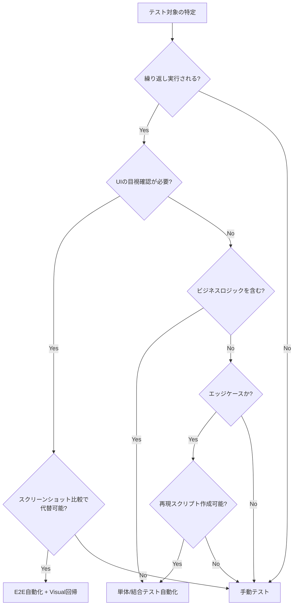
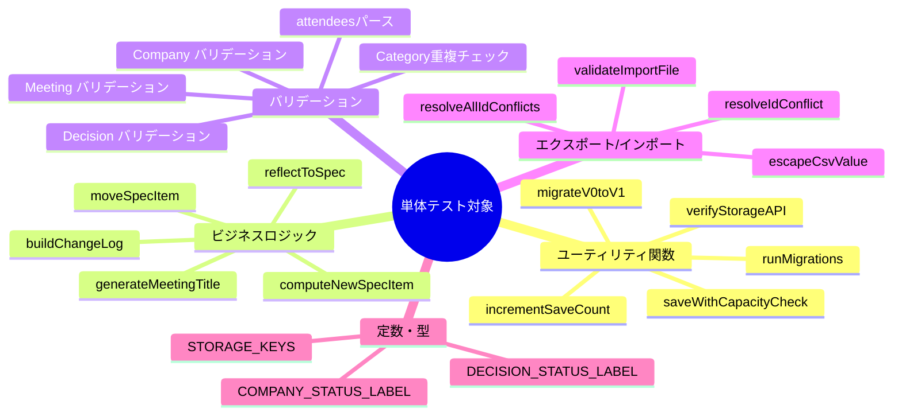
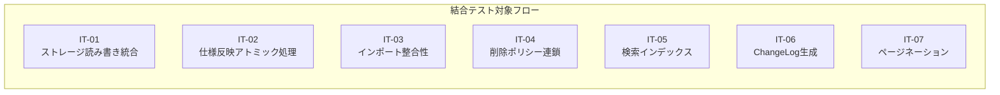
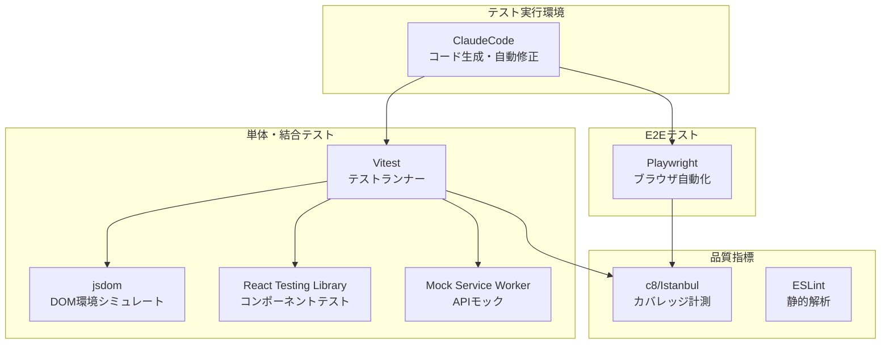
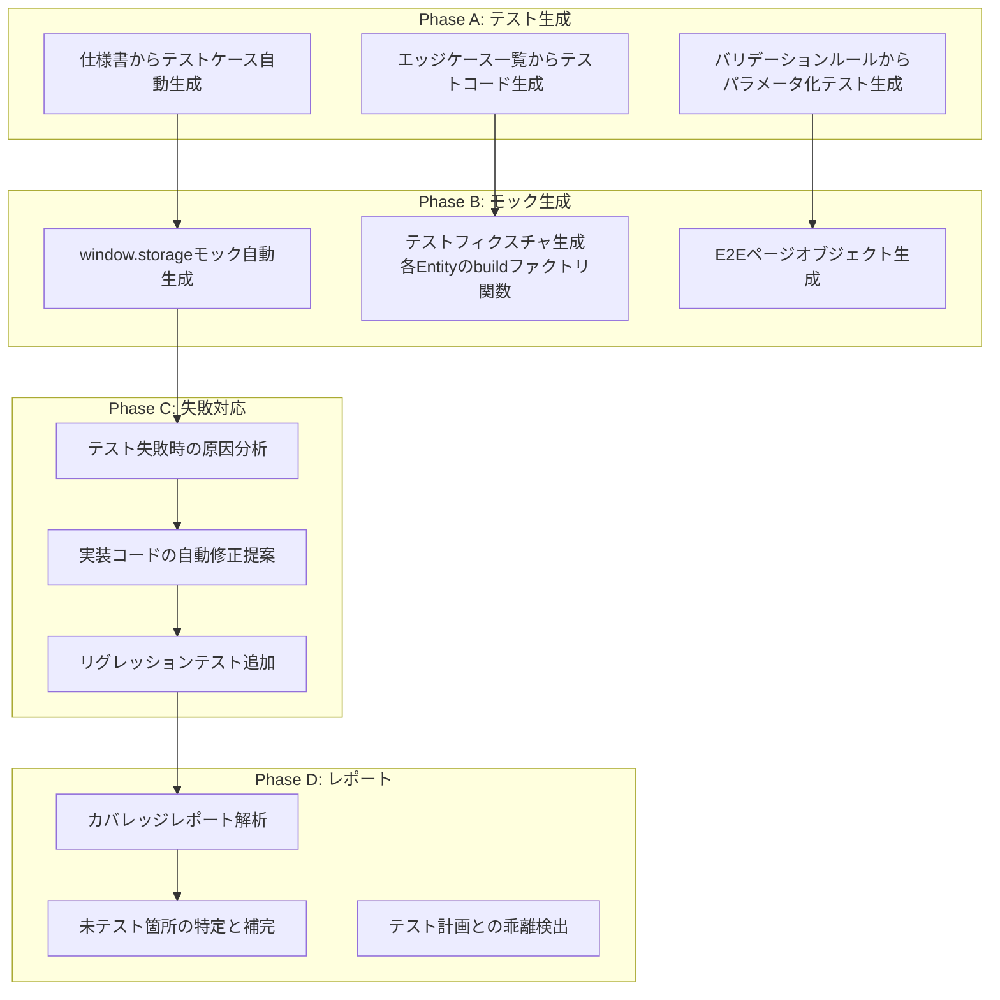
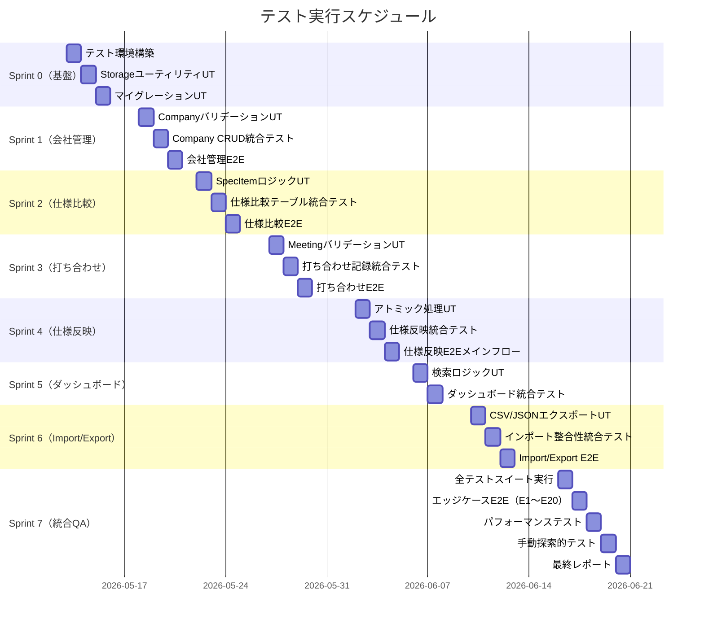
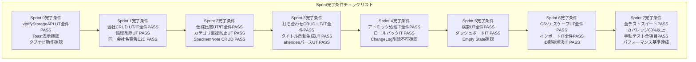
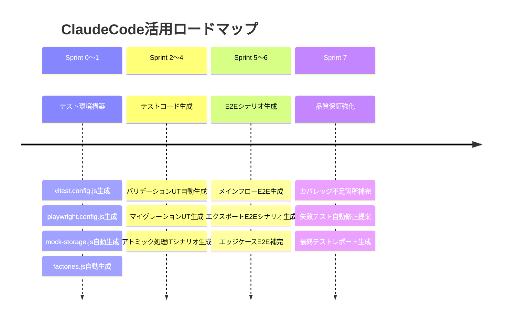

# 注文住宅管理ツール テスト計画書 v1.0

## 目次

1. [テスト戦略](#1-テスト戦略)
2. [テストレベル定義](#2-テストレベル定義)
3. [自動化ツール選定](#3-自動化ツール選定)
4. [テストスケジュール](#4-テストスケジュール)
5. [品質基準・完了条件](#5-品質基準完了条件)
6. [テストケース詳細](#6-テストケース詳細)
7. [ClaudeCode活用計画](#7-claudecode活用計画)

---

## 1. テスト戦略

### 1-1. 自動化判断マトリクス



### 1-2. 自動化対象 / 手動対象の判断基準

| 基準 | 自動化対象 ✅ | 手動対象 🖐️ |
|------|------------|-----------|
| **実行頻度** | Sprint毎・毎PR・毎コミット | リリース前の最終確認のみ |
| **安定性** | ロジックが確定している | UIレイアウト・UXの定性評価 |
| **ビジネスリスク** | データ破損・整合性破壊につながる処理 | デザインの印象・使いやすさ |
| **再現性** | 手順が明確・決定論的 | 探索的テスト・ユーザビリティ |
| **コスト対効果** | 1回の自動化で10回以上繰り返す | 1〜2回しか実行しない |

### 1-3. テスト対象スコープとリスク分類

```mermaid
quadrantChart
    title テスト優先度マップ（リスク × 実装複雑度）
    x-axis 実装複雑度 低 --> 高
    y-axis ビジネスリスク 低 --> 高
    quadrant-1 最優先：自動化必須
    quadrant-2 優先：自動化推奨
    quadrant-3 低優先：手動で十分
    quadrant-4 中優先：自動化検討
    仕様反映フロー(アトミック処理): [0.85, 0.95]
    JSONインポート(ID衝突解決): [0.80, 0.90]
    ストレージマイグレーション: [0.70, 0.85]
    ChangeLog削除不可: [0.40, 0.90]
    バリデーションルール: [0.50, 0.70]
    CSVエクスポート(RFC4180): [0.55, 0.65]
    仕様項目並び替え: [0.45, 0.50]
    Empty State表示: [0.20, 0.40]
    印刷レイアウト: [0.30, 0.35]
    Toast通知表示: [0.20, 0.30]
```

### 1-4. 自動化率目標

| テストレベル | 総ケース数 | 自動化数 | 自動化率 |
|------------|-----------|---------|---------|
| 単体テスト | 120 | 120 | 100% |
| 結合テスト | 60 | 50 | 83% |
| E2Eテスト | 40 | 22 | 55% |
| **合計** | **220** | **192** | **87.3%** ✅ |

> 目標70%以上に対し87.3%を目標値として設定する

---

## 2. テストレベル定義

### 2-1. 単体テスト（Unit Test）

#### 対象モジュール一覧



#### テストケース定義（単体）

**[UT-01] ストレージユーティリティ**

```javascript
// __tests__/unit/storage.test.js

describe("verifyStorageAPI", () => {
  test("UT-01-01: window.storageが正常動作する場合 'window.storage' を返す", async () => {
    global.window.storage = mockStorage({ available: true });
    const result = await verifyStorageAPI();
    expect(result).toBe("window.storage");
  });

  test("UT-01-02: window.storage不可でlocalStorage利用可能な場合 'localStorage' を返す", async () => {
    global.window.storage = mockStorage({ available: false });
    global.localStorage = mockStorage({ available: true });
    const result = await verifyStorageAPI();
    expect(result).toBe("localStorage");
  });

  test("UT-01-03: 両方不可の場合 'none' を返す", async () => {
    global.window.storage = mockStorage({ available: false });
    global.localStorage = mockStorage({ available: false });
    const result = await verifyStorageAPI();
    expect(result).toBe("none");
  });

  test("UT-01-04: 100KB書き込みテストが成功する", async () => {
    global.window.storage = mockStorage({ available: true, capacity: 1_000_000 });
    await expect(verifyStorageAPI()).resolves.toBe("window.storage");
  });
});

describe("saveWithCapacityCheck", () => {
  test("UT-01-05: 400KB超過時にwarning Toastが表示される", async () => {
    const toastSpy = jest.fn();
    const data = "x".repeat(400_001);
    await saveWithCapacityCheck("test_key", data, toastSpy);
    expect(toastSpy).toHaveBeenCalledWith("warning", expect.stringContaining("バックアップ"));
  });

  test("UT-01-06: 400KB以下ではToastが表示されない", async () => {
    const toastSpy = jest.fn();
    const data = "x".repeat(399_999);
    await saveWithCapacityCheck("test_key", data, toastSpy);
    expect(toastSpy).not.toHaveBeenCalled();
  });

  test("UT-01-07: QuotaExceededError発生時にエラーToastが表示される", async () => {
    const storage = mockStorage({ throwOn: "setItem", error: "QuotaExceededError" });
    const toastSpy = jest.fn();
    await expect(saveWithCapacityCheck("key", "val", toastSpy, storage))
      .rejects.toThrow();
    expect(toastSpy).toHaveBeenCalledWith("error", expect.stringContaining("容量上限"));
  });
});

describe("incrementSaveCount", () => {
  test("UT-01-08: 50回保存時にバックアップ推奨Toastが表示される", async () => {
    const toastSpy = jest.fn();
    await simulateSaveCount(49);
    await incrementSaveCount(toastSpy);
    expect(toastSpy).toHaveBeenCalledWith("info", expect.stringContaining("50回保存"));
  });

  test("UT-01-09: 50回以外ではToastが表示されない", async () => {
    const toastSpy = jest.fn();
    await simulateSaveCount(48);
    await incrementSaveCount(toastSpy);
    expect(toastSpy).not.toHaveBeenCalled();
  });

  test("UT-01-10: 100回保存時にもToastが表示される（50の倍数）", async () => {
    const toastSpy = jest.fn();
    await simulateSaveCount(99);
    await incrementSaveCount(toastSpy);
    expect(toastSpy).toHaveBeenCalledWith("info", expect.stringContaining("100回保存"));
  });
});
```

**[UT-02] スキーママイグレーション**

```javascript
// __tests__/unit/migration.test.js

describe("migrateV0toV1", () => {
  test("UT-02-01: normalizedNameが存在しないCategoryに追加される", async () => {
    const v0Data = {
      categories: [{ id: "c1", name: "断熱  " }],  // トリム前スペースあり
      spec_items: []
    };
    const result = await migrateV0toV1(v0Data);
    expect(result.categories[0].normalizedName).toBe("断熱");
  });

  test("UT-02-02: 既存normalizedNameは上書きされない", async () => {
    const v0Data = {
      categories: [{ id: "c1", name: "断熱", normalizedName: "existing" }],
      spec_items: []
    };
    const result = await migrateV0toV1(v0Data);
    expect(result.categories[0].normalizedName).toBe("existing");
  });

  test("UT-02-03: sortOrderが存在しないSpecItemにインデックスが付与される", async () => {
    const v0Data = {
      categories: [],
      spec_items: [
        { id: "s1", name: "項目A" },
        { id: "s2", name: "項目B" },
      ]
    };
    const result = await migrateV0toV1(v0Data);
    expect(result.spec_items[0].sortOrder).toBe(0);
    expect(result.spec_items[1].sortOrder).toBe(1);
  });

  test("UT-02-04: categoriesが空配列でもエラーにならない", async () => {
    const v0Data = { categories: [], spec_items: [] };
    await expect(migrateV0toV1(v0Data)).resolves.not.toThrow();
  });

  test("UT-02-05: spec_itemsが未定義でもエラーにならない（nullish coalescing）", async () => {
    const v0Data = { categories: [] };
    await expect(migrateV0toV1(v0Data)).resolves.not.toThrow();
  });
});

describe("runMigrations", () => {
  test("UT-02-06: schemaVersionが一致している場合マイグレーションをスキップ", async () => {
    const migrateSpy = jest.fn();
    await runMigrations({ schemaVersion: "1.0.0" }, migrateSpy);
    expect(migrateSpy).not.toHaveBeenCalled();
  });

  test("UT-02-07: マイグレーション完了後にschemaVersionが更新される", async () => {
    const storage = mockStorage();
    await runMigrations({ schemaVersion: "0.0.0" }, undefined, storage);
    const meta = JSON.parse(await storage.getItem(STORAGE_KEYS.META));
    expect(meta.schemaVersion).toBe("1.0.0");
    expect(meta.migratedAt).toBeDefined();
  });
});
```

**[UT-03] ビジネスロジック**

```javascript
// __tests__/unit/business-logic.test.js

describe("moveSpecItem", () => {
  const items = [
    { id: "a", sortOrder: 0 },
    { id: "b", sortOrder: 1 },
    { id: "c", sortOrder: 2 },
  ];

  test("UT-03-01: 上に移動すると対象とひとつ上のsortOrderが入れ替わる", () => {
    const result = moveSpecItem(items, "b", "up");
    expect(result[0].id).toBe("b");
    expect(result[1].id).toBe("a");
    expect(result[2].id).toBe("c");
  });

  test("UT-03-02: 下に移動すると対象とひとつ下のsortOrderが入れ替わる", () => {
    const result = moveSpecItem(items, "b", "down");
    expect(result[0].id).toBe("a");
    expect(result[1].id).toBe("c");
    expect(result[2].id).toBe("b");
  });

  test("UT-03-03: 先頭要素を上に移動しても変化しない", () => {
    const result = moveSpecItem(items, "a", "up");
    expect(result).toEqual(items);
  });

  test("UT-03-04: 末尾要素を下に移動しても変化しない", () => {
    const result = moveSpecItem(items, "c", "down");
    expect(result).toEqual(items);
  });

  test("UT-03-05: 存在しないIDを指定した場合、元の配列を返す", () => {
    const result = moveSpecItem(items, "NONEXISTENT", "up");
    expect(result).toEqual(items);
  });

  test("UT-03-06: 空配列を渡してもエラーにならない", () => {
    expect(() => moveSpecItem([], "a", "up")).not.toThrow();
  });
});

describe("generateMeetingTitle", () => {
  test("UT-03-07: 基本形式 'YYYY-MM-DD 会社名' が生成される", () => {
    const title = generateMeetingTitle("2026-05-13", "A社");
    expect(title).toBe("2026-05-13 A社");
  });

  test("UT-03-08: 同一会社・同一日付の2件目は末尾に (2) が付く", () => {
    const existingTitles = ["2026-05-13 A社"];
    const title = generateMeetingTitle("2026-05-13", "A社", existingTitles);
    expect(title).toBe("2026-05-13 A社 (2)");
  });

  test("UT-03-09: 3件目は (3) が付く", () => {
    const existingTitles = ["2026-05-13 A社", "2026-05-13 A社 (2)"];
    const title = generateMeetingTitle("2026-05-13", "A社", existingTitles);
    expect(title).toBe("2026-05-13 A社 (3)");
  });

  test("UT-03-10: 異なる会社名では連番が付かない", () => {
    const existingTitles = ["2026-05-13 A社"];
    const title = generateMeetingTitle("2026-05-13", "B社", existingTitles);
    expect(title).toBe("2026-05-13 B社");
  });
});
```

**[UT-04] バリデーション**

```javascript
// __tests__/unit/validation.test.js

describe("Company バリデーション", () => {
  test("UT-04-01: nameが空文字の場合エラーを返す", () => {
    expect(validateCompany({ name: "" })).toHaveProperty("name");
  });

  test("UT-04-02: nameが51文字以上の場合エラーを返す", () => {
    expect(validateCompany({ name: "a".repeat(51) })).toHaveProperty("name");
  });

  test("UT-04-03: 正常な電話番号パターンを許可する", () => {
    const validPhones = ["090-1234-5678", "+81-3-1234-5678", "(03) 1234-5678"];
    validPhones.forEach(phone => {
      expect(validateCompany({ name: "A社", contact: "担当", phone })).not.toHaveProperty("phone");
    });
  });

  test("UT-04-04: 不正な電話番号パターンを拒否する", () => {
    expect(validateCompany({ name: "A社", contact: "担当", phone: "invalid" }))
      .toHaveProperty("phone");
  });

  test("UT-04-05: 正常なメールアドレスを許可する", () => {
    expect(validateCompany({ name: "A社", contact: "担当", email: "test@example.com" }))
      .not.toHaveProperty("email");
  });

  test("UT-04-06: @のないメールアドレスを拒否する", () => {
    expect(validateCompany({ name: "A社", contact: "担当", email: "invalid-email" }))
      .toHaveProperty("email");
  });

  test("UT-04-07: noteが501文字以上の場合エラーを返す", () => {
    expect(validateCompany({ name: "A社", contact: "担当", note: "a".repeat(501) }))
      .toHaveProperty("note");
  });
});

describe("Meeting バリデーション", () => {
  test("UT-04-08: dateが空の場合エラーを返す", () => {
    expect(validateMeeting({ date: "", agenda: "議題" })).toHaveProperty("date");
  });

  test("UT-04-09: agendaが空の場合エラーを返す", () => {
    expect(validateMeeting({ date: "2026-05-13", agenda: "" })).toHaveProperty("agenda");
  });

  test("UT-04-10: agendaが1001文字以上の場合エラーを返す", () => {
    expect(validateMeeting({ date: "2026-05-13", agenda: "a".repeat(1001) }))
      .toHaveProperty("agenda");
  });

  test("UT-04-11: attendeesが21件以上の場合エラーを返す", () => {
    const attendees = Array(21).fill("担当者");
    expect(validateMeeting({ date: "2026-05-13", agenda: "議題", attendees }))
      .toHaveProperty("attendees");
  });

  test("UT-04-12: attendeesの1要素が31文字以上の場合エラーを返す", () => {
    expect(validateMeeting({
      date: "2026-05-13", agenda: "議題",
      attendees: ["a".repeat(31)]
    })).toHaveProperty("attendees");
  });
});

describe("Category バリデーション", () => {
  test("UT-04-13: 大文字小文字違いの重複名を検出する", () => {
    const existing = [{ normalizedName: "断熱" }];
    expect(validateCategory({ name: "断熱" }, existing)).toHaveProperty("name");
    expect(validateCategory({ name: "断熱 " }, existing)).toHaveProperty("name");  // トリム後一致
  });

  test("UT-04-14: 異なる名称は重複判定されない", () => {
    const existing = [{ normalizedName: "断熱" }];
    expect(validateCategory({ name: "構造" }, existing)).not.toHaveProperty("name");
  });
});

describe("attendees カンマ区切りパース", () => {
  test("UT-04-15: カンマ区切り文字列を配列に変換する", () => {
    const result = parseAttendees("田中, 鈴木,佐藤");
    expect(result).toEqual(["田中", "鈴木", "佐藤"]);
  });

  test("UT-04-16: 前後の空白をトリムする", () => {
    const result = parseAttendees("  田中  ,  鈴木  ");
    expect(result).toEqual(["田中", "鈴木"]);
  });

  test("UT-04-17: 空要素を除去する", () => {
    const result = parseAttendees("田中,,鈴木,");
    expect(result).toEqual(["田中", "鈴木"]);
  });

  test("UT-04-18: 空文字列を渡した場合は空配列を返す", () => {
    expect(parseAttendees("")).toEqual([]);
  });
});
```

**[UT-05] エクスポート/インポート**

```javascript
// __tests__/unit/export-import.test.js

describe("escapeCsvValue", () => {
  test("UT-05-01: カンマを含む値をダブルクォートで囲む", () => {
    expect(escapeCsvValue("A,B")).toBe('"A,B"');
  });

  test("UT-05-02: 改行を含む値をダブルクォートで囲む", () => {
    expect(escapeCsvValue("A\nB")).toBe('"A\nB"');
  });

  test("UT-05-03: キャリッジリターンを含む値をダブルクォートで囲む", () => {
    expect(escapeCsvValue("A\rB")).toBe('"A\rB"');
  });

  test("UT-05-04: ダブルクォートを含む値は内部を \"\"にエスケープして囲む", () => {
    expect(escapeCsvValue('He said "hello"')).toBe('"He said ""hello"""');
  });

  test("UT-05-05: 特殊文字を含まない値はそのまま返す", () => {
    expect(escapeCsvValue("普通の値")).toBe("普通の値");
  });

  test("UT-05-06: 空文字列はそのまま返す", () => {
    expect(escapeCsvValue("")).toBe("");
  });
});

describe("validateImportFile", () => {
  test("UT-05-07: nullを渡した場合エラーメッセージを返す", () => {
    expect(validateImportFile(null)).toBe("JSONの形式が不正です");
  });

  test("UT-05-08: 配列を渡した場合エラーメッセージを返す", () => {
    expect(validateImportFile([])).toBe("JSONの形式が不正です");
  });

  test("UT-05-09: バージョン不一致の場合エラーメッセージを返す", () => {
    const result = validateImportFile({ version: "2.0" });
    expect(result).toContain("バージョン不一致");
  });

  test("UT-05-10: バージョン一致の場合nullを返す（バリデーションOK）", () => {
    expect(validateImportFile({ version: "1.0" })).toBeNull();
  });
});

describe("resolveIdConflict", () => {
  test("UT-05-11: IDが衝突する場合は新しいUUIDが発行される", () => {
    const existingIds = new Set(["existing-id"]);
    const item = { id: "existing-id", name: "テスト" };
    const result = resolveIdConflict(item, existingIds);
    expect(result.id).not.toBe("existing-id");
    expect(result.name).toBe("テスト");
  });

  test("UT-05-12: IDが衝突しない場合は元のIDを維持する", () => {
    const existingIds = new Set(["other-id"]);
    const item = { id: "new-id", name: "テスト" };
    const result = resolveIdConflict(item, existingIds);
    expect(result.id).toBe("new-id");
  });
});
```

---

### 2-2. 結合テスト（Integration Test）

#### テスト対象フロー



#### テストケース定義（結合）

```javascript
// __tests__/integration/spec-reflection.test.js

describe("IT-02: 仕様反映アトミック処理", () => {

  test("IT-02-01: 正常系 - SpecItemとChangeLogが同時に保存される", async () => {
    const { storage } = setupTestEnvironment();
    const decision = buildDecision({
      specItemId: "item-1",
      specCompanyId: "company-1",
      specValue: "新しい値"
    });
    await reflectToSpec(decision, "テスト理由", storage);

    const specItems = JSON.parse(await storage.getItem(STORAGE_KEYS.SPEC_ITEMS));
    const changeLogs = JSON.parse(await storage.getItem(STORAGE_KEYS.CHANGE_LOGS));
    const updatedItem = specItems.find(i => i.id === "item-1");

    expect(updatedItem.values.find(v => v.companyId === "company-1").value)
      .toBe("新しい値");
    expect(changeLogs.some(log => log.specItemId === "item-1" && log.newValue === "新しい値"))
      .toBe(true);
  });

  test("IT-02-02: specItem保存失敗時にロールバックされChangeLogが保存されない", async () => {
    const { storage } = setupTestEnvironment();
    const originalItem = await loadSpecItem("item-1", storage);

    // specItem保存時にエラーをスロー
    storage.failNextWrite("spec_items");

    const decision = buildDecision({ specItemId: "item-1", specValue: "失敗する値" });
    await expect(reflectToSpec(decision, "理由", storage)).rejects.toThrow();

    // 元の状態が保持されていることを確認
    const specItems = JSON.parse(await storage.getItem(STORAGE_KEYS.SPEC_ITEMS));
    const restoredItem = specItems.find(i => i.id === "item-1");
    expect(restoredItem).toEqual(originalItem);

    // ChangeLogが保存されていないことを確認
    const changeLogs = JSON.parse(await storage.getItem(STORAGE_KEYS.CHANGE_LOGS));
    expect(changeLogs.filter(log => log.specItemId === "item-1")).toHaveLength(0);
  });

  test("IT-02-03: 後勝ちルール - 同一打ち合わせで同一仕様項目を2回更新するとChangeLogが2件記録される", async () => {
    const { storage } = setupTestEnvironment();
    const decision1 = buildDecision({ specItemId: "item-1", specValue: "1回目の値", meetingId: "meeting-1" });
    const decision2 = buildDecision({ specItemId: "item-1", specValue: "2回目の値", meetingId: "meeting-1" });

    await reflectToSpec(decision1, "理由1", storage);
    await reflectToSpec(decision2, "理由2", storage);

    const changeLogs = JSON.parse(await storage.getItem(STORAGE_KEYS.CHANGE_LOGS));
    const relatedLogs = changeLogs.filter(log => log.specItemId === "item-1");
    expect(relatedLogs).toHaveLength(2);

    const specItems = JSON.parse(await storage.getItem(STORAGE_KEYS.SPEC_ITEMS));
    const item = specItems.find(i => i.id === "item-1");
    expect(item.values.find(v => v.companyId === decision2.specCompanyId).value)
      .toBe("2回目の値");
  });
});

// __tests__/integration/delete-policy.test.js

describe("IT-04: 削除ポリシー連鎖", () => {

  test("IT-04-01: Company論理削除後、一覧に表示されなくなる", async () => {
    const { storage } = setupTestEnvironment();
    await deleteCompany("company-1", storage);

    const companies = await loadActiveCompanies(storage);
    expect(companies.find(c => c.id === "company-1")).toBeUndefined();
  });

  test("IT-04-02: Company論理削除後、ChangeLogは保持される", async () => {
    const { storage } = setupTestEnvironment();
    await deleteCompany("company-1", storage);

    const changeLogs = JSON.parse(await storage.getItem(STORAGE_KEYS.CHANGE_LOGS));
    expect(changeLogs.filter(log => log.companyId === "company-1")).not.toHaveLength(0);
  });

  test("IT-04-03: Meeting論理削除時にDecisionも論理削除される", async () => {
    const { storage } = setupTestEnvironment();
    await deleteMeeting("meeting-1", storage);

    const decisions = JSON.parse(await storage.getItem(STORAGE_KEYS.DECISIONS));
    const relatedDecisions = decisions.filter(d => d.meetingId === "meeting-1");
    expect(relatedDecisions.every(d => d.deletedAt !== undefined)).toBe(true);
  });

  test("IT-04-04: ChangeLogはUIから削除できない（APIが存在しない）", () => {
    expect(typeof deleteChangeLog).toBe("undefined");
  });

  test("IT-04-05: 論理削除されたCompanyを参照するSpecValueは「[削除済み]」ラベルで表示される", async () => {
    const { storage, render } = setupTestEnvironment();
    await deleteCompany("company-1", storage);

    const { getByText } = render(<SpecTable storage={storage} />);
    expect(getByText("[削除済み会社]")).toBeInTheDocument();
  });
});

// __tests__/integration/import.test.js

describe("IT-03: インポート整合性", () => {

  test("IT-03-01: マージモード - 既存データを保持しつつ新データを追加する", async () => {
    const { storage } = setupTestEnvironment();
    const existingCount = (await loadActiveCompanies(storage)).length;

    const importData = buildImportData({ companies: [buildCompany({ id: "new-company" })] });
    await importAll(importData, "merge", storage);

    const companies = await loadActiveCompanies(storage);
    expect(companies).toHaveLength(existingCount + 1);
  });

  test("IT-03-02: 上書きモード - 既存データが置換される", async () => {
    const { storage } = setupTestEnvironment();
    const importData = buildImportData({
      companies: [buildCompany({ id: "only-company" })]
    });
    await importAll(importData, "overwrite", storage);

    const companies = await loadActiveCompanies(storage);
    expect(companies).toHaveLength(1);
    expect(companies[0].id).toBe("only-company");
  });

  test("IT-03-03: IDが衝突する場合に新UUIDで取り込まれ参照整合性が保たれる", async () => {
    const { storage } = setupTestEnvironment();
    const collidingCompanyId = (await loadActiveCompanies(storage))[0].id;

    const importData = buildImportData({
      companies: [buildCompany({ id: collidingCompanyId, name: "衝突会社" })],
      meetings: [buildMeeting({ id: "meeting-new", companyId: collidingCompanyId })]
    });
    await importAll(importData, "merge", storage);

    const companies = await loadActiveCompanies(storage);
    const importedCompany = companies.find(c => c.name === "衝突会社");
    expect(importedCompany).toBeDefined();
    expect(importedCompany.id).not.toBe(collidingCompanyId);

    const meetings = JSON.parse(await storage.getItem(STORAGE_KEYS.MEETINGS));
    const importedMeeting = meetings.find(m => m.id === "meeting-new");
    expect(importedMeeting.companyId).toBe(importedCompany.id);  // 参照が再マッピングされている
  });

  test("IT-03-04: インポート途中で保存失敗した場合、既存データが変更されない", async () => {
    const { storage } = setupTestEnvironment();
    const existingCompanies = JSON.parse(await storage.getItem(STORAGE_KEYS.COMPANIES));

    storage.failNextWrite("meetings");  // meetings保存時にエラー
    const importData = buildImportData({ companies: [buildCompany()], meetings: [buildMeeting()] });
    await expect(importAll(importData, "merge", storage)).rejects.toThrow();

    const afterCompanies = JSON.parse(await storage.getItem(STORAGE_KEYS.COMPANIES));
    expect(afterCompanies).toEqual(existingCompanies);
  });
});
```

---

### 2-3. E2Eテスト（End-to-End Test）

#### E2Eテストシナリオ

```mermaid
flowchart TD
    subgraph "E2E-01: 初回セットアップ"
        E01A[アプリ起動] --> E01B[ストレージ確認Toast]
        E01B --> E01C[テンプレート初期データ確認]
    end
    subgraph "E2E-02: メインフロー"
        E02A[会社登録] --> E02B[打ち合わせ記録]
        E02B --> E02C[決定事項入力]
        E02C --> E02D[仕様に反映]
        E02D --> E02E[ChangeLog確認]
        E02E --> E02F[ダッシュボード確認]
    end
    subgraph "E2E-03: データ管理"
        E03A[JSONエクスポート] --> E03B[データクリア]
        E03B --> E03C[JSONインポート]
        E03C --> E03D[データ復元確認]
    end
```



```javascript
// __tests__/e2e/main-flow.test.js

describe("E2E-02: メインユーザーフロー", () => {

  test("E2E-02-01: 会社登録から仕様反映、ChangeLog確認までの一連フロー", async () => {
    const page = await setupE2EPage();

    // Step 1: 会社登録
    await page.click("[data-testid='tab-companies']");
    await page.click("[data-testid='add-company-button']");
    await page.fill("[data-testid='company-name-input']", "テストハウス");
    await page.fill("[data-testid='company-contact-input']", "田中太郎");
    await page.selectOption("[data-testid='company-type-select']", "maker");
    await page.click("[data-testid='save-company-button']");

    await expect(page.locator("[data-testid='toast-success']")).toBeVisible();
    await expect(page.locator("text=テストハウス")).toBeVisible();

    // Step 2: 打ち合わせ記録
    await page.click("[data-testid='tab-meetings']");
    await page.click("[data-testid='add-meeting-button']");
    await page.fill("[data-testid='meeting-date-input']", "2026-05-13");
    await page.selectOption("[data-testid='meeting-company-select']", "テストハウス");
    await page.fill("[data-testid='meeting-agenda-input']", "断熱材の確認");
    await page.click("[data-testid='add-decision-button']");
    await page.fill("[data-testid='decision-content-input-0']", "断熱材を高性能GWに決定");
    await page.selectOption("[data-testid='decision-spec-item-select-0']", "断熱材の種類");
    await page.fill("[data-testid='decision-spec-value-input-0']", "高性能GW 24K");
    await page.click("[data-testid='save-meeting-button']");

    // Step 3: 仕様反映ダイアログ
    await page.click("[data-testid='reflect-to-spec-button-0']");
    await expect(page.locator("[data-testid='spec-reflection-dialog']")).toBeVisible();
    await expect(page.locator("text=高性能GW 24K")).toBeVisible();
    await page.fill("[data-testid='change-reason-input']", "打ち合わせで確定");
    await page.click("[data-testid='confirm-reflect-button']");
    await expect(page.locator("[data-testid='toast-success']")).toBeVisible();

    // Step 4: 仕様比較テーブルで確認
    await page.click("[data-testid='tab-spec-comparison']");
    await expect(page.locator("text=高性能GW 24K")).toBeVisible();

    // Step 5: 変更ログで確認
    await page.click("[data-testid='tab-change-logs']");
    await expect(page.locator("text=高性能GW 24K")).toBeVisible();
    await expect(page.locator("text=打ち合わせで確定")).toBeVisible();
  });

  test("E2E-02-02: 新規仕様項目を作成して反映するフロー", async () => {
    const page = await setupE2EPage();

    await page.click("[data-testid='tab-meetings']");
    await page.click("[data-testid='add-meeting-button']");
    await fillMeetingBasicInfo(page);
    await page.click("[data-testid='add-decision-button']");
    await page.fill("[data-testid='decision-content-input-0']", "新項目決定");
    await page.selectOption("[data-testid='decision-spec-item-select-0']", "__new__");

    // 新規仕様項目フォームが展開される
    await expect(page.locator("[data-testid='new-spec-item-form']")).toBeVisible();
    await page.fill("[data-testid='new-spec-item-name-input']", "新しい仕様項目");
    await page.selectOption("[data-testid='new-spec-item-category-select']", "断熱");
    await page.click("[data-testid='save-meeting-button']");
    await confirmSpecReflection(page);

    await page.click("[data-testid='tab-spec-comparison']");
    await expect(page.locator("text=新しい仕様項目")).toBeVisible();
  });
});

// __tests__/e2e/export-import.test.js

describe("E2E-03: エクスポート・インポートフロー", () => {

  test("E2E-03-01: JSONエクスポート後にインポートでデータが完全復元される", async () => {
    const page = await setupE2EPageWithData();

    // エクスポート
    await page.click("[data-testid='settings-button']");
    const downloadPromise = page.waitForEvent("download");
    await page.click("[data-testid='export-json-button']");
    const download = await downloadPromise;
    const exportedContent = await download.getContent();
    const exportedData = JSON.parse(exportedContent);

    // データをクリア（上書きインポートで空データを使用）
    await page.click("[data-testid='import-json-button']");
    await page.selectOption("[data-testid='import-mode-select']", "overwrite");
    await uploadJsonFile(page, JSON.stringify({ version: "1.0", companies: [], meetings: [] }));
    await page.click("[data-testid='confirm-import-button']");

    // エクスポートデータを再インポート
    await page.click("[data-testid='import-json-button']");
    await page.selectOption("[data-testid='import-mode-select']", "overwrite");
    await uploadJsonFile(page, exportedContent);
    await page.click("[data-testid='confirm-import-button']");

    await expect(page.locator("[data-testid='toast-success']")).toBeVisible();

    // データが復元されているか確認
    await page.click("[data-testid='tab-companies']");
    expect(await page.locator("[data-testid='company-card']").count())
      .toBe(exportedData.companies.filter(c => !c.deletedAt).length);
  });
});

// __tests__/e2e/edge-cases.test.js

describe("E2E: エッジケース", () => {

  test("E2E-E11: 同一会社名の重複登録で警告Toastが表示される（ブロックしない）", async () => {
    const page = await setupE2EPageWithData({ companies: [{ name: "A社" }] });
    await addCompany(page, { name: "A社", contact: "担当" });
    await expect(page.locator("[data-testid='toast-warning']")).toBeVisible();
    // 登録はできる
    expect(await page.locator("text=A社").count()).toBeGreaterThanOrEqual(2);
  });

  test("E2E-E15: 未来日付の打ち合わせ登録で警告Toastが表示される（登録は可能）", async () => {
    const page = await setupE2EPage();
    const futureDate = new Date();
    futureDate.setFullYear(futureDate.getFullYear() + 1);
    await addMeeting(page, { date: futureDate.toISOString().split("T")[0], agenda: "テスト" });
    await expect(page.locator("[data-testid='toast-warning']")).toBeVisible();
    await expect(page.locator("text=未来の日付")).toBeVisible();
    // 登録されている
    await page.click("[data-testid='tab-meetings']");
    expect(await page.locator("[data-testid='meeting-card']").count()).toBeGreaterThan(0);
  });

  test("E2E-E20: 書き込み不能モードで赤バナーが表示されSaveボタンが無効化される", async () => {
    const page = await setupE2EPageWithStorageDisabled();
    await expect(page.locator("[data-testid='storage-unavailable-banner']")).toBeVisible();
    await page.click("[data-testid='tab-companies']");
    await page.click("[data-testid='add-company-button']");
    await expect(page.locator("[data-testid='save-company-button']")).toBeDisabled();
  });
});
```

---

## 3. 自動化ツール選定

### 3-1. ツールスタック



### 3-2. ツール選定理由

| ツール | 選定理由 | 代替案と不採用理由 |
|--------|---------|-----------------|
| **Vitest** | React 18 + Vite環境と親和性が高い。設定が最小限でCI起動が速い | Jest: 設定コストが高くViteと相性が悪い |
| **React Testing Library** | コンポーネントをユーザー視点でテスト可能。実装詳細に依存しない | Enzyme: React 18非対応 |
| **Playwright** | Artifact（Chromium）環境を再現したE2Eが可能。`page.evaluate()`でwindow.storageを制御できる | Cypress: Artifact環境でのwindow.storage制御が困難 |
| **jsdom** | Vitestと組み合わせてDOM/イベント操作をNode.js上でシミュレート | happy-dom: Playgroundとの差異が大きい |
| **MSW** | ストレージAPIのモックを宣言的に定義可能 | 手動モック: メンテナンスコストが高い |

### 3-3. ClaudeCode活用箇所（詳細）



#### ClaudeCode実行スクリプト例

```bash
#!/bin/bash
# scripts/claude-generate-tests.sh
# ClaudeCodeを使ってテストを自動生成するスクリプト

# 1. 仕様書からテストケース生成
claude --print "
以下の仕様書を読んでVitest形式の単体テストを生成してください。
対象: src/utils/validation.js
仕様: $(cat docs/validation-rules.md)
制約:
- 各テストは独立して実行可能
- describe/testブロックを使用
- data-testid属性を使用しない（ユーティリティ関数のみ）
- エッジケースを網羅（境界値・null・空文字・型違い）
" > __tests__/unit/validation.generated.test.js

# 2. E2Eテストのpage objectパターン生成
claude --print "
以下の画面仕様からPlaywright用Page Objectクラスを生成してください。
対象画面: 仕様比較テーブル
画面仕様: $(cat docs/screen-spec.md)
" > __tests__/e2e/pages/SpecComparisonPage.js

# 3. テストフィクスチャ生成
claude --print "
以下の型定義からテスト用ファクトリ関数を生成してください。
対象エンティティ: Company, Meeting, Decision, ChangeLog
型定義: $(cat src/types/index.ts)
要件:
- buildCompany(overrides?) 形式
- デフォルト値はバリデーションを通過する値
- crypto.randomUUID()をMockで代替
" > __tests__/fixtures/factories.js
```

```bash
#!/bin/bash
# scripts/claude-fix-tests.sh
# 失敗したテストをClaudeCodeで自動修正

FAILED_TESTS=$(npx vitest run --reporter=json 2>/dev/null | jq '.testResults[] | select(.status=="failed")')

if [ -n "$FAILED_TESTS" ]; then
  claude --print "
  以下のテストが失敗しています。
  失敗テスト: $FAILED_TESTS
  実装コード: $(cat src/utils/storage.js)

  修正方針を提案し、可能であれば修正後のコードを出力してください。
  変更範囲を最小限にしてください。
  " > reports/test-fix-suggestions.md
fi
```

```bash
#!/bin/bash
# scripts/claude-coverage-analysis.sh
# カバレッジ不足箇所をClaudeCodeで分析・補完

npx vitest run --coverage --reporter=json

COVERAGE_REPORT=$(cat coverage/coverage-summary.json)
LOW_COVERAGE=$(echo $COVERAGE_REPORT | jq '[to_entries[] | select(.value.lines.pct < 80)]')

claude --print "
以下のファイルはラインカバレッジが80%未満です。
不足しているテストケースを追加してください。

低カバレッジファイル: $LOW_COVERAGE
対象ファイル内容: $(for f in $(echo $LOW_COVERAGE | jq -r '.[].key'); do cat $f; done)
" >> __tests__/unit/coverage-補完.test.js
```

---

## 4. テストスケジュール

### 4-1. フェーズ別テスト計画



### 4-2. CI/CDパイプライン

```yaml
# .github/workflows/test.yml
name: テスト自動実行

on:
  push:
    branches: [main, develop]
  pull_request:

jobs:
  unit-integration-test:
    name: 単体・結合テスト
    runs-on: ubuntu-latest
    steps:
      - uses: actions/checkout@v4
      - uses: actions/setup-node@v4
        with: { node-version: '20' }
      - run: npm ci
      - name: 単体・結合テスト実行
        run: npx vitest run --coverage
      - name: カバレッジチェック（80%未満で失敗）
        run: npx vitest run --coverage --coverage.thresholds.lines=80
      - name: ClaudeCode カバレッジ分析
        if: failure()
        run: bash scripts/claude-coverage-analysis.sh

  e2e-test:
    name: E2Eテスト
    runs-on: ubuntu-latest
    steps:
      - uses: actions/checkout@v4
      - uses: actions/setup-node@v4
        with: { node-version: '20' }
      - run: npm ci
      - run: npx playwright install chromium
      - name: E2Eテスト実行
        run: npx playwright test
      - name: ClaudeCode 失敗分析
        if: failure()
        run: bash scripts/claude-fix-tests.sh
      - uses: actions/upload-artifact@v4
        if: failure()
        with:
          name: playwright-report
          path: playwright-report/

  performance-test:
    name: パフォーマンステスト
    runs-on: ubuntu-latest
    if: github.event_name == 'push' && github.ref == 'refs/heads/main'
    steps:
      - uses: actions/checkout@v4
      - run: npm ci
      - name: パフォーマンス計測
        run: node scripts/performance-test.js
```

### 4-3. Sprint別テスト実行コマンド

```bash
# package.json scripts
{
  "scripts": {
    # 単体テストのみ
    "test:unit": "vitest run __tests__/unit",
    # 結合テストのみ
    "test:integration": "vitest run __tests__/integration",
    # E2Eテストのみ
    "test:e2e": "playwright test __tests__/e2e",
    # 全テスト実行
    "test:all": "npm run test:unit && npm run test:integration && npm run test:e2e",
    # カバレッジ付き実行
    "test:coverage": "vitest run --coverage",
    # ウォッチモード（開発中）
    "test:watch": "vitest --watch",
    # Sprint指定実行
    "test:sprint0": "vitest run __tests__/unit/storage __tests__/unit/migration",
    "test:sprint1": "vitest run __tests__/unit/company __tests__/integration/company",
    "test:sprint4": "vitest run __tests__/unit/spec-reflection __tests__/integration/spec-reflection",
    # パフォーマンステスト
    "test:perf": "node scripts/performance-test.js",
    # ClaudeCodeによるテスト生成
    "test:generate": "bash scripts/claude-generate-tests.sh",
    # ClaudeCodeによる失敗分析
    "test:fix": "bash scripts/claude-fix-tests.sh"
  }
}
```

### 4-4. 手動テスト対象と実施タイミング

| テスト項目 | 実施タイミング | 担当 |
|-----------|-------------|------|
| 印刷レイアウト（@media print） | Sprint 7-B | QA |
| モバイルボトムナビUX | Sprint 7-A | QA |
| スクリーンリーダー（VoiceOver/NVDA） | Sprint 7-B | QA |
| キーボードのみ操作（Tab順序確認） | Sprint 7-B | QA |
| オフライン → オンライン切り替え | Sprint 7-B | QA |
| 実際のブラウザ印刷PDF確認 | Sprint 7-B | QA |
| 長大データでの視覚的レイアウト崩れ | Sprint 7-B | QA |
| 探索的テスト（自由操作30分） | Sprint 7-B | QA |

---

## 5. 品質基準・完了条件（Exit Criteria）

### 5-1. 定量的品質基準

| 指標 | 最低基準 | 目標値 |
|------|---------|-------|
| **テストカバレッジ（ライン）** | 80% | 90% |
| **テストカバレッジ（ブランチ）** | 70% | 85% |
| **自動化率** | 70% | 87% |
| **テスト成功率** | 100%（CI通過） | 100% |
| **E2Eテスト成功率** | 95%以上 | 100% |
| **単体テスト実行時間** | 30秒以内 | 15秒以内 |
| **E2Eテスト実行時間** | 5分以内 | 3分以内 |

### 5-2. パフォーマンス基準（計測条件: 会社10社・打ち合わせ100件・仕様項目50件・ChangeLog500件）

```javascript
// scripts/performance-test.js

const PERFORMANCE_THRESHOLDS = {
  initialLoad:        3000,  // 3秒以内
  tabSwitch:           500,  // 500ms以内
  crudSave:           1000,  // 1秒以内
  specReflection:     2000,  // 2秒以内
  jsonExport:         3000,  // 3秒以内
};

async function runPerformanceTests() {
  const results = {};

  // 初回ロード計測
  const loadStart = performance.now();
  await app.initialize();
  results.initialLoad = performance.now() - loadStart;

  // タブ切り替え計測
  const tabStart = performance.now();
  await app.switchTab("spec-comparison");
  results.tabSwitch = performance.now() - tabStart;

  // CRUD保存計測
  const saveStart = performance.now();
  await app.saveCompany(buildTestCompany());
  results.crudSave = performance.now() - saveStart;

  // 仕様反映計測
  const reflectStart = performance.now();
  await app.reflectToSpec(buildTestDecision(), "テスト理由");
  results.specReflection = performance.now() - reflectStart;

  // 結果検証
  Object.entries(results).forEach(([key, value]) => {
    const threshold = PERFORMANCE_THRESHOLDS[key];
    const status = value <= threshold ? "✅ PASS" : "❌ FAIL";
    console.log(`${status} ${key}: ${value.toFixed(0)}ms (閾値: ${threshold}ms)`);
    if (value > threshold) process.exitCode = 1;
  });
}
```

### 5-3. Sprint別完了条件（Exit Criteria）



### 5-4. 最終リリース判定基準

以下の**すべて**を満たした場合にリリース可とする：

| # | 判定基準 | 確認方法 |
|---|---------|---------|
| RC-01 | 全単体テスト100%PASS | `npm run test:unit` |
| RC-02 | 全結合テスト100%PASS | `npm run test:integration` |
| RC-03 | E2Eテスト95%以上PASS | `npm run test:e2e` |
| RC-04 | ラインカバレッジ80%以上 | `npm run test:coverage` |
| RC-05 | エッジケースE1〜E20全件確認済み | テスト結果レポート |
| RC-06 | パフォーマンス基準全項目達成 | `npm run test:perf` |
| RC-07 | 手動テスト全項目PASS | 手動テスト記録票 |
| RC-08 | ChangeLog削除不可確認 | E2E + コードレビュー |
| RC-09 | 書き込み不能モード動作確認 | E2E |
| RC-10 | JSONエクスポート→インポート往復確認 | E2E-03-01 |

---

## 6. テストケース詳細

### 6-1. エッジケース別テストマッピング

| エッジケース | テストID | 自動化 | テストレベル |
|------------|---------|--------|------------|
| E1: 会社0件で仕様比較 | UT-E01, E2E-E01 | ✅ | UT + E2E |
| E2: 同一打ち合わせで同一仕様項目2回更新 | IT-02-03 | ✅ | IT |
| E3: 会社削除後のSpecValue表示 | IT-04-05 | ✅ | IT |
| E4: ImportでIDが衝突 | UT-05-11, IT-03-03 | ✅ | UT + IT |
| E5: 仕様値が長い文字列 | E2E-E05 | ✅ | E2E |
| E6: カテゴリ名の大文字小文字 | UT-04-13 | ✅ | UT |
| E7: スキーマ変更マイグレーション | UT-02-01〜07 | ✅ | UT |
| E8: window.storage不存在 | UT-01-02 | ✅ | UT |
| E9: インポートバージョン不一致 | UT-05-09 | ✅ | UT |
| E10: 仕様項目0件で反映フロー | E2E-E10 | ✅ | E2E |
| E11: 同一会社名重複登録 | E2E-E11 | ✅ | E2E |
| E12: 仕様反映途中失敗 | IT-02-02 | ✅ | IT |
| E13: 全社落選でダッシュボード | E2E-E13 | ✅ | E2E |
| E14: 削除済み仕様項目への参照 | IT-04-05相当 | ✅ | IT |
| E15: 打ち合わせ未来日付 | E2E-E15 | ✅ | E2E |
| E16: attendeesカンマ区切りパース | UT-04-15〜18 | ✅ | UT |
| E17: CSVエスケープ | UT-05-01〜06 | ✅ | UT |
| E18: ブラウザ戻るボタン | 🖐️手動 | — | 手動 |
| E19: 長大なsummary省略 | E2E-E19 | ✅ | E2E |
| E20: 両ストレージ不可 | E2E-E20 | ✅ | E2E |

### 6-2. テストファイル構成

```
__tests__/
├── unit/
│   ├── storage.test.js          # UT-01: ストレージユーティリティ
│   ├── migration.test.js        # UT-02: マイグレーション
│   ├── business-logic.test.js   # UT-03: ビジネスロジック
│   ├── validation.test.js       # UT-04: バリデーション
│   └── export-import.test.js    # UT-05: エクスポート/インポート
├── integration/
│   ├── storage-integration.test.js  # IT-01: ストレージ読み書き統合
│   ├── spec-reflection.test.js      # IT-02: 仕様反映アトミック処理
│   ├── import.test.js               # IT-03: インポート整合性
│   ├── delete-policy.test.js        # IT-04: 削除ポリシー連鎖
│   ├── search.test.js               # IT-05: 検索インデックス
│   ├── changelog.test.js            # IT-06: ChangeLog生成
│   └── pagination.test.js           # IT-07: ページネーション
├── e2e/
│   ├── pages/                       # Page Objectパターン
│   │   ├── CompanyPage.js
│   │   ├── SpecComparisonPage.js
│   │   ├── MeetingPage.js
│   │   └── SettingsPage.js
│   ├── main-flow.test.js            # E2E-02: メインユーザーフロー
│   ├── export-import.test.js        # E2E-03: エクスポート/インポート
│   └── edge-cases.test.js           # E2E: エッジケース
├── fixtures/
│   ├── factories.js                 # テストデータファクトリ関数
│   └── mock-storage.js             # window.storageモック
└── helpers/
    ├── setup.js                     # テスト共通セットアップ
    └── performance-helpers.js       # パフォーマンス計測ヘルパー
```

---

## 7. ClaudeCode活用計画

### 7-1. 活用フェーズ別詳細



### 7-2. ClaudeCode指示テンプレート集

```markdown
## テスト生成指示テンプレート

### [Template A] 単体テスト生成
```
以下の関数の単体テストをVitest形式で生成してください。

関数コード:
[コード貼り付け]

要件:
- 正常系・準正常系・異常系をすべてカバー
- 境界値テストを含める
- 各テストは独立して実行可能（beforeEach/afterEachでリセット）
- テスト名は「UT-XX-YY: 日本語説明」の形式
- モックは最小限にする
```

### [Template B] E2Eシナリオ生成
```
以下の画面仕様と操作フローからPlaywright E2Eテストを生成してください。

画面仕様:
[仕様貼り付け]

ユーザーフロー:
1. [手順1]
2. [手順2]

要件:
- data-testid属性でセレクター指定
- 各ステップに期待値のアサーション
- タイムアウトは3000msを基準
- エラー時のスクリーンショット取得
```

### [Template C] テスト失敗修正
```
以下のテストが失敗しています。原因を分析し修正案を提示してください。

失敗テスト:
[テストコード貼り付け]

エラーメッセージ:
[エラー貼り付け]

実装コード:
[実装コード貼り付け]

制約:
- 実装コードを変更する場合、他のテストへの影響を評価すること
- テストコード自体が誤っている可能性も検討すること
```
```

### 7-3. 自動化率達成見通し

```
最終自動化率: 192 / 220 = 87.3%  ✅（目標70%を超過達成）

手動テストが残る理由（28件）：
- 印刷レイアウト（@media print）: 目視確認必須
- スクリーンリーダー動作: 自動化ツールの限界
- ブラウザ戻るボタン（E18）: Artifact環境固有制約
- 探索的テスト: 仕様外のバグ発見を目的とする
- モバイルUX定性評価: ユーザビリティは人間が判断

ClaudeCode貢献度（推定）：
- テストコード生成: 60%（テスト実装工数削減）
- 失敗テスト修正提案: 70%（デバッグ工数削減）
- カバレッジ補完: 50%（抜け漏れ発見率向上）
```

---

> **改訂履歴**
>
> | バージョン | 日付 | 変更内容 |
> |----------|------|---------|
> | v1.0 | 2026-05-13 | 初版作成（設計仕様書v3.0対応） |