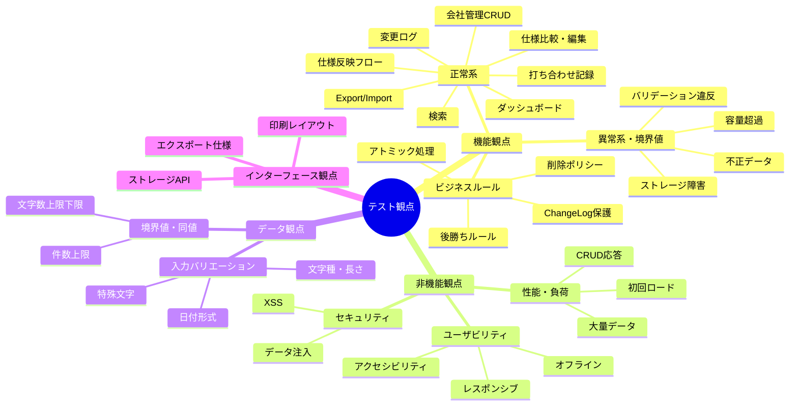
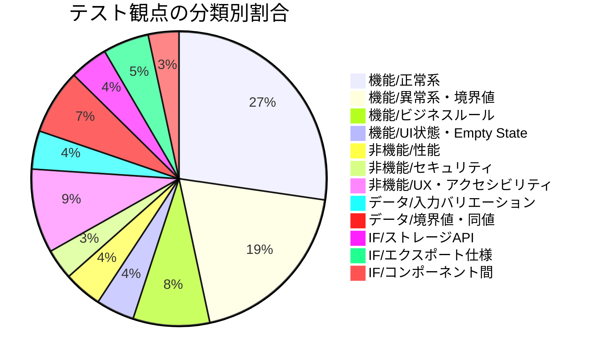
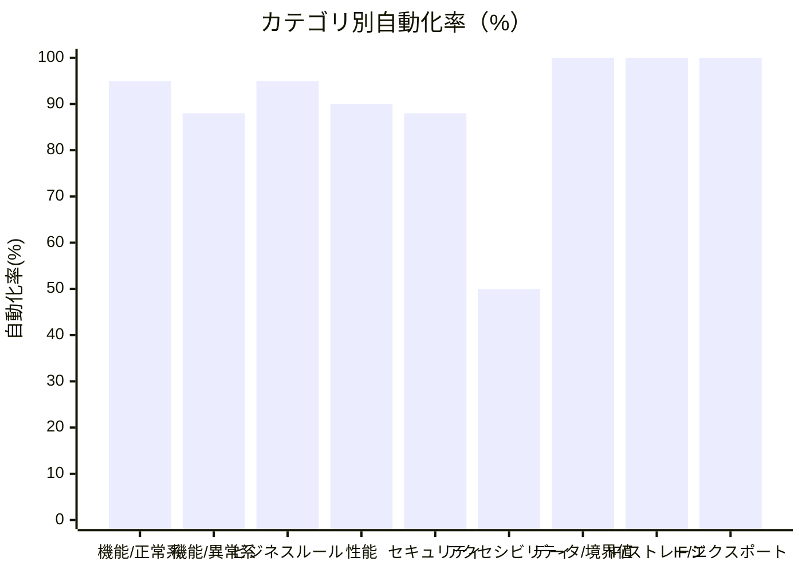

# 注文住宅管理ツール 網羅的テスト観点一覧

## 全体アーキテクチャとテスト観点の関係

---

## 1. 機能観点 — 正常系（Happy Path）

### 1-1. 会社管理

| 観点ID | 分類 | テスト観点 | 優先度 | 自動化可否 |
|--------|------|-----------|--------|----------|
| F-CM-001 | 機能/正常系 | 会社を全フィールド（name/type/contact/phone/email/status/note）入力して登録できる | 高 | ✅ UT+IT |
| F-CM-002 | 機能/正常系 | 必須フィールド（name/contact）のみで会社を登録できる | 高 | ✅ UT |
| F-CM-003 | 機能/正常系 | 登録済み会社の全フィールドを編集して保存できる | 高 | ✅ IT |
| F-CM-004 | 機能/正常系 | 会社を論理削除すると一覧から消え、アーカイブに表示される | 高 | ✅ IT |
| F-CM-005 | 機能/正常系 | ステータスフィルター（considering/candidate/rejected/contracted）で絞り込み表示できる | 中 | ✅ IT |
| F-CM-006 | 機能/正常系 | 契約済み会社が折りたたみ表示され、展開/閉じる操作ができる | 中 | ✅ E2E |
| F-CM-007 | 機能/正常系 | 会社詳細画面でその会社の打ち合わせ一覧・仕様値一覧がタブ切り替えで確認できる | 中 | ✅ E2E |
| F-CM-008 | 機能/正常系 | 会社詳細の打ち合わせ一覧でsummaryが先頭100文字で省略表示される | 低 | ✅ IT |
| F-CM-009 | 機能/正常系 | 会社typeが「maker/builder/other」の3種から選択できる | 中 | ✅ UT |
| F-CM-010 | 機能/正常系 | rejectionNoteフィールドに断り連絡メモを入力・保存・表示できる | 低 | ✅ IT |

### 1-2. 仕様比較

| 観点ID | 分類 | テスト観点 | 優先度 | 自動化可否 |
|--------|------|-----------|--------|----------|
| F-SC-001 | 機能/正常系 | カテゴリを新規作成・編集・論理削除できる | 高 | ✅ IT |
| F-SC-002 | 機能/正常系 | 仕様項目を新規作成・編集・論理削除できる | 高 | ✅ IT |
| F-SC-003 | 機能/正常系 | 仕様比較テーブルに各社の仕様値がカテゴリ別に表示される | 高 | ✅ E2E |
| F-SC-004 | 機能/正常系 | カテゴリの折りたたみ（▶/▼）が正常に動作する | 中 | ✅ E2E |
| F-SC-005 | 機能/正常系 | 会社列の表示/非表示トグルで2社絞り込み比較ができる | 中 | ✅ E2E |
| F-SC-006 | 機能/正常系 | 「未入力のみ表示」フィルターで空値セルのみ絞り込める | 中 | ✅ IT |
| F-SC-007 | 機能/正常系 | セルのインライン編集モーダルで値を変更・保存できる | 高 | ✅ E2E |
| F-SC-008 | 機能/正常系 | 仕様値セル編集時に打ち合わせをmeetingIdとして紐付けられる | 中 | ✅ IT |
| F-SC-009 | 機能/正常系 | 🔗クリックでmeetingIdリンクポップオーバーが表示され、打ち合わせ詳細へ遷移できる | 中 | ✅ E2E |
| F-SC-010 | 機能/正常系 | 仕様項目の▲▼矢印ボタンでsortOrderが入れ替わり表示順が変わる | 中 | ✅ IT |
| F-SC-011 | 機能/正常系 | 仕様項目の並び替えがリロード後も保持される | 高 | ✅ IT |
| F-SC-012 | 機能/正常系 | SpecItemNote（📝）をセルに追加・編集・物理削除できる | 中 | ✅ IT |
| F-SC-013 | 機能/正常系 | 値なしセルに「—」と「[入力+]」ボタンが表示される | 低 | ✅ E2E |
| F-SC-014 | 機能/正常系 | 会社数が多い場合にテーブルが横スクロールできる | 中 | 🖐️手動 |
| F-SC-015 | 機能/正常系 | 標準テンプレートの初期データ（5カテゴリ・各項目）が初回起動時に投入される | 高 | ✅ IT |

### 1-3. 打ち合わせ記録

| 観点ID | 分類 | テスト観点 | 優先度 | 自動化可否 |
|--------|------|-----------|--------|----------|
| F-MT-001 | 機能/正常系 | 打ち合わせを全フィールドで登録できる | 高 | ✅ E2E |
| F-MT-002 | 機能/正常系 | タイトルを省略した場合「YYYY-MM-DD 会社名」形式で自動生成される | 高 | ✅ UT |
| F-MT-003 | 機能/正常系 | 同一会社・同一日付の2件目タイトルに「(2)」が付与される | 中 | ✅ UT |
| F-MT-004 | 機能/正常系 | 同一会社・同一日付の3件目タイトルに「(3)」が付与される | 低 | ✅ UT |
| F-MT-005 | 機能/正常系 | attendeesのカンマ区切り入力が配列に正しくパースされる | 高 | ✅ UT |
| F-MT-006 | 機能/正常系 | 「前回の打ち合わせを参照」パネルに選択会社の直前打ち合わせが表示される | 中 | ✅ IT |
| F-MT-007 | 機能/正常系 | 打ち合わせに複数の決定事項を追加できる | 高 | ✅ E2E |
| F-MT-008 | 機能/正常系 | 打ち合わせ一覧が日付降順で表示される | 中 | ✅ IT |
| F-MT-009 | 機能/正常系 | 打ち合わせ一覧で会社フィルター・期間フィルターが機能する | 中 | ✅ IT |
| F-MT-010 | 機能/正常系 | 打ち合わせ一覧のページング（20件/ページ、前/次）が動作する | 中 | ✅ IT |
| F-MT-011 | 機能/正常系 | 打ち合わせを論理削除すると一覧から消える | 高 | ✅ IT |
| F-MT-012 | 機能/正常系 | 打ち合わせ詳細画面で全情報と決定事項一覧が表示される | 中 | ✅ E2E |
| F-MT-013 | 機能/正常系 | 決定事項のステータスを「保留→確定/キャンセル」に変更できる | 高 | ✅ IT |
| F-MT-014 | 機能/正常系 | 決定事項を物理削除できる（確認ダイアログが表示される） | 中 | ✅ E2E |

### 1-4. 仕様反映フロー

| 観点ID | 分類 | テスト観点 | 優先度 | 自動化可否 |
|--------|------|-----------|--------|----------|
| F-SR-001 | 機能/正常系 | 決定事項から「仕様に反映」ボタンで仕様反映確認ダイアログが開く | 高 | ✅ E2E |
| F-SR-002 | 機能/正常系 | ダイアログに変更前・変更後の値が正しく表示される | 高 | ✅ E2E |
| F-SR-003 | 機能/正常系 | 変更理由を入力して確定すると仕様比較テーブルに新しい値が反映される | 高 | ✅ E2E |
| F-SR-004 | 機能/正常系 | 仕様反映後にChangeLogが1件生成される | 高 | ✅ IT |
| F-SR-005 | 機能/正常系 | 変更理由がChangeLogのreasonフィールドに保存される | 高 | ✅ IT |
| F-SR-006 | 機能/正常系 | 「+ 新規仕様項目を作成して反映」選択時に仕様項目名・カテゴリ入力フォームが展開される | 高 | ✅ E2E |
| F-SR-007 | 機能/正常系 | 新規仕様項目を作成して仕様反映すると仕様比較テーブルに新項目が表示される | 高 | ✅ E2E |
| F-SR-008 | 機能/正常系 | 「+ 新規カテゴリ作成」オプションで新カテゴリを作成できる | 中 | ✅ E2E |
| F-SR-009 | 機能/正常系 | 変更理由なしでも仕様反映できる（reason省略可） | 中 | ✅ IT |

### 1-5. 変更ログ

| 観点ID | 分類 | テスト観点 | 優先度 | 自動化可否 |
|--------|------|-----------|--------|----------|
| F-CL-001 | 機能/正常系 | 変更ログが日付降順のタイムラインで表示される | 高 | ✅ IT |
| F-CL-002 | 機能/正常系 | 変更ログの各エントリに変更前・変更後の値・変更理由・打ち合わせリンクが表示される | 高 | ✅ IT |
| F-CL-003 | 機能/正常系 | 無限スクロールで初期30件表示後、追加20件ずつ読み込める | 中 | ✅ IT |
| F-CL-004 | 機能/正常系 | 会社/カテゴリ/期間フィルターで絞り込みができる | 中 | ✅ IT |
| F-CL-005 | 機能/正常系 | 変更ログの打ち合わせリンクから打ち合わせ詳細へ遷移できる | 中 | ✅ E2E |

### 1-6. ダッシュボード

| 観点ID | 分類 | テスト観点 | 優先度 | 自動化可否 |
|--------|------|-----------|--------|----------|
| F-DB-001 | 機能/正常系 | 4種サマリーカード（検討中・候補・打ち合わせ回数・未確定事項）の数値が実データと一致する | 高 | ✅ IT |
| F-DB-002 | 機能/正常系 | サマリーカードクリックで対応タブへフィルター適用済みで遷移する | 中 | ✅ E2E |
| F-DB-003 | 機能/正常系 | pending決定事項一覧に「確定する」ボタンが表示され、クリックでステータス変更モーダルが開く | 高 | ✅ E2E |
| F-DB-004 | 機能/正常系 | 直近5件の打ち合わせ・決定事項が表示される | 中 | ✅ IT |
| F-DB-005 | 機能/正常系 | 「全件を見る→」リンクで対応タブへ遷移できる | 低 | ✅ E2E |

### 1-7. 全文検索

| 観点ID | 分類 | テスト観点 | 優先度 | 自動化可否 |
|--------|------|-----------|--------|----------|
| F-GS-001 | 機能/正常系 | グローバル検索バーに入力するとMeeting/Decision/SpecItem/Companyを横断検索できる | 高 | ✅ IT |
| F-GS-002 | 機能/正常系 | 300msデバウンスで検索が実行される（入力中は実行されない） | 中 | ✅ UT |
| F-GS-003 | 機能/正常系 | 検索結果のマッチ箇所がハイライト表示される | 中 | ✅ E2E |
| F-GS-004 | 機能/正常系 | Meeting検索がagenda/summary/locationを対象に動作する | 中 | ✅ IT |
| F-GS-005 | 機能/正常系 | Decision検索がcontent/note/specValueを対象に動作する | 中 | ✅ IT |

### 1-8. エクスポート・インポート

| 観点ID | 分類 | テスト観点 | 優先度 | 自動化可否 |
|--------|------|-----------|--------|----------|
| F-EI-001 | 機能/正常系 | JSON全件エクスポートで全エンティティ（companies/categories/specItems/specItemNotes/meetings/decisions/changeLogs）が含まれる | 高 | ✅ IT |
| F-EI-002 | 機能/正常系 | エクスポートJSONにversion/exportedAtが含まれる | 中 | ✅ UT |
| F-EI-003 | 機能/正常系 | JSONインポート（マージ）で既存データを保持しつつ新データが追加される | 高 | ✅ IT |
| F-EI-004 | 機能/正常系 | JSONインポート（上書き）で既存データが置換される | 高 | ✅ IT |
| F-EI-005 | 機能/正常系 | CSVエクスポートで対象会社・確定済み/全件を選択してダウンロードできる | 中 | ✅ IT |
| F-EI-006 | 機能/正常系 | エクスポート→インポートの往復でデータが完全復元される | 高 | ✅ E2E |

### 1-9. 設定画面

| 観点ID | 分類 | テスト観点 | 優先度 | 自動化可否 |
|--------|------|-----------|--------|----------|
| F-ST-001 | 機能/正常系 | 設定画面でストレージ使用量がキー別にプログレスバーで表示される | 中 | ✅ E2E |
| F-ST-002 | 機能/正常系 | 設定画面で累積保存回数が表示される | 低 | ✅ IT |
| F-ST-003 | 機能/正常系 | 論理削除済みデータがアーカイブ表示で確認できる | 中 | ✅ E2E |
| F-ST-004 | 機能/正常系 | 「印刷プレビューを開く」ボタンでwindow.print()が呼び出される | 低 | ✅ UT |

---

## 2. 機能観点 — 異常系・境界値

### 2-1. バリデーション違反

| 観点ID | 分類 | テスト観点 | 優先度 | 自動化可否 |
|--------|------|-----------|--------|----------|
| F-VL-001 | 機能/異常系 | Company.nameが空文字の場合、フォーム送信を拒否しインラインエラーが表示される | 高 | ✅ UT |
| F-VL-002 | 機能/異常系 | Company.nameが51文字の場合エラーが表示される（50文字はOK） | 高 | ✅ UT |
| F-VL-003 | 機能/異常系 | Company.contactが空文字の場合エラーが表示される | 高 | ✅ UT |
| F-VL-004 | 機能/異常系 | Company.contactが31文字の場合エラーが表示される（30文字はOK） | 中 | ✅ UT |
| F-VL-005 | 機能/異常系 | Company.phoneにアルファベットを入力した場合エラーが表示される | 中 | ✅ UT |
| F-VL-006 | 機能/異常系 | Company.emailに「@」を含まない値を入力した場合エラーが表示される | 中 | ✅ UT |
| F-VL-007 | 機能/異常系 | Company.noteが501文字の場合エラーが表示される（500文字はOK） | 中 | ✅ UT |
| F-VL-008 | 機能/異常系 | Meeting.dateが空の場合エラーが表示される | 高 | ✅ UT |
| F-VL-009 | 機能/異常系 | Meeting.agendaが空の場合エラーが表示される | 高 | ✅ UT |
| F-VL-010 | 機能/異常系 | Meeting.agendaが1001文字の場合エラーが表示される（1000文字はOK） | 中 | ✅ UT |
| F-VL-011 | 機能/異常系 | Meeting.summaryが2001文字の場合エラーが表示される（2000文字はOK） | 中 | ✅ UT |
| F-VL-012 | 機能/異常系 | Meeting.attendeesが21件の場合エラーが表示される（20件はOK） | 中 | ✅ UT |
| F-VL-013 | 機能/異常系 | Meeting.attendeesの1要素が31文字の場合エラーが表示される（30文字はOK） | 中 | ✅ UT |
| F-VL-014 | 機能/異常系 | Meeting.locationが101文字の場合エラーが表示される（100文字はOK） | 低 | ✅ UT |
| F-VL-015 | 機能/異常系 | Decision.contentが空の場合エラーが表示される | 高 | ✅ UT |
| F-VL-016 | 機能/異常系 | Decision.contentが1001文字の場合エラーが表示される（1000文字はOK） | 中 | ✅ UT |
| F-VL-017 | 機能/異常系 | Decision.specValueが201文字の場合エラーが表示される（200文字はOK） | 中 | ✅ UT |
| F-VL-018 | 機能/異常系 | SpecItem.nameが空の場合エラーが表示される | 高 | ✅ UT |
| F-VL-019 | 機能/異常系 | SpecItem.nameが51文字の場合エラーが表示される（50文字はOK） | 中 | ✅ UT |
| F-VL-020 | 機能/異常系 | SpecItem.valueが201文字の場合エラーが表示される（200文字はOK） | 中 | ✅ UT |
| F-VL-021 | 機能/異常系 | Category.nameが空の場合エラーが表示される | 高 | ✅ UT |
| F-VL-022 | 機能/異常系 | Category.nameが31文字の場合エラーが表示される（30文字はOK） | 中 | ✅ UT |
| F-VL-023 | 機能/異常系 | SpecItemNote.noteが空の場合エラーが表示される | 中 | ✅ UT |
| F-VL-024 | 機能/異常系 | SpecItemNote.noteが201文字の場合エラーが表示される（200文字はOK） | 中 | ✅ UT |
| F-VL-025 | 機能/異常系 | フォーム送信時に複数の未入力必須項目がすべてハイライト表示される | 中 | ✅ E2E |
| F-VL-026 | 機能/異常系 | 文字数制限のリアルタイムカウンター（残り〇文字）が正しく更新される | 中 | ✅ E2E |

### 2-2. ストレージ障害・容量

| 観点ID | 分類 | テスト観点 | 優先度 | 自動化可否 |
|--------|------|-----------|--------|----------|
| F-SE-001 | 機能/異常系 | データ量400KB超過時にwarning Toastが表示される | 高 | ✅ UT |
| F-SE-002 | 機能/異常系 | QuotaExceededError発生時にエラーToastが表示される | 高 | ✅ UT |
| F-SE-003 | 機能/異常系 | window.storageが利用不可の場合localStorageにフォールバックする | 高 | ✅ UT |
| F-SE-004 | 機能/異常系 | 両ストレージ不可時に赤バナーが表示され保存ボタンが無効化される（書き込み不能モード） | 高 | ✅ E2E |
| F-SE-005 | 機能/異常系 | 書き込み不能モードでもUIの閲覧操作は継続できる | 中 | ✅ E2E |
| F-SE-006 | 機能/異常系 | 50回保存ごとにバックアップ推奨info Toastが表示される | 中 | ✅ UT |
| F-SE-007 | 機能/異常系 | 100回保存時にもバックアップ推奨Toastが表示される（50の倍数） | 低 | ✅ UT |

### 2-3. エッジケース

| 観点ID | 分類 | テスト観点 | 優先度 | 自動化可否 |
|--------|------|-----------|--------|----------|
| F-EC-001 | 機能/異常系 | 会社0件の状態で仕様比較タブを開くとEmpty Stateと「会社を登録する」ボタンが表示される（E1） | 高 | ✅ E2E |
| F-EC-002 | 機能/異常系 | 同一打ち合わせで同一仕様項目を2回更新した場合、後の値で上書きされChangeLogが2件記録される（E2） | 高 | ✅ IT |
| F-EC-003 | 機能/異常系 | 会社を論理削除後、その会社のSpecValueとChangeLogが残り「[削除済み会社]」ラベルで表示される（E3） | 高 | ✅ IT |
| F-EC-004 | 機能/異常系 | ImportでIDが衝突した場合、新UUIDが発行され参照整合性が再マッピングされる（E4） | 高 | ✅ IT |
| F-EC-005 | 機能/異常系 | 200文字超の仕様値はセルでmax-height省略表示され「全文を見る」で展開できる（E5） | 中 | ✅ E2E |
| F-EC-006 | 機能/異常系 | カテゴリ名の大文字小文字違い・前後スペース違いを重複として検出する（E6） | 高 | ✅ UT |
| F-EC-007 | 機能/異常系 | スキーマバージョン不一致データのマイグレーションが起動時に自動実行される（E7） | 高 | ✅ UT |
| F-EC-008 | 機能/異常系 | インポートファイルのバージョン不一致時に警告Toast表示後に続行できる（E9） | 高 | ✅ IT |
| F-EC-009 | 機能/異常系 | 仕様項目0件の状態で反映フロー起動時に「仕様項目を先に追加するか新規作成してください」案内が表示される（E10） | 高 | ✅ E2E |
| F-EC-010 | 機能/異常系 | 同一会社名を重複登録した際に警告Toastが表示されるが登録はできる（E11） | 中 | ✅ E2E |
| F-EC-011 | 機能/異常系 | 仕様反映フローの途中失敗時にSpecItemとChangeLogが両方ロールバックされToastが表示される（E12） | 高 | ✅ IT |
| F-EC-012 | 機能/異常系 | 全社落選/キャンセル状態のダッシュボードで「現在候補会社がありません」Empty Stateが表示される（E13） | 中 | ✅ E2E |
| F-EC-013 | 機能/異常系 | 削除済み仕様項目を参照するDecisionに「[削除済み仕様項目]」ラベルが表示される（E14） | 中 | ✅ IT |
| F-EC-014 | 機能/異常系 | 未来日付の打ち合わせ登録時に警告Toastが表示されるが登録は可能（E15） | 中 | ✅ E2E |
| F-EC-015 | 機能/異常系 | attendeesのカンマ区切りパースで前後空白・空要素が除去される（E16） | 高 | ✅ UT |
| F-EC-016 | 機能/異常系 | CSVエクスポートでカンマ・ダブルクォート・改行を含む値がRFC4180準拠でエスケープされる（E17） | 高 | ✅ UT |
| F-EC-017 | 機能/異常系 | 打ち合わせ一覧でsummaryが先頭100文字を超えた場合に省略表示される（E19） | 低 | ✅ IT |
| F-EC-018 | 機能/異常系 | ChangeLogはUIから削除操作が提供されない（削除ボタンが存在しない） | 高 | ✅ E2E |
| F-EC-019 | 機能/異常系 | インポート途中で保存失敗した場合、既存データが変更されない（アトミックインポート） | 高 | ✅ IT |
| F-EC-020 | 機能/異常系 | 仕様項目0件テンプレート読み込み促進メッセージと「テンプレートを読み込む」ボタンが表示される | 中 | ✅ E2E |

---

## 3. 機能観点 — ビジネスルール検証

| 観点ID | 分類 | テスト観点 | 優先度 | 自動化可否 |
|--------|------|-----------|--------|----------|
| F-BR-001 | 機能/ビジネスルール | Company論理削除時にSpecValue・Meeting・Decision・ChangeLogが保持される（削除ポリシー） | 高 | ✅ IT |
| F-BR-002 | 機能/ビジネスルール | Meeting論理削除時にDecisionも論理削除される（カスケード） | 高 | ✅ IT |
| F-BR-003 | 機能/ビジネスルール | Category論理削除時にSpecItemも論理削除される | 高 | ✅ IT |
| F-BR-004 | 機能/ビジネスルール | SpecItem論理削除時にSpecValueとChangeLogが保持される | 高 | ✅ IT |
| F-BR-005 | 機能/ビジネスルール | Decisionは物理削除のみ可能で、確認ダイアログが必須 | 中 | ✅ E2E |
| F-BR-006 | 機能/ビジネスルール | SpecItemNoteは物理削除のみ可能で、確認ダイアログが必須 | 中 | ✅ E2E |
| F-BR-007 | 機能/ビジネスルール | ChangeLogは削除不可（UIから削除操作が提供されない、APIも存在しない） | 最高 | ✅ IT+E2E |
| F-BR-008 | 機能/ビジネスルール | 仕様反映処理でSpecItemとChangeLogが同時保存される（アトミック） | 最高 | ✅ IT |
| F-BR-009 | 機能/ビジネスルール | 仕様反映処理失敗時に両方がロールバックされる | 最高 | ✅ IT |
| F-BR-010 | 機能/ビジネスルール | Category.normalizedNameによる重複チェックが機能する（大文字小文字・空白を正規化） | 高 | ✅ UT |
| F-BR-011 | 機能/ビジネスルール | 論理削除レコードは通常表示から除外される | 高 | ✅ IT |
| F-BR-012 | 機能/ビジネスルール | 論理削除レコードはアーカイブ表示から参照できる | 中 | ✅ E2E |
| F-BR-013 | 機能/ビジネスルール | 削除済みデータへの参照が残る場合「[削除済み]」ラベルが表示される | 高 | ✅ IT |
| F-BR-014 | 機能/ビジネスルール | SpecItem.name変更後、既存ChangeLogのspecItemIdは変更されない | 高 | ✅ IT |
| F-BR-015 | 機能/ビジネスルール | 変更ログ一覧では仕様項目の現在の名称で表示される（旧名称は保持しない） | 中 | ✅ IT |
| F-BR-016 | 機能/ビジネスルール | 後勝ちルール：同一打ち合わせで同一仕様項目を2回更新した場合、最後の値が反映される | 高 | ✅ IT |
| F-BR-017 | 機能/ビジネスルール | スキーマバージョンが一致している場合、マイグレーションがスキップされる | 中 | ✅ UT |
| F-BR-018 | 機能/ビジネスルール | マイグレーション後にschemaVersionとmigratedAtがMETAに保存される | 中 | ✅ UT |
| F-BR-019 | 機能/ビジネスルール | Phase2予約フィールド（deadline/quoteAmount等）は型定義に存在するが実装されていない | 低 | 🖐️手動 |
| F-BR-020 | 機能/ビジネスルール | SpecValue設計注記：SpecItem.values配列として格納される（独立エンティティではない） | 中 | ✅ IT |

---

## 4. 機能観点 — Empty State・UI状態遷移

| 観点ID | 分類 | テスト観点 | 優先度 | 自動化可否 |
|--------|------|-----------|--------|----------|
| F-ES-001 | 機能/UI状態 | ダッシュボードで会社0件時「まず会社を登録してはじめましょう」が表示され、CTAリンクが機能する | 高 | ✅ E2E |
| F-ES-002 | 機能/UI状態 | 会社管理で会社0件時「検討中の会社を登録してください」が表示される | 中 | ✅ E2E |
| F-ES-003 | 機能/UI状態 | 打ち合わせ0件時「打ち合わせ記録がありません」と「+ 打ち合わせを記録」ボタンが表示される | 中 | ✅ E2E |
| F-ES-004 | 機能/UI状態 | 変更ログ0件時「まだ仕様の変更がありません」が表示される | 中 | ✅ E2E |
| F-ES-005 | 機能/UI状態 | 検索結果0件時「〇〇に一致する記録が見つかりません」が表示される | 中 | ✅ E2E |
| F-ES-006 | 機能/UI状態 | 全社落選時のダッシュボードで「現在候補会社がありません」Empty Stateが表示される | 中 | ✅ E2E |
| F-ES-007 | 機能/UI状態 | Toast通知が4種（success/error/warning/info）表示でき、3秒後に自動消去される | 高 | ✅ E2E |
| F-ES-008 | 機能/UI状態 | 確認ダイアログがモーダル中央に表示され、キャンセル/確定が機能する | 高 | ✅ E2E |
| F-ES-009 | 機能/UI状態 | ローディングスピナーがコンテンツ中央オーバーレイで表示される | 低 | ✅ E2E |
| F-ES-010 | 機能/UI状態 | オフライン状態をnavigator.onLineで検知しヘッダー直下に黄色バナーが表示される | 高 | ✅ E2E |

---

## 5. 非機能観点 — 性能・負荷

| 観点ID | 分類 | テスト観点 | 優先度 | 自動化可否 |
|--------|------|-----------|--------|----------|
| NF-PF-001 | 非機能/性能 | 初回ロード（ストレージ読込）が3秒以内に完了する（計測条件: 会社10社・打ち合わせ100件・仕様項目50件・ChangeLog500件） | 高 | ✅ 自動 |
| NF-PF-002 | 非機能/性能 | タブ切り替えが500ms以内に完了する | 高 | ✅ 自動 |
| NF-PF-003 | 非機能/性能 | CRUD操作（保存）が1秒以内に完了する | 高 | ✅ 自動 |
| NF-PF-004 | 非機能/性能 | 仕様反映フロー（確定〜ChangeLog書き込み完了）が2秒以内に完了する | 高 | ✅ 自動 |
| NF-PF-005 | 非機能/性能 | JSONエクスポートがダウンロード開始まで3秒以内に完了する | 中 | ✅ 自動 |
| NF-PF-006 | 非機能/性能 | 会社50社・仕様項目100件での仕様比較テーブルが3秒以内にレンダリングされる（上限想定） | 中 | ✅ 自動 |
| NF-PF-007 | 非機能/性能 | ChangeLog500件での無限スクロール初期30件表示が1秒以内に完了する | 中 | ✅ 自動 |
| NF-PF-008 | 非機能/性能 | 全文検索300msデバウンス後の結果表示が500ms以内に完了する | 中 | ✅ 自動 |
| NF-PF-009 | 非機能/性能 | 50回連続保存後もパフォーマンス基準を維持できる（メモリリークなし） | 低 | 🖐️手動 |
| NF-PF-010 | 非機能/性能 | 長大なsummary（2000文字）を100件持つデータで打ち合わせ一覧が正常表示される | 低 | ✅ 自動 |

---

## 6. 非機能観点 — セキュリティ

| 観点ID | 分類 | テスト観点 | 優先度 | 自動化可否 |
|--------|------|-----------|--------|----------|
| NF-SC-001 | 非機能/セキュリティ | XSS: 会社名・打ち合わせ議題・決定事項にスクリプトタグ（``）を入力してもスクリプトが実行されない | 最高 | ✅ E2E |
| NF-SC-002 | 非機能/セキュリティ | XSS: 仕様値セルにHTMLタグを入力してもレンダリングされない（テキストとして表示される） | 高 | ✅ E2E |
| NF-SC-003 | 非機能/セキュリティ | XSS: 変更ログの変更前・変更後値にHTMLエンティティが含まれる場合もエスケープされる | 高 | ✅ IT |
| NF-SC-004 | 非機能/セキュリティ | JSONインポートで悪意あるJSONペイロードを入力してもスクリプトが実行されない | 高 | ✅ IT |
| NF-SC-005 | 非機能/セキュリティ | JSONインポートで`__proto__`や`constructor`などのプロトタイプ汚染キーが無視される | 高 | ✅ UT |
| NF-SC-006 | 非機能/セキュリティ | CSVエクスポートでCSVインジェクション（`=CMD|`等の数式文字）が含まれる値が適切にエスケープされる | 中 | ✅ UT |
| NF-SC-007 | 非機能/セキュリティ | URLフィールド（attachmentUrls）に`javascript:`スキームを入力してもコードが実行されない | 中 | ✅ UT |
| NF-SC-008 | 非機能/セキュリティ | ストレージキーに想定外のキー名（`__proto__`等）が混入しても動作が安全に保たれる | 中 | ✅ UT |

---

## 7. 非機能観点 — ユーザビリティ・アクセシビリティ

| 観点ID | 分類 | テスト観点 | 優先度 | 自動化可否 |
|--------|------|-----------|--------|----------|
| NF-UX-001 | 非機能/アクセシビリティ | 全インタラクティブ要素にfocus-visibleリングが適用される | 高 | 🖐️手動 |
| NF-UX-002 | 非機能/アクセシビリティ | Tab/Shift+Tabでフォーカス移動が正常に機能する | 高 | 🖐️手動 |
| NF-UX-003 | 非機能/アクセシビリティ | キーボードのみで全CRUD操作が完結できる | 高 | 🖐️手動 |
| NF-UX-004 | 非機能/アクセシビリティ | アイコンのみのボタンにaria-labelが設定されている | 高 | ✅ UT |
| NF-UX-005 | 非機能/アクセシビリティ | モーダルにrole="dialog" aria-modal="true" aria-labelledbyが設定されている | 高 | ✅ UT |
| NF-UX-006 | 非機能/アクセシビリティ | エラーメッセージがaria-live="polite"でスクリーンリーダーに通知される | 高 | ✅ UT |
| NF-UX-007 | 非機能/アクセシビリティ | 全入力フィールドにhtmlForで明示的に紐付けられたlabelが存在する | 高 | ✅ UT |
| NF-UX-008 | 非機能/アクセシビリティ | Empty Stateイラストにalt属性が設定されている | 中 | ✅ UT |
| NF-UX-009 | 非機能/アクセシビリティ | テキストのカラーコントラスト比が4.5:1以上（大テキストは3:1以上） | 高 | 🖐️手動 |
| NF-UX-010 | 非機能/アクセシビリティ | VoiceOver/NVDAでの読み上げが自然な順序で機能する | 中 | 🖐️手動 |
| NF-UX-011 | 非機能/レスポンシブ | デスクトップ（769px〜）でヘッダーナビゲーションが表示される | 高 | ✅ E2E |
| NF-UX-012 | 非機能/レスポンシブ | モバイル（〜768px）でボトムナビゲーションが表示される | 高 | ✅ E2E |
| NF-UX-013 | 非機能/レスポンシブ | モバイルでフォームが適切に表示・操作できる | 高 | 🖐️手動 |
| NF-UX-014 | 非機能/印刷 | @media printでナビゲーション・ボタン類が非表示になる | 中 | 🖐️手動 |
| NF-UX-015 | 非機能/印刷 | 仕様比較テーブルの印刷でテーブル全体が崩れずに印刷される | 中 | 🖐️手動 |
| NF-UX-016 | 非機能/印刷 | trのpage-break-inside: avoidで行が途中でページ分割されない | 低 | 🖐️手動 |
| NF-UX-017 | 非機能/オフライン | アプリロード後のオフライン状態でCRUD操作が継続できる | 高 | ✅ E2E |
| NF-UX-018 | 非機能/オフライン | オフライン→オンライン切り替え時にバナーが消える | 中 | 🖐️手動 |
| NF-UX-019 | 非機能/ブラウザ | ブラウザ戻るボタン操作でアプリ内ナビゲーションが崩れない（window.historyを使用しない） | 高 | 🖐️手動 |
| NF-UX-020 | 非機能/ブラウザ | Chrome最新2バージョンで全機能が動作する | 高 | ✅ E2E |
| NF-UX-021 | 非機能/ブラウザ | Edge最新2バージョンで全機能が動作する | 中 | ✅ E2E |
| NF-UX-022 | 非機能/ブラウザ | Safari最新2バージョンで全機能が動作する（iOS含む） | 中 | 🖐️手動 |

---

## 8. データ観点 — 入力データのバリエーション

| 観点ID | 分類 | テスト観点 | 優先度 | 自動化可否 |
|--------|------|-----------|--------|----------|
| DT-IN-001 | データ/入力バリエーション | 全角文字（日本語）を含む会社名・仕様値が正常に保存・表示される | 高 | ✅ IT |
| DT-IN-002 | データ/入力バリエーション | 半角英数字のみの入力が正常に保存・表示される | 中 | ✅ IT |
| DT-IN-003 | データ/入力バリエーション | 絵文字（🏠等）を含む入力が正常に保存・表示される | 低 | ✅ IT |
| DT-IN-004 | データ/入力バリエーション | 改行を含む議題・まとめが正常に保存・表示される | 中 | ✅ IT |
| DT-IN-005 | データ/入力バリエーション | 先頭・末尾の空白を含む入力値が保存時にトリムされる（またはトリムされない場合の仕様を確認） | 中 | ✅ UT |
| DT-IN-006 | データ/入力バリエーション | HTMLタグ文字列（`<b>`, `&amp;`等）がテキストとして保存・表示される | 高 | ✅ IT |
| DT-IN-007 | データ/入力バリエーション | JSON特殊文字（`"`, `\`, `/`）を含む仕様値がエクスポート・インポートで正確に復元される | 高 | ✅ IT |
| DT-IN-008 | データ/入力バリエーション | 数値のみの入力（電話番号、金額等）が文字列として保存される | 中 | ✅ UT |
| DT-IN-009 | データ/入力バリエーション | URLを含む入力値が正常に保存・表示される | 低 | ✅ IT |
| DT-IN-010 | データ/入力バリエーション | attendeesのカンマ区切りに全角カンマ（，）が含まれた場合の動作 | 低 | ✅ UT |

---

## 9. データ観点 — 境界値・同値分割

| 観点ID | 分類 | テスト観点 | 優先度 | 自動化可否 |
|--------|------|-----------|--------|----------|
| DT-BV-001 | データ/境界値 | Company.name: 1文字（最小値）・50文字（最大値）・51文字（超過）の3パターン | 高 | ✅ UT |
| DT-BV-002 | データ/境界値 | Meeting.agenda: 1文字・1000文字・1001文字の3パターン | 高 | ✅ UT |
| DT-BV-003 | データ/境界値 | Meeting.summary: 2000文字・2001文字の境界 | 中 | ✅ UT |
| DT-BV-004 | データ/境界値 | Meeting.attendees: 0件・1件・20件・21件の4パターン | 中 | ✅ UT |
| DT-BV-005 | データ/境界値 | SpecItem.value: 200文字・201文字の境界（セル崩れ防止） | 高 | ✅ UT |
| DT-BV-006 | データ/境界値 | SpecItemNote.note: 200文字・201文字の境界 | 中 | ✅ UT |
| DT-BV-007 | データ/境界値 | 打ち合わせ一覧ページング: 20件（1ページ内）・21件（2ページ）・0件の境界 | 中 | ✅ IT |
| DT-BV-008 | データ/境界値 | 変更ログ無限スクロール: 30件・31件（追加ロード発生）・0件の境界 | 中 | ✅ IT |
| DT-BV-009 | データ/境界値 | ストレージ容量警告: 399,999バイト（警告なし）・400,000バイト（警告あり）の境界 | 高 | ✅ UT |
| DT-BV-010 | データ/境界値 | 保存回数カウンター: 49回（通知なし）・50回（通知あり）・99回（通知なし）・100回（通知あり）の境界 | 中 | ✅ UT |
| DT-BV-011 | データ/境界値 | summary省略: 100文字（省略なし）・101文字（省略あり）の境界 | 低 | ✅ UT |
| DT-BV-012 | データ/同値分割 | Company.status: considering/candidate/rejected/contractedの4種すべてが正常に保存・表示される | 中 | ✅ UT |
| DT-BV-013 | データ/同値分割 | Decision.status: confirmed/pending/cancelledの3種すべてが正常に保存・表示される | 中 | ✅ UT |
| DT-BV-014 | データ/同値分割 | Company.type: maker/builder/otherの3種すべてが正常に保存・表示される | 中 | ✅ UT |
| DT-BV-015 | データ/同値分割 | 電話番号パターン: 有効（090-xxxx-xxxx, +81-xxx, (03)xxxx）・無効（アルファベット含む）の同値分割 | 中 | ✅ UT |
| DT-BV-016 | データ/同値分割 | 日付フォーマット: YYYY-MM-DD形式の有効値・無効値（YYYYMMDD, 2026/05/13等） | 高 | ✅ UT |
| DT-BV-017 | データ/同値分割 | sortOrder: 0（先頭）・中間・最末尾の3種でのmoveSpecItem動作 | 中 | ✅ UT |

---

## 10. インターフェース観点 — ストレージAPI

| 観点ID | 分類 | テスト観点 | 優先度 | 自動化可否 |
|--------|------|-----------|--------|----------|
| IF-SA-001 | IF/ストレージ | verifyStorageAPI()がwindow.storage正常時に"window.storage"を返す | 最高 | ✅ UT |
| IF-SA-002 | IF/ストレージ | verifyStorageAPI()が100KBの書き込みテストに成功する | 高 | ✅ UT |
| IF-SA-003 | IF/ストレージ | verifyStorageAPI()がwindow.storage不可時に"localStorage"を返す | 高 | ✅ UT |
| IF-SA-004 | IF/ストレージ | verifyStorageAPI()が両方不可時に"none"を返す | 高 | ✅ UT |
| IF-SA-005 | IF/ストレージ | 全STORAGE_KEYS定数が定義されている（META/COMPANIES/CATEGORIES/SPEC_ITEMS/MEETINGS/DECISIONS/CHANGE_LOGS/SPEC_ITEM_NOTES） | 高 | ✅ UT |
| IF-SA-006 | IF/ストレージ | saveWithCapacityCheck()がJSON.stringify後の長さで容量チェックする | 高 | ✅ UT |
| IF-SA-007 | IF/ストレージ | 各エンティティのload/save関数がJSON.parse/stringifyを正確に処理する | 高 | ✅ UT |
| IF-SA-008 | IF/ストレージ | safeStorageOperation()がQuotaExceededErrorを適切にキャッチしToastを表示する | 高 | ✅ UT |
| IF-SA-009 | IF/ストレージ | セッション（リロード）をまたいでデータが保持される | 最高 | ✅ IT |
| IF-SA-010 | IF/ストレージ | ストレージキーの__test__・__capacity_test__が検証後に削除される | 中 | ✅ UT |

---

## 11. インターフェース観点 — エクスポート仕様準拠

| 観点ID | 分類 | テスト観点 | 優先度 | 自動化可否 |
|--------|------|-----------|--------|----------|
| IF-EX-001 | IF/エクスポート | JSONエクスポートのversion フィールドが"1.0"である | 高 | ✅ UT |
| IF-EX-002 | IF/エクスポート | JSONエクスポートのexportedAtがISO8601形式の文字列である | 中 | ✅ UT |
| IF-EX-003 | IF/エクスポート | 論理削除済みエンティティもJSONエクスポートに含まれる | 高 | ✅ IT |
| IF-EX-004 | IF/エクスポート | ChangeLog全件がJSONエクスポートに含まれる | 高 | ✅ IT |
| IF-EX-005 | IF/エクスポート | CSVエクスポートの第1行がヘッダー行として出力される | 中 | ✅ UT |
| IF-EX-006 | IF/エクスポート | CSVエクスポートの値にカンマが含まれる場合、ダブルクォートで囲まれる（RFC4180） | 高 | ✅ UT |
| IF-EX-007 | IF/エクスポート | CSVエクスポートの値にダブルクォートが含まれる場合、`""`でエスケープされる（RFC4180） | 高 | ✅ UT |
| IF-EX-008 | IF/エクスポート | CSVエクスポートの値に改行（LF/CRLF）が含まれる場合、ダブルクォートで囲まれる（RFC4180） | 高 | ✅ UT |
| IF-EX-009 | IF/エクスポート | CSVエクスポートで特殊文字なしの値はダブルクォートなしで出力される | 中 | ✅ UT |
| IF-EX-010 | IF/エクスポート | JSONインポートでvalidateImportFile()がnull・配列・バージョン不一致を正しく検出する | 高 | ✅ UT |
| IF-EX-011 | IF/エクスポート | JSONインポートでresolveIdConflict()が衝突ID時に新UUIDを発行し、非衝突時は元IDを保持する | 高 | ✅ UT |
| IF-EX-012 | IF/エクスポート | JSONインポートで全エンティティのIDマッピングが整合する（Meetingの companyId等） | 高 | ✅ IT |

---

## 12. インターフェース観点 — コンポーネント間連携

| 観点ID | 分類 | テスト観点 | 優先度 | 自動化可否 |
|--------|------|-----------|--------|----------|
| IF-CI-001 | IF/コンポーネント間 | 打ち合わせ登録後、ダッシュボードの打ち合わせ件数が即座に更新される | 高 | ✅ IT |
| IF-CI-002 | IF/コンポーネント間 | 仕様反映後、仕様比較テーブルの該当セルに新しい値が表示される | 最高 | ✅ E2E |
| IF-CI-003 | IF/コンポーネント間 | 決定事項のステータスをconfirmedに変更後、ダッシュボードの未確定件数が減少する | 高 | ✅ IT |
| IF-CI-004 | IF/コンポーネント間 | 会社を論理削除後、打ち合わせ一覧・仕様比較テーブルに「[削除済み会社]」が表示される | 高 | ✅ IT |
| IF-CI-005 | IF/コンポーネント間 | 仕様項目のsortOrder変更後、全コンポーネントで新しい順序が反映される | 中 | ✅ IT |
| IF-CI-006 | IF/コンポーネント間 | 仕様比較テーブルのmeetingIdリンクが打ち合わせ詳細画面へ正確に遷移する | 中 | ✅ E2E |
| IF-CI-007 | IF/コンポーネント間 | 変更ログの打ち合わせリンクが対応する打ち合わせ詳細へ正確に遷移する | 中 | ✅ E2E |
| IF-CI-008 | IF/コンポーネント間 | ダッシュボードのサマリーカードクリックで対応タブへフィルター適用済みで遷移する | 中 | ✅ E2E |

---

## 観点マトリクスサマリー

### 優先度・自動化可否サマリー

| 優先度 | 件数 | 自動化可 | 手動 | 自動化率 |
|--------|------|---------|------|---------|
| 最高 | 12 | 11 | 1 | 91.7% |
| 高 | 128 | 113 | 15 | 88.3% |
| 中 | 82 | 68 | 14 | 82.9% |
| 低 | 16 | 11 | 5 | 68.8% |
| **合計** | **238** | **203** | **35** | **85.3%** |

### 観点カテゴリ別自動化率

> **手動テストが残る主な理由：** 印刷レイアウト（@media print目視確認）・スクリーンリーダー動作（VoiceOver/NVDA）・ブラウザ戻るボタン（Artifact環境固有制約）・モバイルUX定性評価・Safari/iOSの実機確認・探索的テスト