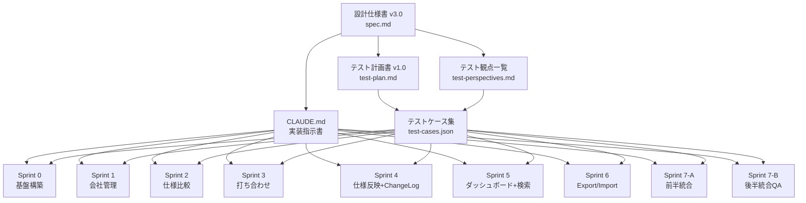
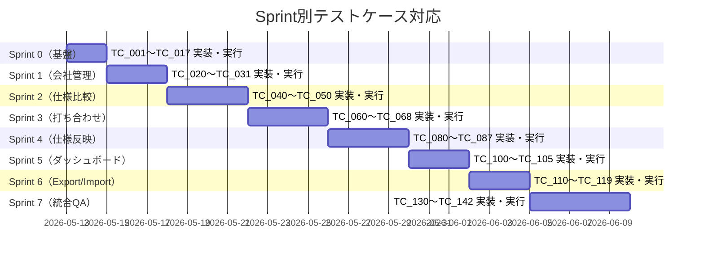

# 注文住宅管理ツール テストケース設計書

## 設計資料ドキュメント体系

まず全体のドキュメント構成を整理します。



---

## CLAUDE.md

```markdown
# CLAUDE.md — 注文住宅管理ツール 実装指示書 v3.0

## プロジェクト概要

注文住宅の建築検討を支援する単一JSXファイルのブラウザアプリ。
打ち合わせ記録・仕様比較・変更ログを一体管理する。

---

## 技術スタック

| 項目 | 内容 |
|------|------|
| フレームワーク | React 18 (JSX) |
| スタイリング | Tailwind CSS コアユーティリティクラス |
| アイコン | lucide-react |
| データ永続化 | window.storage (Artifact Storage API) |
| 動作環境 | Claude.ai Artifact (ブラウザ内) |
| ファイル構成 | 単一JSXファイル (app.jsx) |

---

## ファイル出力ルール

- **必ず `app.jsx` という単一ファイルに全コードを収める**
- セクションコメントで論理ブロックを明示すること
  ```javascript
  // ===== 1. 型定義・定数 =====
  // ===== 2. ストレージユーティリティ =====
  // ===== 3. 共通UIコンポーネント =====
  // ===== 4. 会社管理コンポーネント =====
  // ===== 5. 仕様比較コンポーネント =====
  // ===== 6. 打ち合わせコンポーネント =====
  // ===== 7. 変更ログコンポーネント =====
  // ===== 8. ダッシュボード =====
  // ===== 9. 設定・Import/Export =====
  // ===== 10. メインApp・ルーティング =====
  ```
- 1コンポーネント200行を超えない（超える場合は分割）
- Sprint単位で別Artifactとして生成し、Sprint 7で統合する

---

## ストレージ実装ルール（最重要）

### 優先度順フォールバック

```javascript
// Sprint 0 最初に必ず実行
async function verifyStorageAPI() {
  try {
    await window.storage.setItem("__test__", JSON.stringify({ ok: true }));
    const result = await window.storage.getItem("__test__");
    const parsed = JSON.parse(result);
    await window.storage.removeItem("__test__");
    if (parsed.ok) {
      const dummy = "x".repeat(100_000);
      await window.storage.setItem("__capacity_test__", dummy);
      await window.storage.removeItem("__capacity_test__");
      return "window.storage";
    }
  } catch (e) {
    try {
      localStorage.setItem("__fb_test__", "1");
      localStorage.removeItem("__fb_test__");
      return "localStorage";
    } catch (e2) {
      return "none"; // 書き込み不能モード
    }
  }
}
```

### ストレージキー定数（必須）

```javascript
const STORAGE_KEYS = {
  META:             "meta",
  COMPANIES:        "companies",
  CATEGORIES:       "categories",
  SPEC_ITEMS:       "spec_items",
  SPEC_ITEM_NOTES:  "spec_item_notes",  // 追加
  MEETINGS:         "meetings",
  DECISIONS:        "decisions",
  CHANGE_LOGS:      "change_logs",
};
```

### 容量管理

- 400KB超過 → warning Toast「データ量が多くなっています。JSONエクスポートでバックアップを推奨します。」
- QuotaExceededError → error Toast「容量上限に達しました」
- 50回保存ごと → info Toast「XX回保存しました。JSONエクスポートでバックアップをお勧めします。」

### 書き込み不能モード（"none"の場合）

- ヘッダーに赤色バナー表示：「データを保存できません。ブラウザの設定を確認してください」
- 全Saveボタンを `disabled` にする
- 操作継続は可能（セッション終了でデータ消失の旨を表示）

---

## データモデル実装ルール

### 削除ポリシー（厳守）

| 対象 | ポリシー |
|------|---------|
| Company / Category / SpecItem / Meeting | 論理削除（deletedAt をセット） |
| Decision / SpecItemNote | 物理削除（確認ダイアログ必須） |
| ChangeLog | **削除不可**（UIから削除操作を一切提供しない） |

### ID生成

```javascript
// 全エンティティのID生成
const newId = crypto.randomUUID();
```

### 論理削除パターン

```javascript
// 論理削除
const deleted = { ...entity, deletedAt: new Date().toISOString() };
// 有効データのフィルタ
const active = entities.filter(e => !e.deletedAt);
```

### 削除済み参照の表示

論理削除済みのCompany/SpecItemを参照する場合:
- 会社: `[削除済み会社]` ラベルを表示
- 仕様項目: `[削除済み仕様項目]` ラベルを表示

---

## バリデーションルール（必須実装）

```javascript
const VALIDATION = {
  Company:  { name: {required:true, maxLength:50}, contact:{required:true, maxLength:30},
              phone:{pattern:/^[\d\-\+\(\)\s]*$/}, email:{pattern:/^[^\s@]+@[^\s@]+\.[^\s@]+$/},
              note:{maxLength:500} },
  Meeting:  { date:{required:true}, agenda:{required:true, maxLength:1000},
              summary:{maxLength:2000}, attendees:{maxItems:20, itemMaxLength:30},
              location:{maxLength:100} },
  Decision: { content:{required:true, maxLength:1000}, specValue:{maxLength:200},
              note:{maxLength:500} },
  SpecItem: { name:{required:true, maxLength:50}, value:{maxLength:200} },
  Category: { name:{required:true, maxLength:30, unique:true} },
  SpecItemNote: { note:{required:true, maxLength:200} },
};
```

**エラー表示ルール:**
- フィールド直下にインラインエラー（赤文字）
- フォーム送信時に未入力必須項目をすべてハイライト
- 文字数制限はリアルタイムカウンター（残り〇文字）
- エラーは `aria-live="polite"` で通知

---

## 仕様反映フロー（アトミック処理）

```javascript
async function reflectToSpec(decision, reason) {
  const specItemBackup = deepClone(await loadSpecItem(decision.specItemId));
  const newSpecItem    = computeNewSpecItem(specItemBackup, decision);
  const newChangeLog   = buildChangeLog(specItemBackup, decision, reason);
  let changeLogSaved   = false;
  try {
    await Promise.all([
      saveSpecItem(newSpecItem),
      (async () => { await saveChangeLog(newChangeLog); changeLogSaved = true; })(),
    ]);
  } catch (e) {
    await saveSpecItem(specItemBackup);
    if (changeLogSaved) await deleteChangeLog(newChangeLog.id);
    showToast("error", "仕様の反映に失敗しました。元の状態に戻しました。");
    throw e;
  }
}
```

**後勝ちルール:** 同一打ち合わせで同一仕様項目を2回更新 → 後の値で上書き、ChangeLog は2件記録。

---

## 検索実装ルール

```javascript
const SearchTargets = {
  Meeting:  ["agenda", "summary", "location"],
  Decision: ["content", "note", "specValue"],
  SpecItem: ["name"],
  Company:  ["name", "contact", "note"],
};
// 300ms debounce + マッチ箇所ハイライト表示
```

---

## エクスポート・インポートルール

### JSONエクスポート形式
```json
{
  "version": "1.0",
  "exportedAt": "ISO文字列",
  "companies": [], "categories": [], "specItems": [],
  "specItemNotes": [], "meetings": [], "decisions": [], "changeLogs": []
}
```

### CSVエスケープ（RFC 4180準拠）
```javascript
function escapeCsvValue(value) {
  if (/[,"\n\r]/.test(value)) return `"${value.replace(/"/g, '""')}"`;
  return value;
}
```

### インポート: アトミック処理
- メモリ上でバリデーション→ID衝突解決→一括保存
- 途中失敗時は既存データを変更しない

---

## アクセシビリティ要件

- アイコンのみのボタン: `aria-label` 必須
- モーダル: `role="dialog" aria-modal="true" aria-labelledby` 必須
- エラー通知: `aria-live="polite"` 必須
- 全フォームフィールド: `<label htmlFor>` 明示的紐付け必須
- `focus-visible` リングを全インタラクティブ要素に適用

---

## 印刷対応

```css
@media print {
  header, nav, .no-print { display: none !important; }
  table { page-break-inside: auto; }
  tr    { page-break-inside: avoid; page-break-after: auto; }
}
```

---

## ブラウザ固有制約

- `window.history` API は使用禁止（Artifact環境）
- アプリ内ナビゲーションは独自タブ状態管理で制御
- `navigator.onLine` でオフライン検知 → 黄色バナー表示

---

## 標準テンプレート（初回起動時投入）

| カテゴリ | 項目 |
|---------|------|
| 断熱 | 断熱工法、断熱材の種類、断熱等性能等級（UA値）、床断熱材 |
| 開口部（窓） | サッシの種類、ガラスの種類、玄関ドアの種類 |
| 構造 | 工法、耐震等級、基礎の種類、地盤保証 |
| 設備（水回り） | キッチン、浴室、洗面台、トイレ |
| 保証・アフターサービス | 初期保証年数、長期保証の条件、定期点検の頻度 |

---

## Sprint 実装順序（必ず順番通りに実装）

```
Sprint 0 → Sprint 1 → Sprint 2 → Sprint 3
→ Sprint 4 → Sprint 5 → Sprint 6
→ Sprint 7-A → Sprint 7-B
```

各Sprintの完了条件チェックリストを全てクリアしてから次Sprintへ進むこと。

---

## data-testid 命名規則（テスト自動化用）

全インタラクティブ要素に `data-testid` 属性を付与する。

```
タブ:          tab-{name}           例: tab-companies
ボタン:        {action}-{entity}-button  例: add-company-button, save-company-button
入力:          {entity}-{field}-input    例: company-name-input
セレクト:      {entity}-{field}-select   例: company-type-select
カード:        {entity}-card             例: company-card
モーダル:      {entity}-{action}-modal   例: company-form-modal
ダイアログ:    {name}-dialog             例: spec-reflection-dialog
Toast:         toast-{type}             例: toast-success, toast-error
バナー:        {name}-banner            例: offline-banner, storage-unavailable-banner
```

---

## エラーメッセージ定数

```javascript
const StorageError = {
  QUOTA_EXCEEDED:       "容量上限に達しました。JSONエクスポートで容量を確保してください",
  READ_FAILED:          "データの読み込みに失敗しました。ページを再読み込みしてください",
  WRITE_FAILED:         "保存に失敗しました。しばらく待ってから再試行してください",
  PARSE_ERROR:          "データ形式が不正です。インポートファイルを確認してください",
  STORAGE_UNAVAILABLE:  "ストレージが利用できません。データは保存されません",
};
```

---

## Sprint別完了チェックリスト（実装後に確認）

### Sprint 0
- [ ] verifyStorageAPI() がコンソールに結果を出力する
- [ ] Toast 4種（success/error/warning/info）が表示される
- [ ] 確認ダイアログが表示・キャンセルできる
- [ ] タブナビゲーションが動作する
- [ ] オフライン検知バナーが表示される
- [ ] 書き込み不能モード時に赤バナーとSave無効化が機能する

### Sprint 1
- [ ] ストレージ書き込み後リロードしてもデータが残る
- [ ] 論理削除した会社が一覧に表示されない
- [ ] バリデーションエラーがインライン表示される
- [ ] 同一会社名で警告Toastが出る（登録はできる）

### Sprint 2
- [ ] カテゴリ名の重複が防止される（大文字小文字区別なし）
- [ ] セル編集後に仕様比較テーブルに値が反映される
- [ ] 会社0件時にEmpty Stateが表示される
- [ ] 仕様項目の順序が入れ替わり、リロード後も保持される
- [ ] 評価メモが保存・表示される

### Sprint 3
- [ ] 打ち合わせ登録後、会社詳細画面に反映される
- [ ] タイトル自動生成フォーマットが正しい
- [ ] 前回打ち合わせ参照パネルが正しい会社でフィルターされる
- [ ] 決定事項のステータスがダッシュボードの未確定件数に反映される
- [ ] 未来日付で警告Toastが表示される（登録は可能）
- [ ] 新規仕様項目を作成して反映するフローが動作する

### Sprint 4
- [ ] 同一仕様項目を2回更新するとChangeLogが2件記録される
- [ ] 仕様反映後、仕様比較テーブルに新しい値が反映される
- [ ] 反映フローの途中失敗時にロールバックされToastが出る
- [ ] ChangeLogにUIからの削除操作が存在しない

### Sprint 5
- [ ] サマリーカードの数値が実データと一致する
- [ ] 検索結果のマッチ箇所がハイライト表示される
- [ ] pendingの「確定する」ボタンでステータスが更新される
- [ ] 全社落選時にEmpty Stateが表示される

### Sprint 6
- [ ] JSONエクスポート→インポートで同一データが復元される
- [ ] ID衝突したデータが新IDで取り込まれ参照整合性が保たれる
- [ ] 容量超過時に警告Toastが表示される
- [ ] CSVでカンマ・改行含む値が正しくエスケープされる
- [ ] インポート中断時に既存データが変更されていない

### Sprint 7-A / 7-B
- [ ] 全テストスイート PASS
- [ ] カバレッジ 80% 以上
- [ ] エッジケース E1〜E20 全件確認済み
- [ ] パフォーマンス基準全項目達成
- [ ] 手動テスト全項目 PASS
```

---

## テストケース集（JSON形式）

以下が ClaudeCode 読み込み用テストケース JSON です。実装量が多いため、カテゴリ別に分割して出力します。

### test-cases-sprint0-storage.json

```json
{
  "test_suite": "Sprint0_Storage_Infrastructure",
  "description": "ストレージ基盤・マイグレーション・共通UIの単体テスト",
  "test_cases": [
    {
      "tc_id": "TC_001",
      "perspective_id": "IF-SA-001",
      "purpose": "window.storage が正常動作する場合、verifyStorageAPI() が 'window.storage' を返す",
      "precondition": "window.storage が利用可能な環境",
      "steps": [
        "1. window.storage モックを正常動作するよう設定する",
        "2. verifyStorageAPI() を呼び出す",
        "3. 戻り値を検証する",
        "4. __test__ と __capacity_test__ キーが削除されていることを確認する"
      ],
      "input_data": {
        "mock_storage": "available=true, capacity=1000000"
      },
      "expected_result": "戻り値が 'window.storage' であること。__test__ および __capacity_test__ キーがストレージに残っていないこと。",
      "automation_hint": "Vitest + jsdom。global.window.storage = mockStorage({ available: true }) でモック設定。IF-SA-010 の「テストキー削除確認」も同時検証可能。"
    },
    {
      "tc_id": "TC_002",
      "perspective_id": "IF-SA-003",
      "purpose": "window.storage が利用不可の場合、localStorage にフォールバックして 'localStorage' を返す",
      "precondition": "window.storage が利用不可・localStorage が利用可能な環境",
      "steps": [
        "1. window.storage モックを setItem 呼び出し時に例外をスローするよう設定する",
        "2. localStorage モックを正常動作するよう設定する",
        "3. verifyStorageAPI() を呼び出す",
        "4. 戻り値を検証する"
      ],
      "input_data": {
        "window_storage": "throwError=true",
        "localStorage": "available=true"
      },
      "expected_result": "戻り値が 'localStorage' であること。",
      "automation_hint": "global.window.storage = mockStorage({ available: false }); global.localStorage = mockStorage({ available: true })。E8 対応テスト。"
    },
    {
      "tc_id": "TC_003",
      "perspective_id": "IF-SA-004",
      "purpose": "window.storage と localStorage の両方が利用不可の場合、'none' を返す",
      "precondition": "window.storage および localStorage が共に利用不可な環境",
      "steps": [
        "1. window.storage モックを例外スローに設定",
        "2. localStorage モックも例外スローに設定",
        "3. verifyStorageAPI() を呼び出す",
        "4. 戻り値を検証する"
      ],
      "input_data": {
        "window_storage": "throwError=true",
        "localStorage": "throwError=true"
      },
      "expected_result": "戻り値が 'none' であること。",
      "automation_hint": "E20 対応テスト。書き込み不能モードのトリガー確認。"
    },
    {
      "tc_id": "TC_004",
      "perspective_id": "IF-SA-002",
      "purpose": "verifyStorageAPI() の 100KB 書き込みテストが成功する",
      "precondition": "window.storage が利用可能で容量が十分ある環境",
      "steps": [
        "1. window.storage モックを利用可能・容量 1MB に設定",
        "2. verifyStorageAPI() を呼び出す",
        "3. 100KB（100,000文字）のダミーデータが書き込まれ・削除されることを確認する"
      ],
      "input_data": {
        "dummy_data_size": "100000 bytes ('x'.repeat(100000))"
      },
      "expected_result": "例外が発生せず、戻り値が 'window.storage' であること。",
      "automation_hint": "mockStorage に capacity オプションを持たせ、書き込みバイト数を追跡する実装が必要。"
    },
    {
      "tc_id": "TC_005",
      "perspective_id": "F-SE-001",
      "purpose": "saveWithCapacityCheck() でデータ量が 400KB を超えた場合に warning Toast が表示される",
      "precondition": "ストレージが利用可能な状態",
      "steps": [
        "1. 400,001 文字のデータを用意する",
        "2. saveWithCapacityCheck('test_key', data) を呼び出す",
        "3. Toast の呼び出しを検証する"
      ],
      "input_data": {
        "data_length": 400001,
        "data": "'x'.repeat(400001)"
      },
      "expected_result": "showToast が ('warning', '...バックアップ...' を含む文字列) で呼び出されること。ストレージへの書き込みは実行されること。",
      "automation_hint": "jest.fn() で showToast をスパイ。expect(toastSpy).toHaveBeenCalledWith('warning', expect.stringContaining('バックアップ'))。"
    },
    {
      "tc_id": "TC_006",
      "perspective_id": "F-SE-001",
      "purpose": "saveWithCapacityCheck() でデータ量が 400KB 以下の場合に warning Toast が表示されない",
      "precondition": "ストレージが利用可能な状態",
      "steps": [
        "1. 399,999 文字のデータを用意する",
        "2. saveWithCapacityCheck('test_key', data) を呼び出す",
        "3. Toast が呼び出されないことを確認する"
      ],
      "input_data": {
        "data_length": 399999,
        "data": "'x'.repeat(399999)"
      },
      "expected_result": "showToast が warning で呼び出されないこと。",
      "automation_hint": "DT-BV-009 の境界値（400,000バイト付近）テストと組み合わせ可能。"
    },
    {
      "tc_id": "TC_007",
      "perspective_id": "F-SE-002",
      "purpose": "QuotaExceededError 発生時にエラー Toast が表示される",
      "precondition": "ストレージが QuotaExceededError をスローするよう設定",
      "steps": [
        "1. storage.setItem が QuotaExceededError をスローするモックを設定",
        "2. saveWithCapacityCheck または safeStorageOperation を呼び出す",
        "3. Toast の呼び出しを検証する",
        "4. 例外が再スローされることを確認する"
      ],
      "input_data": {
        "error_type": "QuotaExceededError",
        "key": "companies",
        "value": "[{...}]"
      },
      "expected_result": "showToast が ('error', '容量上限...' を含む文字列) で呼び出されること。エラーが呼び出し元まで伝播すること。",
      "automation_hint": "mockStorage({ throwOn: 'setItem', error: 'QuotaExceededError' }) を使用。"
    },
    {
      "tc_id": "TC_008",
      "perspective_id": "F-SE-006",
      "purpose": "保存回数が 50 回に達したとき、バックアップ推奨 info Toast が表示される",
      "precondition": "保存回数カウンターが 49 の状態",
      "steps": [
        "1. META ストレージに saveCount: 49 をセットする",
        "2. incrementSaveCount() を呼び出す",
        "3. Toast の呼び出しを検証する",
        "4. META の saveCount が 50 になっていることを確認する"
      ],
      "input_data": {
        "initial_save_count": 49
      },
      "expected_result": "showToast が ('info', '50回保存' を含む文字列) で呼び出されること。META.saveCount が 50 になること。",
      "automation_hint": "simulateSaveCount(49) ヘルパーで事前状態設定。DT-BV-010 の境界値テスト。"
    },
    {
      "tc_id": "TC_009",
      "perspective_id": "F-SE-006",
      "purpose": "保存回数が 49 回のとき Toast が表示されない（境界値）",
      "precondition": "保存回数カウンターが 48 の状態",
      "steps": [
        "1. META ストレージに saveCount: 48 をセットする",
        "2. incrementSaveCount() を呼び出す",
        "3. Toast が呼び出されないことを確認する"
      ],
      "input_data": {
        "initial_save_count": 48
      },
      "expected_result": "showToast が info で呼び出されないこと。META.saveCount が 49 になること。",
      "automation_hint": "expect(toastSpy).not.toHaveBeenCalledWith('info', expect.anything())。"
    },
    {
      "tc_id": "TC_010",
      "perspective_id": "F-SE-007",
      "purpose": "保存回数が 100 回（50 の倍数）でも Toast が表示される",
      "precondition": "保存回数カウンターが 99 の状態",
      "steps": [
        "1. META ストレージに saveCount: 99 をセットする",
        "2. incrementSaveCount() を呼び出す",
        "3. Toast の呼び出しを検証する"
      ],
      "input_data": {
        "initial_save_count": 99
      },
      "expected_result": "showToast が ('info', '100回保存' を含む文字列) で呼び出されること。",
      "automation_hint": "DT-BV-010 の 100回境界値。"
    }
  ]
}
```

### test-cases-sprint0-migration.json

```json
{
  "test_suite": "Sprint0_Migration",
  "description": "スキーママイグレーション単体テスト",
  "test_cases": [
    {
      "tc_id": "TC_011",
      "perspective_id": "F-EC-007",
      "purpose": "migrateV0toV1: normalizedName が存在しない Category に name.trim().toLowerCase() の値が追加される",
      "precondition": "normalizedName フィールドを持たない v0 データが存在する",
      "steps": [
        "1. normalizedName を持たない Category を含む v0 データを用意する（name に前後スペースあり）",
        "2. migrateV0toV1(v0Data) を呼び出す",
        "3. 結果の categories[0].normalizedName を検証する"
      ],
      "input_data": {
        "v0Data": {
          "categories": [{"id": "c1", "name": "  断熱  "}],
          "spec_items": []
        }
      },
      "expected_result": "result.categories[0].normalizedName が '断熱' であること（trim + toLowerCase 適用済み）。",
      "automation_hint": "UT-02-01 対応。name の前後スペースが除去されることを確認。"
    },
    {
      "tc_id": "TC_012",
      "perspective_id": "F-EC-007",
      "purpose": "migrateV0toV1: 既存の normalizedName は上書きされない",
      "precondition": "normalizedName フィールドが既に存在する Category データ",
      "steps": [
        "1. normalizedName: 'existing' を持つ Category を含むデータを用意する",
        "2. migrateV0toV1(data) を呼び出す",
        "3. 結果の normalizedName が変更されていないことを確認する"
      ],
      "input_data": {
        "v0Data": {
          "categories": [{"id": "c1", "name": "断熱", "normalizedName": "existing"}],
          "spec_items": []
        }
      },
      "expected_result": "result.categories[0].normalizedName が 'existing' のまま変化しないこと。",
      "automation_hint": "Nullish coalescing (??) の動作確認。"
    },
    {
      "tc_id": "TC_013",
      "perspective_id": "F-EC-007",
      "purpose": "migrateV0toV1: sortOrder が存在しない SpecItem にインデックス番号が付与される",
      "precondition": "sortOrder を持たない SpecItem が複数存在する v0 データ",
      "steps": [
        "1. sortOrder を持たない SpecItem を2件含む v0 データを用意する",
        "2. migrateV0toV1(v0Data) を呼び出す",
        "3. 各 SpecItem の sortOrder を検証する"
      ],
      "input_data": {
        "v0Data": {
          "categories": [],
          "spec_items": [
            {"id": "s1", "name": "項目A"},
            {"id": "s2", "name": "項目B"}
          ]
        }
      },
      "expected_result": "result.spec_items[0].sortOrder が 0、result.spec_items[1].sortOrder が 1 であること。",
      "automation_hint": "UT-02-03 対応。配列インデックスをそのまま sortOrder に使用する動作を確認。"
    },
    {
      "tc_id": "TC_014",
      "perspective_id": "F-EC-007",
      "purpose": "migrateV0toV1: categories が空配列でもエラーにならない",
      "precondition": "categories が空配列の v0 データ",
      "steps": [
        "1. categories: [], spec_items: [] の v0 データを用意する",
        "2. migrateV0toV1(v0Data) を呼び出す",
        "3. 例外が発生しないことを確認する"
      ],
      "input_data": {
        "v0Data": {"categories": [], "spec_items": []}
      },
      "expected_result": "例外が発生せず、正常に処理が完了すること。",
      "automation_hint": "await expect(migrateV0toV1(v0Data)).resolves.not.toThrow()。"
    },
    {
      "tc_id": "TC_015",
      "perspective_id": "F-EC-007",
      "purpose": "migrateV0toV1: spec_items が undefined でもエラーにならない",
      "precondition": "spec_items フィールドが存在しない v0 データ",
      "steps": [
        "1. categories のみを持つ v0 データを用意する（spec_items 未定義）",
        "2. migrateV0toV1(v0Data) を呼び出す",
        "3. 例外が発生しないことを確認する"
      ],
      "input_data": {
        "v0Data": {"categories": []}
      },
      "expected_result": "例外が発生せず、正常に処理が完了すること。Nullish coalescing (?? []) が正しく動作すること。",
      "automation_hint": "UT-02-05 対応。"
    },
    {
      "tc_id": "TC_016",
      "perspective_id": "F-BR-017",
      "purpose": "runMigrations: schemaVersion が一致している場合にマイグレーションをスキップする",
      "precondition": "META に schemaVersion: '1.0.0' が保存されている状態",
      "steps": [
        "1. META ストレージに schemaVersion: '1.0.0' をセットする",
        "2. runMigrations() を呼び出す",
        "3. マイグレーション関数が呼び出されていないことを確認する"
      ],
      "input_data": {
        "meta": {"schemaVersion": "1.0.0"}
      },
      "expected_result": "migrateSpy が呼び出されないこと。",
      "automation_hint": "UT-02-06 対応。migrateSpy = jest.fn() でスパイを差し込む。"
    },
    {
      "tc_id": "TC_017",
      "perspective_id": "F-BR-018",
      "purpose": "runMigrations: マイグレーション完了後に schemaVersion と migratedAt が META に更新される",
      "precondition": "META に schemaVersion: '0.0.0' が保存されている状態",
      "steps": [
        "1. META ストレージに schemaVersion: '0.0.0' をセットする",
        "2. runMigrations() を呼び出す",
        "3. META の schemaVersion を確認する",
        "4. META の migratedAt を確認する"
      ],
      "input_data": {
        "meta": {"schemaVersion": "0.0.0"}
      },
      "expected_result": "META.schemaVersion が '1.0.0' になること。META.migratedAt が ISO8601 形式の文字列であること。",
      "automation_hint": "UT-02-07 対応。new Date().toISOString() の形式チェックには /^\\d{4}-\\d{2}-\\d{2}T/ の正規表現を使用。"
    }
  ]
}
```

### test-cases-sprint1-company.json

```json
{
  "test_suite": "Sprint1_Company_Management",
  "description": "会社管理 CRUD・バリデーション・削除ポリシーのテスト",
  "test_cases": [
    {
      "tc_id": "TC_020",
      "perspective_id": "F-CM-001",
      "purpose": "全フィールドを入力して会社を正常に登録できる",
      "precondition": "会社管理タブが表示されている状態",
      "steps": [
        "1. 会社管理タブを開く",
        "2. 「+ 会社を追加」ボタンをクリックする",
        "3. 全フィールドに有効な値を入力する",
        "4. 「保存」ボタンをクリックする",
        "5. 会社一覧に新規会社が表示されることを確認する",
        "6. success Toast が表示されることを確認する",
        "7. リロード後もデータが保持されることを確認する"
      ],
      "input_data": {
        "name": "テストハウスメーカー株式会社",
        "type": "maker",
        "contact": "田中太郎",
        "phone": "090-1234-5678",
        "email": "tanaka@test-house.co.jp",
        "status": "considering",
        "note": "展示場で名刺をもらった会社"
      },
      "expected_result": "会社一覧に「テストハウスメーカー株式会社」が表示されること。success Toast が3秒表示されること。リロード後も同データが表示されること。",
      "automation_hint": "E2E (Playwright): data-testid='tab-companies' → data-testid='add-company-button' → 各フィールド入力 → data-testid='save-company-button'。結合テスト: ストレージに正しいキーで保存されることを確認。"
    },
    {
      "tc_id": "TC_021",
      "perspective_id": "F-CM-002",
      "purpose": "必須フィールド（name/contact）のみで会社を登録できる",
      "precondition": "会社管理タブが表示されている状態",
      "steps": [
        "1. 「+ 会社を追加」ボタンをクリックする",
        "2. name と contact のみ入力する",
        "3. その他フィールドは空欄のまま保存する"
      ],
      "input_data": {
        "name": "A工務店",
        "contact": "鈴木一郎"
      },
      "expected_result": "バリデーションエラーが発生せず登録成功すること。phone/email/note が undefined または空文字で保存されること。",
      "automation_hint": "UT: validateCompany({ name: 'A工務店', contact: '鈴木一郎' }) がエラーオブジェクトを返さないことを確認。"
    },
    {
      "tc_id": "TC_022",
      "perspective_id": "F-VL-001",
      "purpose": "Company.name が空文字の場合、フォーム送信を拒否しインラインエラーが表示される",
      "precondition": "会社追加フォームが表示されている状態",
      "steps": [
        "1. 「+ 会社を追加」ボタンをクリックする",
        "2. name を空欄のまま、contact に「担当者名」を入力する",
        "3. 「保存」ボタンをクリックする",
        "4. エラーメッセージの表示を確認する",
        "5. フォームが閉じていないことを確認する"
      ],
      "input_data": {
        "name": "",
        "contact": "担当者名"
      },
      "expected_result": "name フィールド直下に赤色のインラインエラーが表示されること。フォームが閉じずに残ること。ストレージへの書き込みが行われないこと。",
      "automation_hint": "UT: validateCompany({ name: '' }) の戻り値に 'name' キーが含まれること。E2E: data-testid='company-name-error' が表示されること。"
    },
    {
      "tc_id": "TC_023",
      "perspective_id": "F-VL-002",
      "purpose": "Company.name が 50 文字はOK、51 文字はエラーになる（境界値）",
      "precondition": "会社追加フォームが表示されている状態",
      "steps": [
        "1. name に 50 文字の文字列を入力して保存する → 成功を確認",
        "2. name に 51 文字の文字列を入力して保存する → エラーを確認"
      ],
      "input_data": {
        "name_50chars": "あいうえおかきくけこさしすせそたちつてとなにぬねのはひふへほまみむめもやゆよらりるれろわをん",
        "name_51chars": "あいうえおかきくけこさしすせそたちつてとなにぬねのはひふへほまみむめもやゆよらりるれろわをんあ"
      },
      "expected_result": "50文字: 保存成功。51文字: name フィールドにエラーが表示され保存されないこと。",
      "automation_hint": "UT: validateCompany({ name: 'a'.repeat(50) }) → エラーなし。validateCompany({ name: 'a'.repeat(51) }) → errors.name 存在。DT-BV-001 対応。"
    },
    {
      "tc_id": "TC_024",
      "perspective_id": "F-VL-005",
      "purpose": "電話番号にアルファベットを含む場合エラーが表示される",
      "precondition": "会社追加フォームが表示されている状態",
      "steps": [
        "1. name と contact に有効な値を入力する",
        "2. phone に 'invalid-phone' を入力する",
        "3. 「保存」ボタンをクリックする",
        "4. phone フィールドのエラーを確認する"
      ],
      "input_data": {
        "name": "A社",
        "contact": "担当",
        "phone": "invalid-phone"
      },
      "expected_result": "phone フィールド直下にエラーメッセージが表示されること。",
      "automation_hint": "UT: validateCompany({ name: 'A社', contact: '担当', phone: 'invalid-phone' }).phone が存在すること。"
    },
    {
      "tc_id": "TC_025",
      "perspective_id": "F-VL-005",
      "purpose": "有効な電話番号パターン（複数形式）が許可される",
      "precondition": "バリデーション関数が実装されている状態",
      "steps": [
        "1. 各電話番号パターンで validateCompany を呼び出す"
      ],
      "input_data": {
        "valid_phones": ["090-1234-5678", "+81-3-1234-5678", "(03) 1234-5678", "0120-000-000"]
      },
      "expected_result": "全パターンで errors.phone が存在しないこと。",
      "automation_hint": "UT: パラメータ化テスト (test.each) で全パターンを検証。DT-BV-015 対応。"
    },
    {
      "tc_id": "TC_026",
      "perspective_id": "F-VL-006",
      "purpose": "'@' を含まないメールアドレスでエラーが表示される",
      "precondition": "バリデーション関数が実装されている状態",
      "steps": [
        "1. email に '@' なしの値を入力して saveCompany を呼び出す"
      ],
      "input_data": {
        "name": "A社",
        "contact": "担当",
        "email": "invalid-email-no-at-sign"
      },
      "expected_result": "errors.email が存在すること。",
      "automation_hint": "UT: validateCompany({ ..., email: 'invalid-email-no-at-sign' }).email が存在すること。"
    },
    {
      "tc_id": "TC_027",
      "perspective_id": "F-CM-004",
      "purpose": "会社を論理削除すると一覧から消え、アーカイブに表示される",
      "precondition": "テスト用会社「削除テスト社」が登録されている状態",
      "steps": [
        "1. 「削除テスト社」の削除ボタンをクリックする",
        "2. 確認ダイアログで「確定」をクリックする",
        "3. 会社一覧に表示されないことを確認する",
        "4. 設定画面のアーカイブ表示で確認できることを確認する",
        "5. ストレージのデータに deletedAt が設定されていることを確認する"
      ],
      "input_data": {
        "company_name": "削除テスト社",
        "company_id": "test-company-uuid-001"
      },
      "expected_result": "会社一覧に「削除テスト社」が表示されないこと。ストレージの該当レコードに deletedAt が ISO8601 形式で設定されること。アーカイブ表示では確認できること。",
      "automation_hint": "IT: deleteCompany 後に loadActiveCompanies でフィルタリングされることを確認。F-BR-001 との組み合わせで Meeting/Decision/ChangeLog の保持を同時検証。"
    },
    {
      "tc_id": "TC_028",
      "perspective_id": "F-EC-010",
      "purpose": "同一会社名を重複登録した際に警告 Toast が表示されるが登録はできる（E11）",
      "precondition": "会社名「A社」が既に登録されている状態",
      "steps": [
        "1. 「+ 会社を追加」ボタンをクリックする",
        "2. name に「A社」、contact に「担当B」を入力する",
        "3. 「保存」ボタンをクリックする",
        "4. warning Toast が表示されることを確認する",
        "5. 会社一覧に「A社」が2件表示されることを確認する"
      ],
      "input_data": {
        "existing_company": {"name": "A社", "contact": "担当A"},
        "new_company": {"name": "A社", "contact": "担当B"}
      },
      "expected_result": "warning Toast が表示されること。フォームが閉じ登録が完了すること。会社一覧に「A社」が2件以上表示されること（ブロックされないこと）。",
      "automation_hint": "E2E: data-testid='toast-warning' が表示された後、data-testid='company-card' が2件以上存在することを確認。"
    },
    {
      "tc_id": "TC_029",
      "perspective_id": "F-CM-007",
      "purpose": "会社詳細画面でその会社の打ち合わせ一覧と仕様値一覧がタブ切り替えで確認できる",
      "precondition": "「テスト社」の登録・打ち合わせ1件・仕様値1件が存在する状態",
      "steps": [
        "1. 会社一覧で「テスト社」をクリックする",
        "2. 「打ち合わせ」タブをクリックして打ち合わせ一覧を確認する",
        "3. 「仕様値」タブをクリックして仕様値一覧を確認する"
      ],
      "input_data": {
        "company_name": "テスト社",
        "meeting": {"date": "2026-05-13", "agenda": "初回打合せ"},
        "spec_value": {"item": "断熱材の種類", "value": "GW 16K"}
      },
      "expected_result": "打ち合わせタブに「初回打合せ」の記録が表示されること。仕様値タブに「断熱材の種類: GW 16K」が表示されること。",
      "automation_hint": "E2E: Playwright でタブ切り替え動作を確認。IT: CompanyDetailPage コンポーネントに正しいデータが渡されることを確認。"
    },
    {
      "tc_id": "TC_030",
      "perspective_id": "F-CM-008",
      "purpose": "会社詳細の打ち合わせ一覧で summary が先頭 100 文字で省略表示される",
      "precondition": "summary が 101 文字以上の打ち合わせが存在する状態",
      "steps": [
        "1. summary に 200 文字の文字列を持つ打ち合わせを登録する",
        "2. 会社詳細画面を開く",
        "3. 打ち合わせ一覧の summary 表示を確認する"
      ],
      "input_data": {
        "summary_length": 200,
        "summary": "あ".repeat(200)
      },
      "expected_result": "表示される summary が先頭 100 文字で省略（... または truncate）されること。フルテキストが表示されないこと。",
      "automation_hint": "IT: summary.slice(0, 100) + '...' の出力を確認。DT-BV-011 対応（100文字/101文字境界値）。"
    },
    {
      "tc_id": "TC_031",
      "perspective_id": "F-BR-001",
      "purpose": "Company 論理削除後、ChangeLog・Meeting・SpecValue が保持される",
      "precondition": "テスト用会社の打ち合わせ・ChangeLog・SpecValue が存在する状態",
      "steps": [
        "1. テスト会社「保持確認社」を論理削除する",
        "2. ストレージの meetings を確認する",
        "3. ストレージの change_logs を確認する",
        "4. ストレージの spec_items の values を確認する"
      ],
      "input_data": {
        "company_id": "company-preserve-test"
      },
      "expected_result": "meetings・change_logs・spec_items.values に company_id='company-preserve-test' のレコードが保持されること。物理削除されていないこと。",
      "automation_hint": "IT: IT-04-02 対応。deleteCompany 後に各ストレージキーのデータを直接確認。"
    }
  ]
}
```

### test-cases-sprint2-spec.json

```json
{
  "test_suite": "Sprint2_Spec_Comparison",
  "description": "仕様比較・カテゴリ管理・SpecItemNote・並び替えのテスト",
  "test_cases": [
    {
      "tc_id": "TC_040",
      "perspective_id": "F-BR-010",
      "purpose": "Category 名の大文字小文字違い・前後スペース違いが重複として検出される（E6）",
      "precondition": "カテゴリ「断熱」が既に登録されている状態",
      "steps": [
        "1. validateCategory({ name: '断熱' }, existing) を呼び出す",
        "2. validateCategory({ name: '断熱 ' }, existing) を呼び出す（後スペースあり）",
        "3. validateCategory({ name: '  断熱' }, existing) を呼び出す（前スペースあり）"
      ],
      "input_data": {
        "existing": [{"normalizedName": "断熱"}],
        "test_names": ["断熱", "断熱 ", "  断熱"]
      },
      "expected_result": "全パターンで errors.name が存在すること（重複エラー）。",
      "automation_hint": "UT: normalizedName = name.trim().toLowerCase() の正規化ロジック確認。UT-04-13 対応。"
    },
    {
      "tc_id": "TC_041",
      "perspective_id": "F-SC-010",
      "purpose": "moveSpecItem で ▲ 上へ移動した場合、対象と1つ上の sortOrder が入れ替わる",
      "precondition": "sortOrder が 0,1,2 の SpecItem が3件存在する",
      "steps": [
        "1. 3件の SpecItem（a:0, b:1, c:2）を用意する",
        "2. moveSpecItem(items, 'b', 'up') を呼び出す",
        "3. 結果の順序を確認する"
      ],
      "input_data": {
        "items": [
          {"id": "a", "sortOrder": 0},
          {"id": "b", "sortOrder": 1},
          {"id": "c", "sortOrder": 2}
        ],
        "target_id": "b",
        "direction": "up"
      },
      "expected_result": "result[0].id が 'b'、result[1].id が 'a'、result[2].id が 'c' であること。",
      "automation_hint": "UT-03-01 対応。moveSpecItem 関数の純粋関数テスト。"
    },
    {
      "tc_id": "TC_042",
      "perspective_id": "F-SC-010",
      "purpose": "moveSpecItem で ▼ 下へ移動した場合、対象と1つ下の sortOrder が入れ替わる",
      "precondition": "sortOrder が 0,1,2 の SpecItem が3件存在する",
      "steps": [
        "1. 3件の SpecItem（a:0, b:1, c:2）を用意する",
        "2. moveSpecItem(items, 'b', 'down') を呼び出す",
        "3. 結果の順序を確認する"
      ],
      "input_data": {
        "items": [
          {"id": "a", "sortOrder": 0},
          {"id": "b", "sortOrder": 1},
          {"id": "c", "sortOrder": 2}
        ],
        "target_id": "b",
        "direction": "down"
      },
      "expected_result": "result[0].id が 'a'、result[1].id が 'c'、result[2].id が 'b' であること。",
      "automation_hint": "UT-03-02 対応。"
    },
    {
      "tc_id": "TC_043",
      "perspective_id": "F-SC-010",
      "purpose": "先頭要素を上に移動しても変化しない",
      "precondition": "3件の SpecItem が存在する",
      "steps": [
        "1. moveSpecItem(items, 'a', 'up') を呼び出す",
        "2. 結果が元の配列と同一であることを確認する"
      ],
      "input_data": {
        "target_id": "a",
        "direction": "up"
      },
      "expected_result": "元の配列と同一の結果が返ること。例外が発生しないこと。",
      "automation_hint": "UT-03-03 対応。"
    },
    {
      "tc_id": "TC_044",
      "perspective_id": "F-SC-010",
      "purpose": "存在しない ID を指定した場合、元の配列がそのまま返る",
      "precondition": "3件の SpecItem が存在する",
      "steps": [
        "1. moveSpecItem(items, 'NONEXISTENT', 'up') を呼び出す",
        "2. 結果が元の配列と同一であることを確認する"
      ],
      "input_data": {
        "target_id": "NONEXISTENT",
        "direction": "up"
      },
      "expected_result": "元の配列と同一の結果が返ること。例外が発生しないこと。",
      "automation_hint": "UT-03-05 対応。"
    },
    {
      "tc_id": "TC_045",
      "perspective_id": "F-SC-011",
      "purpose": "仕様項目の並び替えがリロード後も保持される",
      "precondition": "カテゴリ「断熱」に SpecItem が3件存在する状態",
      "steps": [
        "1. 仕様比較画面を開く",
        "2. 2番目の仕様項目の ▲ 上へボタンをクリックする",
        "3. 順序が変わったことを画面で確認する",
        "4. アプリを再起動（ストレージ再読込を模倣）する",
        "5. 並び替え後の順序が保持されていることを確認する"
      ],
      "input_data": {
        "spec_items": [
          {"name": "断熱工法", "sortOrder": 0},
          {"name": "断熱材の種類", "sortOrder": 1},
          {"name": "UA値", "sortOrder": 2}
        ]
      },
      "expected_result": "リロード後も「断熱材の種類」が1番目、「断熱工法」が2番目に表示されること。",
      "automation_hint": "IT: moveSpecItem 後に saveSpecItems、loadSpecItems して順序が保持されることを確認。"
    },
    {
      "tc_id": "TC_046",
      "perspective_id": "F-SC-012",
      "purpose": "SpecItemNote（📝評価メモ）を追加・編集・削除できる",
      "precondition": "仕様比較テーブルが表示されている状態",
      "steps": [
        "1. 仕様値セルの 📝 アイコンをクリックする",
        "2. メモ入力フィールドに「A社が優れている」を入力する",
        "3. 「保存」ボタンをクリックする",
        "4. 📝 アイコンをクリックして保存されたメモを確認する",
        "5. 「削除」ボタンをクリックする",
        "6. 確認ダイアログで「確定」をクリックする",
        "7. メモが削除されたことを確認する"
      ],
      "input_data": {
        "note_content": "A社が優れている",
        "spec_item_id": "spec-item-uuid-001",
        "company_id": "company-uuid-001"
      },
      "expected_result": "メモが追加・表示・削除されること。削除はダイアログ確認後に物理削除されること。STORAGE_KEYS.SPEC_ITEM_NOTES に正しく保存・削除されること。",
      "automation_hint": "IT: spec_item_notes ストレージキーへの CRUD を確認。F-BR-006 のダイアログ必須ルールも同時確認。"
    },
    {
      "tc_id": "TC_047",
      "perspective_id": "F-VL-024",
      "purpose": "SpecItemNote.note が 200 文字はOK、201 文字はエラー（境界値）",
      "precondition": "SpecItemNote 追加フォームが表示されている状態",
      "steps": [
        "1. note に 200 文字を入力して保存する → 成功を確認",
        "2. note に 201 文字を入力して保存する → エラーを確認"
      ],
      "input_data": {
        "note_200chars": "a".repeat(200),
        "note_201chars": "a".repeat(201)
      },
      "expected_result": "200文字: 保存成功。201文字: エラーメッセージが表示され保存されないこと。",
      "automation_hint": "UT: validateSpecItemNote({ note: 'a'.repeat(200) }) → エラーなし。validateSpecItemNote({ note: 'a'.repeat(201) }) → errors.note 存在。DT-BV-006 対応。"
    },
    {
      "tc_id": "TC_048",
      "perspective_id": "F-SC-015",
      "purpose": "初回起動時に標準テンプレートの初期データが投入される",
      "precondition": "ストレージが空の状態（初回起動）",
      "steps": [
        "1. ストレージをクリアした状態でアプリを起動する",
        "2. 仕様比較タブを開く",
        "3. カテゴリ一覧を確認する",
        "4. 各カテゴリの仕様項目を確認する"
      ],
      "input_data": {
        "initial_storage": "empty"
      },
      "expected_result": "「断熱」「開口部（窓）」「構造」「設備（水回り）」「保証・アフターサービス」の5カテゴリが存在すること。各カテゴリに仕様書記載の仕様項目が存在すること。",
      "automation_hint": "IT: initializeDefaultTemplate() 後に loadCategories() で5件、loadSpecItems() で仕様書記載の件数が存在することを確認。"
    },
    {
      "tc_id": "TC_049",
      "perspective_id": "F-EC-001",
      "purpose": "会社0件の状態で仕様比較タブを開くと Empty State と「会社を登録する」ボタンが表示される（E1）",
      "precondition": "会社が1件も登録されていない状態",
      "steps": [
        "1. 会社管理で全会社を論理削除する（または初期状態）",
        "2. 仕様比較タブをクリックする",
        "3. Empty State の表示を確認する"
      ],
      "input_data": {
        "companies": []
      },
      "expected_result": "「比較する会社を先に登録してください」のメッセージが表示されること。「会社を登録する」ボタンが存在し、クリックで会社管理タブへ遷移すること。",
      "automation_hint": "E2E: Playwright で会社0件状態を作り data-testid='spec-empty-state' の存在を確認。"
    },
    {
      "tc_id": "TC_050",
      "perspective_id": "NF-SC-002",
      "purpose": "仕様値セルに HTML タグを入力してもレンダリングされない（XSS 防止）",
      "precondition": "仕様比較テーブルが表示されている状態",
      "steps": [
        "1. 仕様値セルをクリックする",
        "2. 値に '' を入力して保存する",
        "3. セルの表示を確認する",
        "4. アラートダイアログが出ないことを確認する"
      ],
      "input_data": {
        "malicious_value": ""
      },
      "expected_result": "入力した文字列がテキストとしてそのまま表示されること。JavaScript が実行されないこと（alert が出ないこと）。",
      "automation_hint": "E2E: page.evaluate(() => window.xssExecuted) が falsy であることを確認。React の JSX は標準で XSS を防ぐが確認が必要。"
    }
  ]
}
```

### test-cases-sprint3-meeting.json

```json
{
  "test_suite": "Sprint3_Meeting_Records",
  "description": "打ち合わせ記録・決定事項・タイトル生成・バリデーションのテスト",
  "test_cases": [
    {
      "tc_id": "TC_060",
      "perspective_id": "F-MT-002",
      "purpose": "タイトルを省略した場合「YYYY-MM-DD 会社名」形式で自動生成される",
      "precondition": "generateMeetingTitle 関数が実装されている状態",
      "steps": [
        "1. generateMeetingTitle('2026-05-13', 'A社') を呼び出す",
        "2. 戻り値を確認する"
      ],
      "input_data": {
        "date": "2026-05-13",
        "company_name": "A社"
      },
      "expected_result": "戻り値が '2026-05-13 A社' であること。",
      "automation_hint": "UT-03-07 対応。"
    },
    {
      "tc_id": "TC_061",
      "perspective_id": "F-MT-003",
      "purpose": "同一会社・同一日付の2件目タイトルに「(2)」が付与される",
      "precondition": "generateMeetingTitle 関数が existingTitles 引数を受け取る実装",
      "steps": [
        "1. existingTitles = ['2026-05-13 A社'] を用意する",
        "2. generateMeetingTitle('2026-05-13', 'A社', existingTitles) を呼び出す",
        "3. 戻り値を確認する"
      ],
      "input_data": {
        "date": "2026-05-13",
        "company_name": "A社",
        "existingTitles": ["2026-05-13 A社"]
      },
      "expected_result": "戻り値が '2026-05-13 A社 (2)' であること。",
      "automation_hint": "UT-03-08 対応。"
    },
    {
      "tc_id": "TC_062",
      "perspective_id": "F-MT-004",
      "purpose": "同一会社・同一日付の3件目タイトルに「(3)」が付与される",
      "precondition": "generateMeetingTitle 関数が実装されている状態",
      "steps": [
        "1. existingTitles = ['2026-05-13 A社', '2026-05-13 A社 (2)'] を用意する",
        "2. generateMeetingTitle('2026-05-13', 'A社', existingTitles) を呼び出す"
      ],
      "input_data": {
        "existingTitles": ["2026-05-13 A社", "2026-05-13 A社 (2)"]
      },
      "expected_result": "戻り値が '2026-05-13 A社 (3)' であること。",
      "automation_hint": "UT-03-09 対応。"
    },
    {
      "tc_id": "TC_063",
      "perspective_id": "F-MT-005",
      "purpose": "attendees のカンマ区切り入力が配列に正しくパースされる（E16）",
      "precondition": "parseAttendees 関数が実装されている状態",
      "steps": [
        "1. parseAttendees('田中, 鈴木,佐藤') を呼び出す",
        "2. parseAttendees('  田中  ,  鈴木  ') を呼び出す（前後スペース）",
        "3. parseAttendees('田中,,鈴木,') を呼び出す（空要素含む）",
        "4. parseAttendees('') を呼び出す（空文字）"
      ],
      "input_data": {
        "input1": "田中, 鈴木,佐藤",
        "input2": "  田中  ,  鈴木  ",
        "input3": "田中,,鈴木,",
        "input4": ""
      },
      "expected_result": "input1: ['田中', '鈴木', '佐藤']。input2: ['田中', '鈴木']。input3: ['田中', '鈴木']（空要素除去）。input4: []。",
      "automation_hint": "UT-04-15〜18 対応。attendees.map(a => a.trim()).filter(Boolean) の動作確認。"
    },
    {
      "tc_id": "TC_064",
      "perspective_id": "F-VL-008",
      "purpose": "Meeting.date が空の場合エラーが表示される",
      "precondition": "打ち合わせ追加フォームが表示されている状態",
      "steps": [
        "1. date を空欄、agenda を有効値で入力する",
        "2. 「保存」ボタンをクリックする",
        "3. date フィールドのエラーを確認する"
      ],
      "input_data": {
        "date": "",
        "agenda": "断熱材の確認"
      },
      "expected_result": "date フィールド直下にエラーメッセージが表示されること。フォームが閉じないこと。",
      "automation_hint": "UT: validateMeeting({ date: '', agenda: '議題' }).date が存在すること。"
    },
    {
      "tc_id": "TC_065",
      "perspective_id": "F-VL-012",
      "purpose": "Meeting.attendees が 21 件の場合エラー（20件はOK）",
      "precondition": "バリデーション関数が実装されている状態",
      "steps": [
        "1. 20件の attendees で validateMeeting を呼び出す → エラーなしを確認",
        "2. 21件の attendees で validateMeeting を呼び出す → エラーを確認"
      ],
      "input_data": {
        "attendees_20": "Array(20).fill('担当者').map((n, i) => n + i)",
        "attendees_21": "Array(21).fill('担当者').map((n, i) => n + i)"
      },
      "expected_result": "20件: errors.attendees が存在しないこと。21件: errors.attendees が存在すること。",
      "automation_hint": "UT-04-11 対応。DT-BV-004 の境界値テスト。"
    },
    {
      "tc_id": "TC_066",
      "perspective_id": "F-EC-014",
      "purpose": "未来日付の打ち合わせ登録時に warning Toast が表示されるが登録は可能（E15）",
      "precondition": "打ち合わせ追加フォームが表示されている状態",
      "steps": [
        "1. date に来年の日付を入力する（例: 2027-01-01）",
        "2. agenda に有効値を入力する",
        "3. 「保存」ボタンをクリックする",
        "4. warning Toast の表示を確認する",
        "5. 打ち合わせ一覧に追加されることを確認する"
      ],
      "input_data": {
        "date": "2027-01-01",
        "agenda": "将来の打ち合わせ予定"
      },
      "expected_result": "warning Toast「未来の日付が設定されています」が表示されること。登録は完了し打ち合わせ一覧に追加されること。",
      "automation_hint": "E2E: data-testid='toast-warning' + data-testid='meeting-card' が存在することを確認。"
    },
    {
      "tc_id": "TC_067",
      "perspective_id": "F-MT-011",
      "purpose": "Meeting 論理削除時に Decision も論理削除される（カスケード）",
      "precondition": "決定事項を持つ打ち合わせが存在する状態",
      "steps": [
        "1. 決定事項2件を持つ打ち合わせを登録する",
        "2. その打ち合わせを論理削除する",
        "3. ストレージの decisions を確認する"
      ],
      "input_data": {
        "meeting_id": "meeting-cascade-test",
        "decision_count": 2
      },
      "expected_result": "decisions の meetingId='meeting-cascade-test' の全レコードに deletedAt が設定されること。",
      "automation_hint": "IT: IT-04-03 対応。deleteMeeting 後に decisions をフィルタして全件 deletedAt が存在することを確認。"
    },
    {
      "tc_id": "TC_068",
      "perspective_id": "F-MT-013",
      "purpose": "決定事項のステータスを「保留→確定」に変更できる",
      "precondition": "status='pending' の決定事項が存在する状態",
      "steps": [
        "1. 打ち合わせ詳細画面を開く",
        "2. pending の決定事項のステータス変更ボタンをクリックする",
        "3. 「確定」を選択する",
        "4. 保存する",
        "5. ステータスが confirmed に変わることを確認する",
        "6. ダッシュボードの未確定件数が減少することを確認する"
      ],
      "input_data": {
        "decision_id": "decision-status-test",
        "from_status": "pending",
        "to_status": "confirmed"
      },
      "expected_result": "決定事項のステータスが 'confirmed' に更新されること。ダッシュボードの未確定件数が1減少すること。",
      "automation_hint": "IT: IF-CI-003 対応。updateDecisionStatus 後に loadDecisions で確認、ダッシュボード集計値を再計算して確認。"
    }
  ]
}
```

### test-cases-sprint4-spec-reflection.json

```json
{
  "test_suite": "Sprint4_SpecReflection_ChangeLog",
  "description": "仕様反映フロー（アトミック処理）・ChangeLog・後勝ちルールのテスト",
  "test_cases": [
    {
      "tc_id": "TC_080",
      "perspective_id": "F-SR-003",
      "purpose": "仕様反映フロー正常系: SpecItem と ChangeLog が同時に保存される",
      "precondition": "specItemId, specCompanyId が設定された Decision が存在する状態",
      "steps": [
        "1. specItemId='item-1', specCompanyId='company-1', specValue='新しい値' の Decision を用意する",
        "2. reflectToSpec(decision, '変更理由') を呼び出す",
        "3. spec_items ストレージを確認する",
        "4. change_logs ストレージを確認する"
      ],
      "input_data": {
        "decision": {
          "specItemId": "item-1",
          "specCompanyId": "company-1",
          "specValue": "新しい値"
        },
        "reason": "打ち合わせで確定"
      },
      "expected_result": "spec_items の item-1 の values に company-1 の value='新しい値' が設定されること。change_logs に specItemId='item-1', newValue='新しい値', reason='打ち合わせで確定' のレコードが追加されること。",
      "automation_hint": "IT-02-01 対応。Promise.all の両方が成功することを確認。"
    },
    {
      "tc_id": "TC_081",
      "perspective_id": "F-EC-011",
      "purpose": "仕様反映フロー失敗時（specItem 保存失敗）にロールバックされ ChangeLog が保存されない（E12）",
      "precondition": "specItem 保存時にエラーが発生するよう設定した環境",
      "steps": [
        "1. specItem の保存時に例外をスローするモックを設定する",
        "2. reflectToSpec(decision, '理由') を呼び出す",
        "3. spec_items が元の状態に戻っていることを確認する",
        "4. change_logs が変更されていないことを確認する",
        "5. error Toast が表示されることを確認する"
      ],
      "input_data": {
        "mock_spec_items": "failNextWrite=true",
        "decision": {
          "specItemId": "item-1",
          "specCompanyId": "company-1",
          "specValue": "失敗する値"
        }
      },
      "expected_result": "spec_items の item-1 が元の値のままであること。change_logs に新規レコードが追加されていないこと。error Toast「仕様の反映に失敗しました」が表示されること。",
      "automation_hint": "IT-02-02 対応。storage.failNextWrite('spec_items') でモック設定。ロールバックロジックの確認。"
    },
    {
      "tc_id": "TC_082",
      "perspective_id": "F-BR-016",
      "purpose": "後勝ちルール: 同一打ち合わせで同一仕様項目を2回更新すると ChangeLog が2件記録される（E2）",
      "precondition": "仕様反映フローが正常動作する状態",
      "steps": [
        "1. specItemId='item-1', meetingId='meeting-1' で specValue='1回目の値' を反映する",
        "2. 同じ specItemId='item-1', meetingId='meeting-1' で specValue='2回目の値' を反映する",
        "3. change_logs を確認する",
        "4. spec_items を確認する"
      ],
      "input_data": {
        "first_reflection": {
          "specItemId": "item-1",
          "specCompanyId": "company-1",
          "specValue": "1回目の値",
          "meetingId": "meeting-1"
        },
        "second_reflection": {
          "specItemId": "item-1",
          "specCompanyId": "company-1",
          "specValue": "2回目の値",
          "meetingId": "meeting-1"
        }
      },
      "expected_result": "change_logs の specItemId='item-1' のレコードが2件存在すること。spec_items の item-1 の値が '2回目の値' であること（後勝ち）。",
      "automation_hint": "IT-02-03 対応。2回の reflectToSpec 呼び出し後にストレージを直接確認。"
    },
    {
      "tc_id": "TC_083",
      "perspective_id": "F-BR-007",
      "purpose": "ChangeLog は UI から削除操作が提供されない（削除ボタンが存在しない）",
      "precondition": "変更ログが1件以上存在する状態",
      "steps": [
        "1. 変更ログタブを開く",
        "2. 各ログエントリに削除ボタンが存在しないことを確認する",
        "3. コードを確認し deleteChangeLog API が実装されていないことを確認する"
      ],
      "input_data": {
        "change_log_count": 3
      },
      "expected_result": "変更ログの各エントリに削除ボタン・削除アイコンが存在しないこと。deleteChangeLog 関数が定義されていないこと（typeof deleteChangeLog === 'undefined'）。",
      "automation_hint": "E2E: data-testid='change-log-item' 内に削除ボタンが存在しないことを確認。IT-04-04 対応。"
    },
    {
      "tc_id": "TC_084",
      "perspective_id": "F-SR-006",
      "purpose": "「+ 新規仕様項目を作成して反映」選択時に仕様項目名・カテゴリ入力フォームが展開される",
      "precondition": "打ち合わせ登録フォームが表示されている状態",
      "steps": [
        "1. 決定事項に仕様反映設定を追加する",
        "2. 仕様項目セレクトボックスで「+ 新規仕様項目を作成して反映」を選択する",
        "3. 展開されたフォームを確認する"
      ],
      "input_data": {
        "select_value": "__new__"
      },
      "expected_result": "新規仕様項目名の入力フィールドが表示されること。カテゴリ選択セレクトボックスが表示されること。「+ 新規カテゴリ作成」オプションが選択可能であること。",
      "automation_hint": "E2E: data-testid='new-spec-item-form' が visible になることを確認。"
    },
    {
      "tc_id": "TC_085",
      "perspective_id": "F-SR-007",
      "purpose": "新規仕様項目を作成して仕様反映すると仕様比較テーブルに新項目が表示される",
      "precondition": "打ち合わせ登録フォームで新規仕様項目フォームが展開されている状態",
      "steps": [
        "1. 決定事項の仕様項目で「+ 新規仕様項目を作成して反映」を選択する",
        "2. 新規仕様項目名に「新仕様項目テスト」を入力する",
        "3. カテゴリに「断熱」を選択する",
        "4. specValue に「テスト値」を入力する",
        "5. 打ち合わせを保存する",
        "6. 仕様反映ダイアログで変更理由を入力して確定する",
        "7. 仕様比較タブを確認する"
      ],
      "input_data": {
        "new_spec_item_name": "新仕様項目テスト",
        "category": "断熱",
        "spec_value": "テスト値",
        "reason": "テスト用"
      },
      "expected_result": "spec_items に「新仕様項目テスト」が追加されること。仕様比較テーブルの「断熱」カテゴリに「新仕様項目テスト: テスト値」が表示されること。",
      "automation_hint": "E2E-02-02 対応。フルフロー E2E テスト。"
    },
    {
      "tc_id": "TC_086",
      "perspective_id": "F-EC-013",
      "purpose": "削除済み仕様項目を参照する Decision に「[削除済み仕様項目]」ラベルが表示される（E14）",
      "precondition": "仕様項目が論理削除されており、その仕様項目を参照する Decision が存在する状態",
      "steps": [
        "1. specItemId='deleted-spec-item' の Decision を作成する",
        "2. specItemId='deleted-spec-item' の SpecItem を論理削除する",
        "3. 打ち合わせ詳細画面を開く",
        "4. 該当 Decision の仕様項目表示を確認する"
      ],
      "input_data": {
        "spec_item_id": "deleted-spec-item",
        "spec_item_name": "削除される仕様項目"
      },
      "expected_result": "打ち合わせ詳細画面の Decision に「[削除済み仕様項目]」ラベルが表示されること。",
      "automation_hint": "IT: IT-04-05 相当。renderDecision コンポーネントが削除済み判定でラベルを返すことを確認。"
    },
    {
      "tc_id": "TC_087",
      "perspective_id": "F-CL-001",
      "purpose": "変更ログが日付降順のタイムラインで表示される",
      "precondition": "異なる日時の ChangeLog が3件存在する状態",
      "steps": [
        "1. 変更ログタブを開く",
        "2. 表示順序を確認する"
      ],
      "input_data": {
        "change_logs": [
          {"changedAt": "2026-05-10T10:00:00Z"},
          {"changedAt": "2026-05-13T10:00:00Z"},
          {"changedAt": "2026-05-11T10:00:00Z"}
        ]
      },
      "expected_result": "変更ログが 2026-05-13 → 2026-05-11 → 2026-05-10 の降順で表示されること。",
      "automation_hint": "IT: loadChangeLogs を changedAt 降順ソートで実装し、表示順を確認。"
    }
  ]
}
```

### test-cases-sprint5-dashboard-search.json

```json
{
  "test_suite": "Sprint5_Dashboard_Search",
  "description": "ダッシュボード・全文検索のテスト",
  "test_cases": [
    {
      "tc_id": "TC_100",
      "perspective_id": "F-DB-001",
      "purpose": "ダッシュボードの4種サマリーカードの数値が実データと一致する",
      "precondition": "検討中2社・候補1社・打ち合わせ5件・未確定決定事項3件のデータが存在する状態",
      "steps": [
        "1. ダッシュボードタブを開く",
        "2. 「検討中」カードの数値を確認する",
        "3. 「候補」カードの数値を確認する",
        "4. 「打ち合わせ」カードの数値を確認する",
        "5. 「未確定事項」カードの数値を確認する"
      ],
      "input_data": {
        "companies": [
          {"status": "considering"},
          {"status": "considering"},
          {"status": "candidate"}
        ],
        "meetings": 5,
        "pending_decisions": 3
      },
      "expected_result": "検討中: 2。候補: 1。打ち合わせ: 5回。未確定事項: 3件。",
      "automation_hint": "IT: calculateDashboardSummary(companies, meetings, decisions) の戻り値を確認。IF-CI-001 との連携確認。"
    },
    {
      "tc_id": "TC_101",
      "perspective_id": "F-DB-002",
      "purpose": "ダッシュボードのサマリーカードクリックで対応タブへフィルター適用済みで遷移する",
      "precondition": "ダッシュボードが表示されている状態",
      "steps": [
        "1. 「未確定事項」サマリーカードをクリックする",
        "2. 打ち合わせタブに遷移することを確認する",
        "3. 「保留」フィルターが適用されていることを確認する"
      ],
      "input_data": {
        "card_type": "pending_decisions"
      },
      "expected_result": "打ち合わせ（または決定事項）タブへ遷移し、status='pending' フィルターが適用された状態で表示されること。",
      "automation_hint": "E2E: data-testid='summary-card-pending' クリック後に URL パラメータまたは状態変数でフィルターが設定されていることを確認。"
    },
    {
      "tc_id": "TC_102",
      "perspective_id": "F-ES-006",
      "purpose": "全社落選時のダッシュボードで「現在候補会社がありません」Empty State が表示される（E13）",
      "precondition": "全会社のステータスが 'rejected' の状態",
      "steps": [
        "1. 全会社のステータスを 'rejected' に変更する",
        "2. ダッシュボードタブを開く",
        "3. Empty State の表示を確認する"
      ],
      "input_data": {
        "all_companies_status": "rejected"
      },
      "expected_result": "「現在候補会社がありません」のメッセージが表示されること。「会社を登録する」ボタンが存在すること。",
      "automation_hint": "E2E: 全 company の status を rejected に更新後に data-testid='dashboard-no-candidates' を確認。"
    },
    {
      "tc_id": "TC_103",
      "perspective_id": "F-GS-001",
      "purpose": "グローバル検索バーで Meeting/Decision/SpecItem/Company を横断検索できる",
      "precondition": "各エンティティにテスト用データが存在する状態",
      "steps": [
        "1. グローバル検索バーに「断熱」を入力する（300ms待機）",
        "2. 検索結果を確認する"
      ],
      "input_data": {
        "search_keyword": "断熱",
        "expected_matches": {
          "meetings": "agenda に '断熱' を含む打ち合わせ",
          "decisions": "content に '断熱' を含む決定事項",
          "spec_items": "name に '断熱' を含む仕様項目",
          "companies": "note に '断熱' を含む会社"
        }
      },
      "expected_result": "「断熱」を含む Meeting・Decision・SpecItem・Company が全てヒットすること。マッチ箇所が強調（ハイライト）表示されること。",
      "automation_hint": "IT: searchAll('断熱', { meetings, decisions, specItems, companies }) で各エンティティのヒット件数を確認。"
    },
    {
      "tc_id": "TC_104",
      "perspective_id": "F-GS-002",
      "purpose": "検索入力の 300ms デバウンスで検索が実行される",
      "precondition": "グローバル検索バーが表示されている状態",
      "steps": [
        "1. 検索バーに「断熱」を素早く入力する",
        "2. 入力直後（100ms 以内）に検索実行されていないことを確認する",
        "3. 300ms 後に検索が実行されることを確認する"
      ],
      "input_data": {
        "search_keyword": "断熱",
        "debounce_ms": 300
      },
      "expected_result": "入力から 300ms が経過するまで検索処理が呼び出されないこと。300ms 経過後に検索が実行されること。",
      "automation_hint": "UT: jest.useFakeTimers() で時間制御。debounceSearch のスパイが 300ms 前には呼ばれないことを確認。"
    },
    {
      "tc_id": "TC_105",
      "perspective_id": "F-ES-005",
      "purpose": "検索結果が0件の場合に空振りメッセージが表示される",
      "precondition": "グローバル検索バーが表示されている状態",
      "steps": [
        "1. 検索バーに「xyzxyzxyz存在しないキーワード」を入力する",
        "2. 300ms 待機する",
        "3. 表示を確認する"
      ],
      "input_data": {
        "search_keyword": "xyzxyzxyz存在しないキーワード"
      },
      "expected_result": "「xyzxyzxyz存在しないキーワード に一致する記録が見つかりません」のメッセージが表示されること。",
      "automation_hint": "E2E: data-testid='search-empty-state' が visible であることを確認。"
    }
  ]
}
```

### test-cases-sprint6-export-import.json

```json
{
  "test_suite": "Sprint6_Export_Import",
  "description": "JSON/CSV エクスポート・インポート・ID衝突解決のテスト",
  "test_cases": [
    {
      "tc_id": "TC_110",
      "perspective_id": "F-EI-001",
      "purpose": "JSON 全件エクスポートで全エンティティが含まれる",
      "precondition": "各エンティティにデータが存在する状態",
      "steps": [
        "1. 設定画面を開く",
        "2. 「JSON でエクスポート」ボタンをクリックする",
        "3. ダウンロードされた JSON の構造を確認する"
      ],
      "input_data": {
        "expected_keys": ["version", "exportedAt", "companies", "categories", "specItems", "specItemNotes", "meetings", "decisions", "changeLogs"]
      },
      "expected_result": "ダウンロードされた JSON に全9キーが存在すること。version が '1.0' であること。exportedAt が ISO8601 形式であること。",
      "automation_hint": "IT: exportAll() の戻り値オブジェクトのキーを確認。IF-EX-001, IF-EX-002 対応。"
    },
    {
      "tc_id": "TC_111",
      "perspective_id": "IF-EX-003",
      "purpose": "論理削除済みエンティティも JSON エクスポートに含まれる",
      "precondition": "論理削除済みの会社が1件存在する状態",
      "steps": [
        "1. 会社「削除済み社」を論理削除する",
        "2. JSON エクスポートを実行する",
        "3. エクスポートデータの companies を確認する"
      ],
      "input_data": {
        "deleted_company": {"id": "company-deleted", "name": "削除済み社", "deletedAt": "2026-05-13T00:00:00Z"}
      },
      "expected_result": "エクスポートの companies 配列に deletedAt が設定されたレコードが含まれること。",
      "automation_hint": "IT: exportAll() の companies に deletedAt フィールドを持つレコードが存在することを確認。"
    },
    {
      "tc_id": "TC_112",
      "perspective_id": "F-EI-006",
      "purpose": "JSON エクスポート後にインポートで全データが完全復元される（往復テスト）",
      "precondition": "各エンティティに十分なテストデータが存在する状態",
      "steps": [
        "1. 現在のデータで JSON エクスポートを実行する",
        "2. importAll（上書きモード）で空データをインポートしてクリアする",
        "3. エクスポートした JSON を上書きインポートする",
        "4. 各エンティティのデータ数と内容を確認する"
      ],
      "input_data": {
        "mode": "overwrite"
      },
      "expected_result": "インポート後の companies/meetings/decisions/changeLogs の件数がエクスポート前と一致すること。各レコードの主要フィールド（name, content, value 等）が一致すること。",
      "automation_hint": "E2E-03-01 対応。フルラウンドトリップテスト。"
    },
    {
      "tc_id": "TC_113",
      "perspective_id": "F-EC-004",
      "purpose": "インポートで ID が衝突した場合、新 UUID が発行され参照整合性が保たれる（E4）",
      "precondition": "既存の会社 ID と同一 ID を持つインポートデータを用意した状態",
      "steps": [
        "1. 既存会社の ID（colliding-id）を取得する",
        "2. 同一 ID の会社と、その会社を参照する Meeting を含むインポートデータを用意する",
        "3. マージモードでインポートする",
        "4. インポートされた会社の ID を確認する",
        "5. インポートされた Meeting の companyId を確認する"
      ],
      "input_data": {
        "colliding_company": {"id": "colliding-id", "name": "衝突会社"},
        "related_meeting": {"id": "meeting-new", "companyId": "colliding-id"}
      },
      "expected_result": "インポートされた会社の ID が 'colliding-id' とは異なる新 UUID であること。インポートされた Meeting の companyId が新 UUID と一致すること（参照整合性）。",
      "automation_hint": "IT-03-03 対応。resolveAllIdConflicts の参照再マッピングロジックを確認。"
    },
    {
      "tc_id": "TC_114",
      "perspective_id": "F-EC-019",
      "purpose": "インポート途中で保存失敗した場合、既存データが変更されない（アトミックインポート）",
      "precondition": "既存データが存在する状態。meetings 保存時にエラーをスローするよう設定",
      "steps": [
        "1. 既存の companies データを記録する",
        "2. meetings 保存時にエラーをスローするモックを設定する",
        "3. importAll（マージモード）を実行する",
        "4. 例外が発生することを確認する",
        "5. 既存の companies データが変更されていないことを確認する"
      ],
      "input_data": {
        "mock_setting": "failNextWrite='meetings'",
        "import_data": {"companies": [{"id": "new-company"}], "meetings": [{"id": "new-meeting"}]}
      },
      "expected_result": "例外が発生すること。companies ストレージが インポート前の状態と同一であること（変更されていないこと）。",
      "automation_hint": "IT-03-04 対応。Promise.all の途中失敗時の原子性確認。"
    },
    {
      "tc_id": "TC_115",
      "perspective_id": "IF-EX-006",
      "purpose": "CSV エクスポートでカンマを含む値がダブルクォートで囲まれる（RFC 4180）",
      "precondition": "escapeCsvValue 関数が実装されている状態",
      "steps": [
        "1. escapeCsvValue('A,B') を呼び出す",
        "2. 戻り値を確認する"
      ],
      "input_data": {
        "value": "A,B"
      },
      "expected_result": "戻り値が '\"A,B\"' であること。",
      "automation_hint": "UT-05-01 対応。"
    },
    {
      "tc_id": "TC_116",
      "perspective_id": "IF-EX-007",
      "purpose": "CSV エクスポートでダブルクォートを含む値が \"\" でエスケープされ全体が囲まれる（RFC 4180）",
      "precondition": "escapeCsvValue 関数が実装されている状態",
      "steps": [
        "1. escapeCsvValue('He said \"hello\"') を呼び出す",
        "2. 戻り値を確認する"
      ],
      "input_data": {
        "value": "He said \"hello\""
      },
      "expected_result": "戻り値が '\"He said \"\"hello\"\"\"' であること。",
      "automation_hint": "UT-05-04 対応。"
    },
    {
      "tc_id": "TC_117",
      "perspective_id": "IF-EX-008",
      "purpose": "CSV エクスポートで改行を含む値がダブルクォートで囲まれる（RFC 4180）",
      "precondition": "escapeCsvValue 関数が実装されている状態",
      "steps": [
        "1. escapeCsvValue('A\\nB') を呼び出す",
        "2. escapeCsvValue('A\\rB') を呼び出す"
      ],
      "input_data": {
        "value_lf": "A\nB",
        "value_cr": "A\rB"
      },
      "expected_result": "LF: '\"A\\nB\"'。CR: '\"A\\rB\"'。",
      "automation_hint": "UT-05-02, UT-05-03 対応。"
    },
    {
      "tc_id": "TC_118",
      "perspective_id": "NF-SC-005",
      "purpose": "JSON インポートで __proto__ や constructor などのプロトタイプ汚染キーが無視される",
      "precondition": "validateImportFile / importAll が実装されている状態",
      "steps": [
        "1. '__proto__' キーを含む JSON をインポートする",
        "2. Object.prototype が汚染されていないことを確認する"
      ],
      "input_data": {
        "malicious_json": {
          "version": "1.0",
          "__proto__": {"polluted": "yes"},
          "companies": []
        }
      },
      "expected_result": "Object.prototype.polluted が undefined であること（プロトタイプ汚染が発生しないこと）。",
      "automation_hint": "UT: JSON.parse + Object.assign ではなく structuredClone または安全なマージを使用しているか確認。"
    },
    {
      "tc_id": "TC_119",
      "perspective_id": "IF-EX-010",
      "purpose": "validateImportFile が null・配列・バージョン不一致を正しく検出する",
      "precondition": "validateImportFile 関数が実装されている状態",
      "steps": [
        "1. validateImportFile(null) を呼び出す",
        "2. validateImportFile([]) を呼び出す",
        "3. validateImportFile({ version: '2.0' }) を呼び出す",
        "4. validateImportFile({ version: '1.0' }) を呼び出す"
      ],
      "input_data": {
        "test_cases": [null, [], {"version": "2.0"}, {"version": "1.0"}]
      },
      "expected_result": "null: 'JSONの形式が不正です'。[]: 'JSONの形式が不正です'。{ version: '2.0' }: 'バージョン不一致' を含む文字列。{ version: '1.0' }: null（バリデーションOK）。",
      "automation_hint": "UT-05-07〜10 対応。"
    }
  ]
}
```

### test-cases-sprint7-integration-qa.json

```json
{
  "test_suite": "Sprint7_Integration_QA",
  "description": "統合QA・エンドツーエンドフロー・パフォーマンス・アクセシビリティのテスト",
  "test_cases": [
    {
      "tc_id": "TC_130",
      "perspective_id": "IF-CI-002",
      "purpose": "メインフロー E2E: 会社登録から仕様反映・ChangeLog確認までの一連フロー",
      "precondition": "ストレージが空の状態（またはテスト用クリーン状態）",
      "steps": [
        "1. 会社管理タブで「テストハウス」を登録する",
        "2. 打ち合わせタブで「テストハウス」の打ち合わせを登録する（date: 2026-05-13, agenda: 断熱材の確認）",
        "3. 決定事項「断熱材を高性能GWに決定」を追加する",
        "4. 仕様項目「断熱材の種類」と specValue「高性能GW 24K」を設定する",
        "5. 打ち合わせを保存する",
        "6. 仕様反映ダイアログで変更理由「打ち合わせで確定」を入力し確定する",
        "7. 仕様比較タブで「断熱材の種類」のセルに「高性能GW 24K」が表示されることを確認する",
        "8. 変更ログタブで記録を確認する"
      ],
      "input_data": {
        "company": {"name": "テストハウス", "contact": "田中太郎", "type": "maker"},
        "meeting": {"date": "2026-05-13", "agenda": "断熱材の確認"},
        "decision": {"content": "断熱材を高性能GWに決定", "specValue": "高性能GW 24K"},
        "reason": "打ち合わせで確定"
      },
      "expected_result": "仕様比較テーブルの「断熱材の種類」列に「高性能GW 24K」が表示されること。変更ログに「高性能GW 24K」と「打ち合わせで確定」が記録されること。success Toast が各ステップで表示されること。",
      "automation_hint": "E2E-02-01 完全対応。Playwright でステップ実行。data-testid 属性を全ステップで使用。"
    },
    {
      "tc_id": "TC_131",
      "perspective_id": "NF-PF-001",
      "purpose": "初回ロードが 3 秒以内に完了する（パフォーマンス基準）",
      "precondition": "会社10社・打ち合わせ100件・仕様項目50件・ChangeLog500件のデータが存在する状態",
      "steps": [
        "1. テストデータをストレージに投入する",
        "2. performance.now() でタイムスタンプを記録する",
        "3. アプリを初期化する（app.initialize()）",
        "4. 最初の画面が表示された時点でタイムスタンプを記録する",
        "5. 経過時間を計算する"
      ],
      "input_data": {
        "companies": 10,
        "meetings": 100,
        "spec_items": 50,
        "change_logs": 500
      },
      "expected_result": "初回ロード時間が 3000ms 以内であること。",
      "automation_hint": "scripts/performance-test.js で PERFORMANCE_THRESHOLDS.initialLoad = 3000 と比較。"
    },
    {
      "tc_id": "TC_132",
      "perspective_id": "NF-PF-003",
      "purpose": "CRUD 操作（保存）が 1 秒以内に完了する",
      "precondition": "テストデータが投入されている状態",
      "steps": [
        "1. performance.now() を記録する",
        "2. saveCompany(buildTestCompany()) を呼び出す",
        "3. success Toast が表示された時点で performance.now() を記録する",
        "4. 経過時間を計算する"
      ],
      "input_data": {
        "test_company": {"name": "パフォーマンステスト社", "contact": "担当"}
      },
      "expected_result": "CRUD 保存処理が 1000ms 以内に完了すること。",
      "automation_hint": "PERFORMANCE_THRESHOLDS.crudSave = 1000 と比較。"
    },
    {
      "tc_id": "TC_133",
      "perspective_id": "NF-UX-004",
      "purpose": "アイコンのみのボタンに aria-label が設定されている",
      "precondition": "アプリが起動している状態",
      "steps": [
        "1. DOM 上のボタン要素を全て取得する",
        "2. テキストを持たないボタンを特定する",
        "3. 各ボタンの aria-label 属性を確認する"
      ],
      "input_data": {
        "selectors": ["button:not(:has(span:not(:empty)))", "button[aria-label]"]
      },
      "expected_result": "テキストを持たないボタン（アイコンのみ）に全て aria-label が設定されていること。",
      "automation_hint": "UT: React Testing Library で render 後に screen.getAllByRole('button') を取得し aria-label の存在を確認。axe-core での自動アクセシビリティチェックも推奨。"
    },
    {
      "tc_id": "TC_134",
      "perspective_id": "NF-UX-005",
      "purpose": "モーダルに role='dialog' aria-modal='true' aria-labelledby が設定されている",
      "precondition": "会社追加モーダルが表示されている状態",
      "steps": [
        "1. 「+ 会社を追加」ボタンをクリックする",
        "2. モーダル要素の属性を確認する"
      ],
      "input_data": {
        "modal_type": "company-form-modal"
      },
      "expected_result": "data-testid='company-form-modal' の要素に role='dialog'、aria-modal='true'、aria-labelledby が設定されていること。",
      "automation_hint": "UT: render 後に getByRole('dialog') が存在し、aria-modal='true' を持つことを確認。"
    },
    {
      "tc_id": "TC_135",
      "perspective_id": "NF-UX-006",
      "purpose": "バリデーションエラーメッセージが aria-live='polite' で通知される",
      "precondition": "会社追加フォームが表示されている状態",
      "steps": [
        "1. 会社追加フォームを開く",
        "2. name を空欄のまま保存ボタンをクリックする",
        "3. エラーメッセージ領域の aria-live 属性を確認する"
      ],
      "input_data": {
        "trigger": "empty name field submission"
      },
      "expected_result": "エラーメッセージを含む要素（または親コンテナ）に aria-live='polite' が設定されていること。",
      "automation_hint": "UT: getByRole('alert') または querySelector('[aria-live=polite]') で確認。"
    },
    {
      "tc_id": "TC_136",
      "perspective_id": "F-SE-004",
      "purpose": "書き込み不能モードで赤バナーが表示され Save ボタンが無効化される（E20）",
      "precondition": "window.storage と localStorage が共に利用不可な環境",
      "steps": [
        "1. 両ストレージをエラースローするよう設定する",
        "2. アプリを起動する",
        "3. ヘッダーバナーを確認する",
        "4. 会社管理タブの「+ 会社を追加」ボタンをクリックする",
        "5. 保存ボタンの状態を確認する"
      ],
      "input_data": {
        "storage_mode": "none"
      },
      "expected_result": "赤色バナー「データを保存できません。ブラウザの設定を確認してください」が表示されること。会社追加フォームの保存ボタンが disabled 状態であること。",
      "automation_hint": "E2E-E20 対応。Playwright で page.evaluate() で storageMode を 'none' にモック設定。"
    },
    {
      "tc_id": "TC_137",
      "perspective_id": "F-ES-010",
      "purpose": "オフライン状態を navigator.onLine で検知しヘッダー直下に黄色バナーが表示される",
      "precondition": "アプリが起動している状態",
      "steps": [
        "1. navigator.onLine = false をシミュレートする（または Network を Offline に設定）",
        "2. 'offline' イベントを発火させる",
        "3. バナーの表示を確認する",
        "4. navigator.onLine = true に戻す",
        "5. 'online' イベントを発火させる",
        "6. バナーが消えることを確認する"
      ],
      "input_data": {
        "network_state": "offline"
      },
      "expected_result": "オフライン時に黄色バナー「オフラインで動作中」が表示されること。オンライン復帰時にバナーが非表示になること。",
      "automation_hint": "E2E: Playwright の page.route('**', route => route.abort()) でオフラインを模倣。または page.evaluate(() => { Object.defineProperty(navigator, 'onLine', { value: false }) })。"
    },
    {
      "tc_id": "TC_138",
      "perspective_id": "DT-IN-001",
      "purpose": "全角文字（日本語）を含む全フィールドが正常に保存・表示される",
      "precondition": "ストレージが利用可能な状態",
      "steps": [
        "1. 全フィールドに日本語を含む値で会社を登録する",
        "2. リロード後に値を確認する",
        "3. 検索バーで日本語キーワードを検索する"
      ],
      "input_data": {
        "name": "株式会社テスト建設（全角）",
        "contact": "山田太郎・鈴木花子",
        "note": "日本語のメモです。特殊文字：①②③【】「」"
      },
      "expected_result": "全フィールドが文字化けなく正常に表示されること。リロード後も同様であること。検索でヒットすること。",
      "automation_hint": "IT: JSON.stringify/parse の往復で日本語文字列が保持されることを確認。"
    },
    {
      "tc_id": "TC_139",
      "perspective_id": "NF-SC-001",
      "purpose": "XSS: 会社名にスクリプトタグを入力してもスクリプトが実行されない",
      "precondition": "会社追加フォームが表示されている状態",
      "steps": [
        "1. name に '<script>window.xssExecuted=true;alert(\"XSS\")</script>' を入力する",
        "2. フォームを保存する",
        "3. 会社一覧でその会社が表示されることを確認する",
        "4. window.xssExecuted が undefined であることを確認する",
        "5. alert ダイアログが表示されていないことを確認する"
      ],
      "input_data": {
        "name": "<script>window.xssExecuted=true;alert('XSS')</script>",
        "contact": "担当者"
      },
      "expected_result": "スクリプトが実行されないこと（window.xssExecuted が undefined）。入力文字列がテキストとして表示されること。",
      "automation_hint": "E2E: page.evaluate(() => window.xssExecuted) で undefined を確認。"
    },
    {
      "tc_id": "TC_140",
      "perspective_id": "IF-SA-009",
      "purpose": "セッション（リロード）をまたいでデータが保持される",
      "precondition": "ストレージが正常動作している状態",
      "steps": [
        "1. 会社「セッションテスト社」を登録する",
        "2. アプリを再起動（ストレージ再読込）する",
        "3. 会社一覧を確認する"
      ],
      "input_data": {
        "company": {"name": "セッションテスト社", "contact": "担当"}
      },
      "expected_result": "再起動後も「セッションテスト社」が会社一覧に表示されること。",
      "automation_hint": "IT: saveCompany → loadCompanies の往復確認。E2E ではページリロード後の確認。"
    },
    {
      "tc_id": "TC_141",
      "perspective_id": "DT-IN-004",
      "purpose": "改行を含む議題・まとめが正常に保存・表示される",
      "precondition": "打ち合わせ追加フォームが表示されている状態",
      "steps": [
        "1. agenda に改行を含む文字列を入力する",
        "2. summary に改行を含む文字列を入力する",
        "3. 保存する",
        "4. 打ち合わせ詳細画面で表示を確認する"
      ],
      "input_data": {
        "agenda": "1. 断熱材の確認\n2. 窓の仕様\n3. 構造について",
        "summary": "断熱材: 高性能GW 24K に決定\n窓: トリプルガラス検討中"
      },
      "expected_result": "改行が保持されて表示されること（<br> または whitespace-pre-wrap）。JSON としての往復でも改行が保持されること。",
      "automation_hint": "IT: JSON.stringify(meeting).includes('\\n') が true であることを確認。"
    },
    {
      "tc_id": "TC_142",
      "perspective_id": "F-BR-014",
      "purpose": "SpecItem.name 変更後、既存 ChangeLog の specItemId は変更されない",
      "precondition": "仕様項目「旧名称」の ChangeLog が1件存在する状態",
      "steps": [
        "1. 仕様項目「旧名称」の ChangeLog を生成する",
        "2. 仕様項目名を「新名称」に編集・保存する",
        "3. ChangeLog の specItemId を確認する",
        "4. 変更ログ一覧で表示名を確認する"
      ],
      "input_data": {
        "old_name": "旧名称",
        "new_name": "新名称",
        "spec_item_id": "spec-item-rename-test"
      },
      "expected_result": "ChangeLog の specItemId が 'spec-item-rename-test' のままであること（変更されないこと）。変更ログ一覧では「新名称」として表示されること（F-BR-015）。",
      "automation_hint": "IT: updateSpecItemName 後に loadChangeLogs で specItemId を確認。表示コンポーネントが現在の specItem.name を使用していることを確認。"
    }
  ]
}
```

---

## 実装計画との対応マトリクス



---

## テストケースと設計仕様エッジケースの対応確認

```mermaid
flowchart LR
    subgraph "エッジケースカバレッジ"
        E1["E1: 会社0件<br/>→ TC_049"]
        E2["E2: 同一仕様2回更新<br/>→ TC_082"]
        E3["E3: 削除後の参照<br/>→ TC_027, TC_031"]
        E4["E4: IDインポート衝突<br/>→ TC_113"]
        E5["E5: 長い仕様値<br/>→ TC_047相当"]
        E6["E6: カテゴリ重複<br/>→ TC_040"]
        E7["E7: マイグレーション<br/>→ TC_011〜TC_017"]
        E8["E8: storage不可<br/>→ TC_002"]
        E9["E9: バージョン不一致<br/>→ TC_119"]
        E10["E10: 仕様項目0件<br/>→ TC_084相当"]
        E11["E11: 同一会社名<br/>→ TC_028"]
        E12["E12: 反映途中失敗<br/>→ TC_081"]
        E13["E13: 全社落選<br/>→ TC_102"]
        E14["E14: 削除済み参照<br/>→ TC_086"]
        E15["E15: 未来日付<br/>→ TC_066"]
        E16["E16: attendeesパース<br/>→ TC_063"]
        E17["E17: CSVエスケープ<br/>→ TC_115〜TC_117"]
        E18["E18: 戻るボタン<br/>→ 手動"]
        E19["E19: summary省略<br/>→ TC_030"]
        E20["E20: 両storage不可<br/>→ TC_003, TC_136"]
    end
```



---

## ClaudeCode 実行用プロンプトテンプレート

テストケースを ClaudeCode に渡して実装させる際のテンプレート：

```bash
# テスト実装指示
claude --print "
以下のテストケースJSONを読み込み、Vitest形式の自動テストコードを生成してください。

テストケース:
$(cat test-cases-sprint0-storage.json)

実装対象コード:
$(cat src/utils/storage.js)

制約:
- describe/test ブロックを使用
- tc_id をテスト名に含める（例: 'TC_001: window.storageが正常動作する場合...'）
- beforeEach/afterEach でストレージモックをリセット
- 各テストは独立して実行可能
- モックは __tests__/fixtures/mock-storage.js を使用
- 日本語テスト名を維持する
" > __tests__/unit/storage.test.js
```