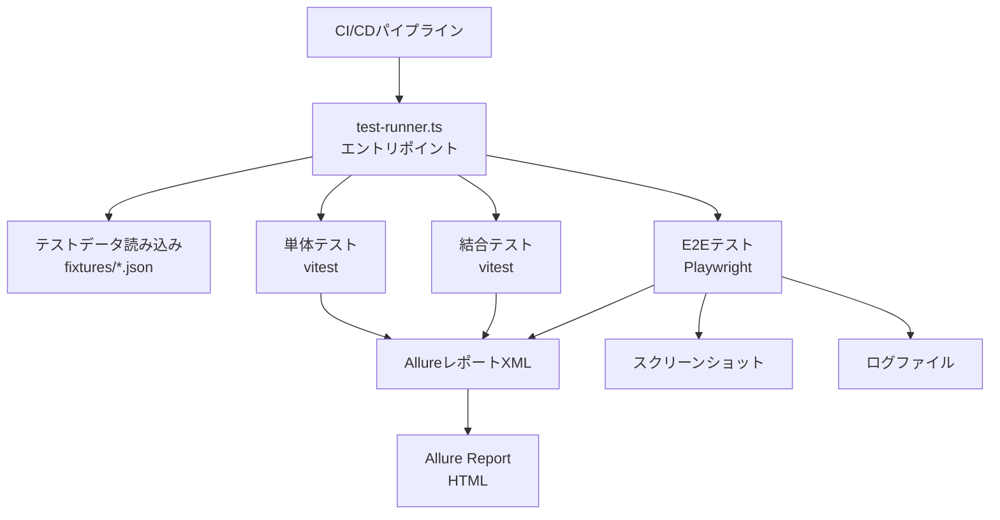
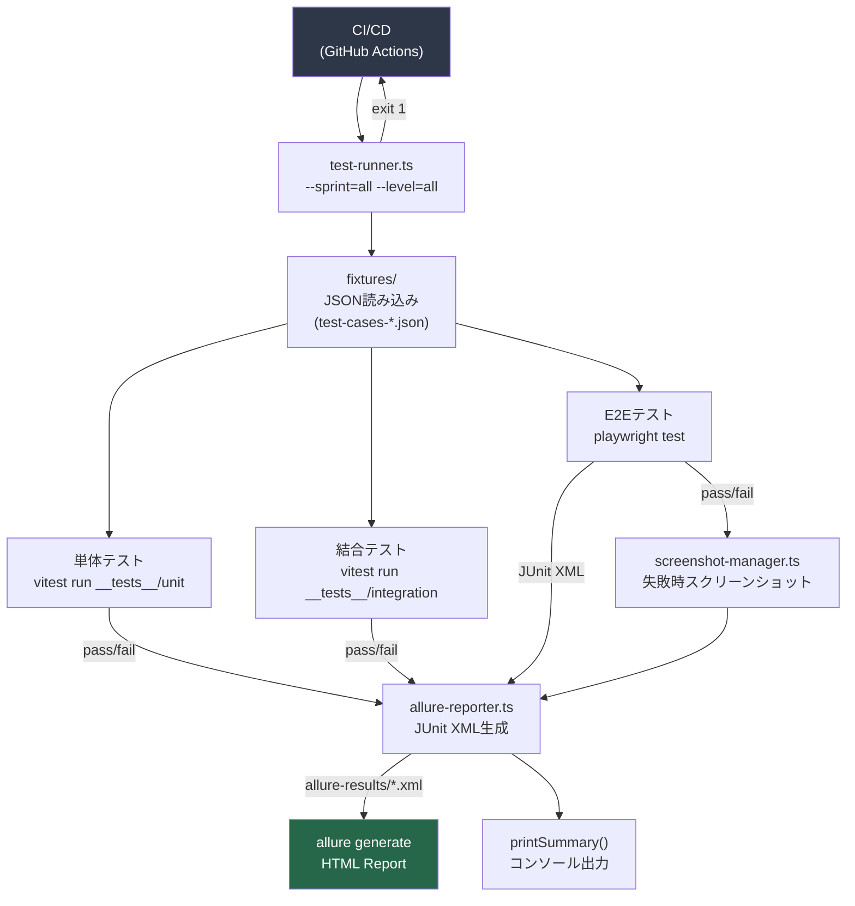

# 住宅会社仕様比較ツール — 実行可能テストスクリプト生成

## アーキテクチャ概要



---

## ディレクトリ構成

```
project-root/
├── __tests__/
│   ├── unit/
│   │   ├── storage.test.ts
│   │   ├── migration.test.ts
│   │   ├── business-logic.test.ts
│   │   ├── validation.test.ts
│   │   └── export-import.test.ts
│   ├── integration/
│   │   ├── spec-reflection.test.ts
│   │   ├── delete-policy.test.ts
│   │   └── import.test.ts
│   ├── e2e/
│   │   ├── main-flow.test.ts
│   │   ├── export-import.test.ts
│   │   └── edge-cases.test.ts
│   └── fixtures/
│       ├── mock-storage.ts
│       ├── factories.ts
│       ├── test-cases-sprint0-storage.json
│       ├── test-cases-sprint1-company.json
│       ├── test-cases-sprint2-spec.json
│       ├── test-cases-sprint3-meeting.json
│       ├── test-cases-sprint4-spec-reflection.json
│       ├── test-cases-sprint5-dashboard-search.json
│       ├── test-cases-sprint6-export-import.json
│       └── test-cases-sprint7-integration-qa.json
├── scripts/
│   ├── test-runner.ts          ← CIエントリポイント
│   ├── allure-reporter.ts      ← XML生成
│   ├── screenshot-manager.ts   ← スクリーンショット管理
│   └── retry-helper.ts         ← リトライロジック
├── allure-results/             ← XML出力先
├── allure-report/              ← HTML出力先
├── screenshots/                ← スクリーンショット
├── logs/                       ← テストログ
├── vitest.config.ts
├── playwright.config.ts
└── package.json
```

---

## 1. 共通インフラ

### `scripts/retry-helper.ts`

```typescript
/**
 * @file retry-helper.ts
 * @description テスト実行のリトライロジック。
 * 最大3回まで再試行し、各試行間に指数バックオフを適用する。
 */

import { writeFileSync, mkdirSync } from "fs";
import { join } from "path";

/** リトライ設定 */
export interface RetryOptions {
  /** 最大リトライ回数（デフォルト: 3） */
  maxAttempts?: number;
  /** 初回待機時間ms（デフォルト: 500） */
  baseDelayMs?: number;
  /** バックオフ倍率（デフォルト: 2） */
  backoffFactor?: number;
  /** リトライ対象外エラークラス */
  excludeErrors?: Array<new (...args: unknown[]) => Error>;
}

/** リトライ結果 */
export interface RetryResult<T> {
  success: boolean;
  value?: T;
  error?: Error;
  attempts: number;
  durationMs: number;
}

/**
 * 指数バックオフ付きリトライ実行
 * @param fn 実行する非同期関数
 * @param options リトライオプション
 * @returns リトライ結果
 */
export async function withRetry<T>(
  fn: () => Promise<T>,
  options: RetryOptions = {}
): Promise<RetryResult<T>> {
  const {
    maxAttempts = 3,
    baseDelayMs = 500,
    backoffFactor = 2,
    excludeErrors = [],
  } = options;

  const startTime = Date.now();
  let lastError: Error | undefined;

  for (let attempt = 1; attempt <= maxAttempts; attempt++) {
    try {
      const value = await fn();
      return {
        success: true,
        value,
        attempts: attempt,
        durationMs: Date.now() - startTime,
      };
    } catch (err) {
      lastError = err instanceof Error ? err : new Error(String(err));

      // リトライ対象外エラーは即座に失敗
      const isExcluded = excludeErrors.some((ErrClass) => lastError instanceof ErrClass);
      if (isExcluded) {
        console.error(`[Retry] 対象外エラーのため即座に失敗: ${lastError.message}`);
        break;
      }

      if (attempt < maxAttempts) {
        const delayMs = baseDelayMs * Math.pow(backoffFactor, attempt - 1);
        console.warn(
          `[Retry] 試行 ${attempt}/${maxAttempts} 失敗: ${lastError.message}。` +
          `${delayMs}ms 後に再試行...`
        );
        await sleep(delayMs);
      }
    }
  }

  return {
    success: false,
    error: lastError,
    attempts: maxAttempts,
    durationMs: Date.now() - startTime,
  };
}

/**
 * 指定時間待機
 * @param ms 待機時間（ミリ秒）
 */
export const sleep = (ms: number): Promise<void> =>
  new Promise((resolve) => setTimeout(resolve, ms));

/**
 * リトライログをファイルに記録
 * @param tcId テストケースID
 * @param result リトライ結果
 */
export function logRetryResult<T>(tcId: string, result: RetryResult<T>): void {
  const logDir = join(process.cwd(), "logs");
  mkdirSync(logDir, { recursive: true });

  const logEntry = {
    tcId,
    timestamp: new Date().toISOString(),
    success: result.success,
    attempts: result.attempts,
    durationMs: result.durationMs,
    error: result.error?.message,
    stack: result.error?.stack,
  };

  const logPath = join(logDir, `retry-${new Date().toISOString().slice(0, 10)}.jsonl`);
  writeFileSync(logPath, JSON.stringify(logEntry) + "\n", { flag: "a" });
}
```

---

### `scripts/screenshot-manager.ts`

```typescript
/**
 * @file screenshot-manager.ts
 * @description E2Eテスト失敗時のスクリーンショット・DOMスナップショット管理。
 * ファイル名にテストID・タイムスタンプを含め、Allureレポートに添付する。
 */

import { mkdirSync, writeFileSync } from "fs";
import { join } from "path";
import type { Page } from "@playwright/test";

/** スクリーンショット設定 */
export interface ScreenshotOptions {
  /** スクリーンショット保存ディレクトリ */
  outputDir?: string;
  /** フルページキャプチャ（デフォルト: true） */
  fullPage?: boolean;
  /** DOMスナップショットも取得（デフォルト: true） */
  captureDom?: boolean;
  /** コンソールログも取得（デフォルト: true） */
  captureConsole?: boolean;
}

/** スクリーンショット結果 */
export interface ScreenshotResult {
  screenshotPath: string;
  domSnapshotPath?: string;
  consolePath?: string;
  timestamp: string;
}

/**
 * テスト失敗時のスクリーンショットを取得・保存
 * @param page Playwright Page オブジェクト
 * @param tcId テストケースID（例: "TC_001"）
 * @param testName テスト名
 * @param consoleLogs 蓄積されたコンソールログ
 * @param options スクリーンショットオプション
 * @returns 保存されたファイルのパス情報
 */
export async function captureOnFailure(
  page: Page,
  tcId: string,
  testName: string,
  consoleLogs: string[],
  options: ScreenshotOptions = {}
): Promise<ScreenshotResult> {
  const {
    outputDir = join(process.cwd(), "screenshots"),
    fullPage = true,
    captureDom = true,
    captureConsole = true,
  } = options;

  const timestamp = new Date().toISOString().replace(/[:.]/g, "-");
  const safeTestName = testName.replace(/[^a-zA-Z0-9ぁ-んァ-ン一-龯]/g, "_").slice(0, 50);
  const baseFilename = `${tcId}_${safeTestName}_${timestamp}`;

  mkdirSync(outputDir, { recursive: true });

  // スクリーンショット取得
  const screenshotPath = join(outputDir, `${baseFilename}.png`);
  await page.screenshot({ path: screenshotPath, fullPage });
  console.log(`[Screenshot] 保存: ${screenshotPath}`);

  const result: ScreenshotResult = { screenshotPath, timestamp };

  // DOMスナップショット取得
  if (captureDom) {
    try {
      const domContent = await page.content();
      const domSnapshotPath = join(outputDir, `${baseFilename}.html`);
      writeFileSync(domSnapshotPath, domContent, "utf-8");
      result.domSnapshotPath = domSnapshotPath;
      console.log(`[Screenshot] DOMスナップショット保存: ${domSnapshotPath}`);
    } catch (e) {
      console.warn(`[Screenshot] DOMスナップショット取得失敗: ${e}`);
    }
  }

  // コンソールログ保存
  if (captureConsole && consoleLogs.length > 0) {
    const consolePath = join(outputDir, `${baseFilename}_console.txt`);
    writeFileSync(consolePath, consoleLogs.join("\n"), "utf-8");
    result.consolePath = consolePath;
    console.log(`[Screenshot] コンソールログ保存: ${consolePath}`);
  }

  return result;
}

/**
 * Playwright Page にコンソールログ収集フックを設定
 * @param page Playwright Page オブジェクト
 * @returns ログ収集配列（参照渡し）
 */
export function attachConsoleCollector(page: Page): string[] {
  const logs: string[] = [];
  page.on("console", (msg) => {
    logs.push(`[${msg.type()}] ${msg.text()}`);
  });
  page.on("pageerror", (err) => {
    logs.push(`[pageerror] ${err.message}\n${err.stack}`);
  });
  return logs;
}
```

---

### `scripts/allure-reporter.ts`

```typescript
/**
 * @file allure-reporter.ts
 * @description Allure互換XML（JUnit形式）レポートの生成。
 * テストケースJSONのメタデータを活用してperspective_idやtc_idをラベルとして付与する。
 */

import { writeFileSync, mkdirSync } from "fs";
import { join } from "path";
import { create } from "xmlbuilder2";

/** テスト結果ステータス */
export type TestStatus = "passed" | "failed" | "broken" | "skipped" | "unknown";

/** 個別テスト結果 */
export interface TestResult {
  tcId: string;
  perspectiveId: string;
  suiteName: string;
  testName: string;
  status: TestStatus;
  durationMs: number;
  errorMessage?: string;
  errorTrace?: string;
  screenshotPath?: string;
  consolePath?: string;
  retryCount?: number;
  timestamp: string;
  /** カスタムラベル（Sprint, Category等） */
  labels?: Record<string, string>;
}

/** テストスイート集計 */
export interface SuiteResult {
  suiteName: string;
  tests: TestResult[];
  totalDurationMs: number;
  timestamp: string;
}

/**
 * テスト結果をAllure互換のJUnit XML形式で出力
 * @param suites テストスイート結果の配列
 * @param outputDir 出力ディレクトリ（デフォルト: allure-results）
 */
export function generateAllureXml(
  suites: SuiteResult[],
  outputDir: string = join(process.cwd(), "allure-results")
): void {
  mkdirSync(outputDir, { recursive: true });

  for (const suite of suites) {
    const passed  = suite.tests.filter((t) => t.status === "passed").length;
    const failed  = suite.tests.filter((t) => t.status === "failed").length;
    const broken  = suite.tests.filter((t) => t.status === "broken").length;
    const skipped = suite.tests.filter((t) => t.status === "skipped").length;

    // XML ルートノード
    const root = create({ version: "1.0", encoding: "UTF-8" }).ele("testsuites");

    const testSuiteNode = root.ele("testsuite", {
      name:      suite.suiteName,
      tests:     suite.tests.length,
      failures:  failed,
      errors:    broken,
      skipped:   skipped,
      passed:    passed,
      time:      (suite.totalDurationMs / 1000).toFixed(3),
      timestamp: suite.timestamp,
    });

    for (const test of suite.tests) {
      const testCaseNode = testSuiteNode.ele("testcase", {
        name:      `[${test.tcId}] ${test.testName}`,
        classname: `${suite.suiteName}.${test.perspectiveId}`,
        time:      (test.durationMs / 1000).toFixed(3),
        timestamp: test.timestamp,
      });

      // Allureカスタムラベル
      const properties = testCaseNode.ele("properties");
      properties.ele("property", { name: "tc_id",           value: test.tcId });
      properties.ele("property", { name: "perspective_id",  value: test.perspectiveId });
      properties.ele("property", { name: "retry_count",     value: String(test.retryCount ?? 0) });
      if (test.labels) {
        for (const [key, value] of Object.entries(test.labels)) {
          properties.ele("property", { name: key, value });
        }
      }

      // 失敗・エラー情報
      if (test.status === "failed" && test.errorMessage) {
        testCaseNode
          .ele("failure", { message: test.errorMessage, type: "AssertionError" })
          .txt(test.errorTrace ?? test.errorMessage);
      } else if (test.status === "broken" && test.errorMessage) {
        testCaseNode
          .ele("error", { message: test.errorMessage, type: "Error" })
          .txt(test.errorTrace ?? test.errorMessage);
      } else if (test.status === "skipped") {
        testCaseNode.ele("skipped");
      }

      // スクリーンショット添付（system-out経由でAllureが認識）
      if (test.screenshotPath) {
        testCaseNode
          .ele("system-out")
          .txt(`[[ATTACHMENT|${test.screenshotPath}]]`);
      }
      if (test.consolePath) {
        testCaseNode
          .ele("system-err")
          .txt(`[[ATTACHMENT|${test.consolePath}]]`);
      }
    }

    // ファイル出力
    const safeFileName = suite.suiteName.replace(/[^a-zA-Z0-9_-]/g, "_");
    const xmlPath = join(outputDir, `${safeFileName}-${Date.now()}.xml`);
    writeFileSync(xmlPath, root.end({ prettyPrint: true }), "utf-8");
    console.log(`[Allure] XML出力: ${xmlPath}`);
  }
}

/**
 * テスト結果のサマリーをコンソール表示
 * @param suites テストスイート結果の配列
 */
export function printSummary(suites: SuiteResult[]): void {
  let totalPassed = 0, totalFailed = 0, totalBroken = 0, totalSkipped = 0;

  console.log("\n" + "=".repeat(70));
  console.log("📊 テスト実行サマリー");
  console.log("=".repeat(70));

  for (const suite of suites) {
    const p = suite.tests.filter((t) => t.status === "passed").length;
    const f = suite.tests.filter((t) => t.status === "failed").length;
    const b = suite.tests.filter((t) => t.status === "broken").length;
    const s = suite.tests.filter((t) => t.status === "skipped").length;
    totalPassed  += p;
    totalFailed  += f;
    totalBroken  += b;
    totalSkipped += s;

    const icon = (f + b) > 0 ? "❌" : "✅";
    console.log(
      `${icon} ${suite.suiteName.padEnd(40)} ` +
      `✅${p} ❌${f} 💥${b} ⏭️${s}  ` +
      `(${(suite.totalDurationMs / 1000).toFixed(1)}s)`
    );
  }

  const total = totalPassed + totalFailed + totalBroken + totalSkipped;
  const passRate = total > 0 ? ((totalPassed / total) * 100).toFixed(1) : "0.0";
  const overallIcon = (totalFailed + totalBroken) === 0 ? "🎉" : "⚠️";

  console.log("-".repeat(70));
  console.log(
    `${overallIcon} 合計: ${total}件  ` +
    `✅PASS: ${totalPassed}  ❌FAIL: ${totalFailed}  💥BROKEN: ${totalBroken}  ⏭️SKIP: ${totalSkipped}`
  );
  console.log(`   合格率: ${passRate}%`);
  console.log("=".repeat(70) + "\n");
}
```

---

### `__tests__/fixtures/mock-storage.ts`

```typescript
/**
 * @file mock-storage.ts
 * @description window.storage / localStorage のテスト用モック。
 * 容量制限・エラー注入・書き込み失敗シミュレーションに対応する。
 */

/** モック設定オプション */
export interface MockStorageOptions {
  /** ストレージを利用可能にするか（false = setItem で例外スロー） */
  available?: boolean;
  /** 容量上限バイト数（デフォルト: 無制限） */
  capacityBytes?: number;
  /** 指定メソッドで例外スロー（"setItem" | "getItem" | "removeItem"） */
  throwOn?: "setItem" | "getItem" | "removeItem";
  /** スロー時のエラータイプ */
  error?: "QuotaExceededError" | "SecurityError" | "generic";
}

/** テスト用ストレージモック */
export class MockStorage {
  private store: Map<string, string> = new Map();
  private options: MockStorageOptions;
  private failNextWriteKey: string | null = null;
  private totalBytes = 0;

  /** @param options モック設定 */
  constructor(options: MockStorageOptions = {}) {
    this.options = { available: true, ...options };
  }

  /**
   * 次回書き込みを強制失敗させる（アトミック処理テスト用）
   * @param key 失敗させるストレージキー（未指定 = 全キー）
   */
  failNextWrite(key?: string): void {
    this.failNextWriteKey = key ?? "__ALL__";
  }

  /**
   * キーに値をセット
   * @param key ストレージキー
   * @param value 保存する文字列値
   * @throws 容量超過時 QuotaExceededError、利用不可時 SecurityError
   */
  async setItem(key: string, value: string): Promise<void> {
    if (!this.options.available || this.options.throwOn === "setItem") {
      throw this.createError();
    }

    // failNextWrite チェック
    if (
      this.failNextWriteKey === "__ALL__" ||
      this.failNextWriteKey === key
    ) {
      this.failNextWriteKey = null;
      throw new Error(`[MockStorage] 意図的な書き込み失敗: ${key}`);
    }

    // 容量チェック
    if (this.options.capacityBytes !== undefined) {
      const newTotal = this.totalBytes + value.length;
      if (newTotal > this.options.capacityBytes) {
        const err = new DOMException("QuotaExceededError", "QuotaExceededError");
        throw err;
      }
      this.totalBytes = newTotal;
    }

    this.store.set(key, value);
  }

  /**
   * キーから値を取得
   * @param key ストレージキー
   * @returns 保存された文字列値（存在しない場合 null）
   */
  async getItem(key: string): Promise<string | null> {
    if (this.options.throwOn === "getItem") throw this.createError();
    return this.store.get(key) ?? null;
  }

  /**
   * キーを削除
   * @param key 削除するストレージキー
   */
  async removeItem(key: string): Promise<void> {
    if (this.options.throwOn === "removeItem") throw this.createError();
    const val = this.store.get(key);
    if (val && this.options.capacityBytes !== undefined) {
      this.totalBytes -= val.length;
    }
    this.store.delete(key);
  }

  /**
   * 全キーをクリア
   */
  async clear(): Promise<void> {
    this.store.clear();
    this.totalBytes = 0;
  }

  /**
   * 保存されているキーの一覧を取得（デバッグ用）
   */
  keys(): string[] {
    return Array.from(this.store.keys());
  }

  private createError(): Error {
    switch (this.options.error) {
      case "QuotaExceededError":
        return new DOMException("QuotaExceededError", "QuotaExceededError");
      case "SecurityError":
        return new DOMException("SecurityError", "SecurityError");
      default:
        return new Error("MockStorage: 利用不可");
    }
  }
}

/**
 * MockStorage インスタンスを生成するファクトリ関数
 * @param options モック設定
 */
export const mockStorage = (options: MockStorageOptions = {}): MockStorage =>
  new MockStorage(options);
```

---

### `__tests__/fixtures/factories.ts`

```typescript
/**
 * @file factories.ts
 * @description テストデータファクトリ関数。
 * 各エンティティのデフォルト値はバリデーションを通過する値を使用。
 * crypto.randomUUID() はテスト環境ではシーケンシャルIDに差し替え。
 */

let _idCounter = 0;

/** テスト用UUID生成（決定論的） */
export const testUUID = (): string => {
  _idCounter++;
  return `test-uuid-${String(_idCounter).padStart(6, "0")}`;
};

/** IDカウンタリセット（beforeEach で使用） */
export const resetIdCounter = (): void => { _idCounter = 0; };

// ─────────────────────────────────────────────
// 型定義（app.jsx の型と同期）
// ─────────────────────────────────────────────

export interface Company {
  id: string; name: string; type: string; contact: string;
  phone?: string; email?: string; status: string; note?: string;
  createdAt: string; updatedAt: string; deletedAt?: string;
}
export interface Meeting {
  id: string; companyId: string; date: string; title: string;
  agenda: string; summary?: string; location?: string;
  attendees: string[]; createdAt: string; updatedAt: string; deletedAt?: string;
}
export interface Decision {
  id: string; meetingId: string; content: string; status: string;
  specItemId?: string; specCompanyId?: string; specValue?: string; note?: string;
  createdAt: string; updatedAt: string; deletedAt?: string;
}
export interface SpecItem {
  id: string; categoryId: string; name: string; sortOrder: number;
  values: Array<{ companyId: string; value: string }>;
  createdAt: string; updatedAt: string; deletedAt?: string;
}
export interface Category {
  id: string; name: string; normalizedName: string;
  sortOrder: number; createdAt: string; deletedAt?: string;
}
export interface ChangeLog {
  id: string; specItemId: string; specCompanyId: string;
  oldValue: string; newValue: string; changedAt: string;
  reason: string; meetingId?: string; decisionId?: string;
}

// ─────────────────────────────────────────────
// ファクトリ関数
// ─────────────────────────────────────────────

/**
 * Company テストデータを生成
 * @param overrides 上書きするフィールド
 */
export const buildCompany = (overrides: Partial<Company> = {}): Company => ({
  id:        testUUID(),
  name:      "テスト住宅株式会社",
  type:      "maker",
  contact:   "テスト担当者",
  phone:     "090-1234-5678",
  email:     "test@example.com",
  status:    "considering",
  note:      "テスト用会社メモ",
  createdAt: "2026-05-13T00:00:00.000Z",
  updatedAt: "2026-05-13T00:00:00.000Z",
  ...overrides,
});

/**
 * Meeting テストデータを生成
 * @param overrides 上書きするフィールド
 */
export const buildMeeting = (overrides: Partial<Meeting> = {}): Meeting => ({
  id:         testUUID(),
  companyId:  testUUID(),
  date:       "2026-05-13",
  title:      "2026-05-13 テスト住宅株式会社",
  agenda:     "断熱材の確認および窓仕様の検討",
  summary:    "断熱材はGW 24Kに決定",
  location:   "展示場会議室",
  attendees:  ["田中太郎", "鈴木花子"],
  createdAt:  "2026-05-13T00:00:00.000Z",
  updatedAt:  "2026-05-13T00:00:00.000Z",
  ...overrides,
});

/**
 * Decision テストデータを生成
 * @param overrides 上書きするフィールド
 */
export const buildDecision = (overrides: Partial<Decision> = {}): Decision => ({
  id:           testUUID(),
  meetingId:    testUUID(),
  content:      "断熱材を高性能GW 24Kに決定",
  status:       "confirmed",
  specItemId:   testUUID(),
  specCompanyId: testUUID(),
  specValue:    "高性能GW 24K",
  note:         "競合比較の結果、コストパフォーマンスが最良",
  createdAt:    "2026-05-13T00:00:00.000Z",
  updatedAt:    "2026-05-13T00:00:00.000Z",
  ...overrides,
});

/**
 * SpecItem テストデータを生成
 * @param overrides 上書きするフィールド
 */
export const buildSpecItem = (overrides: Partial<SpecItem> = {}): SpecItem => ({
  id:         testUUID(),
  categoryId: testUUID(),
  name:       "断熱材の種類",
  sortOrder:  0,
  values:     [],
  createdAt:  "2026-05-13T00:00:00.000Z",
  updatedAt:  "2026-05-13T00:00:00.000Z",
  ...overrides,
});

/**
 * Category テストデータを生成
 * @param overrides 上書きするフィールド
 */
export const buildCategory = (overrides: Partial<Category> = {}): Category => ({
  id:             testUUID(),
  name:           "断熱",
  normalizedName: "断熱",
  sortOrder:      0,
  createdAt:      "2026-05-13T00:00:00.000Z",
  ...overrides,
});

/**
 * ChangeLog テストデータを生成
 * @param overrides 上書きするフィールド
 */
export const buildChangeLog = (overrides: Partial<ChangeLog> = {}): ChangeLog => ({
  id:            testUUID(),
  specItemId:    testUUID(),
  specCompanyId: testUUID(),
  oldValue:      "旧値",
  newValue:      "新値",
  changedAt:     "2026-05-13T00:00:00.000Z",
  reason:        "打ち合わせで確定",
  ...overrides,
});

/**
 * JSONインポート用テストデータを生成
 * @param overrides 上書きする配列
 */
export const buildImportData = (
  overrides: Partial<{
    companies: Company[]; categories: Category[]; specItems: SpecItem[];
    meetings: Meeting[]; decisions: Decision[]; changeLogs: ChangeLog[];
  }> = {}
) => ({
  version:      "1.0",
  exportedAt:   new Date().toISOString(),
  companies:    [],
  categories:   [],
  specItems:    [],
  specItemNotes: [],
  meetings:     [],
  decisions:    [],
  changeLogs:   [],
  ...overrides,
});
```

---

## 2. 単体テスト

### `__tests__/unit/storage.test.ts`

```typescript
/**
 * @file storage.test.ts
 * @description ストレージユーティリティの単体テスト（TC_001〜TC_010）。
 * verifyStorageAPI・saveWithCapacityCheck・incrementSaveCount の動作を検証する。
 */

import { describe, test, expect, vi, beforeEach, afterEach } from "vitest";
import { readFileSync } from "fs";
import { join } from "path";
import { withRetry } from "../../scripts/retry-helper";
import { mockStorage } from "../fixtures/mock-storage";

// テストケースJSONの読み込み
const TC = JSON.parse(
  readFileSync(join(__dirname, "../fixtures/test-cases-sprint0-storage.json"), "utf-8")
).test_cases;

/** テストケースをIDで検索 */
const getTC = (id: string) => TC.find((t: { tc_id: string }) => t.tc_id === id);

// ─────────────────────────────────────────────
// モジュールのインポート（app.jsx から抽出した関数）
// ─────────────────────────────────────────────
// NOTE: 実装時は src/utils/storage.ts から import する
import {
  verifyStorageAPI,
  saveWithCapacityCheck,
  incrementSaveCount,
  STORAGE_KEYS,
} from "../../src/utils/storage";

// ─────────────────────────────────────────────
// テストヘルパー
// ─────────────────────────────────────────────

/** 保存カウントを指定値に設定するヘルパー */
async function simulateSaveCount(count: number, storage: ReturnType<typeof mockStorage>) {
  await storage.setItem(STORAGE_KEYS.META, JSON.stringify({ saveCount: count }));
}

// ─────────────────────────────────────────────
// verifyStorageAPI テスト群
// ─────────────────────────────────────────────

describe("verifyStorageAPI", () => {
  let originalStorage: typeof window.storage;

  beforeEach(() => {
    // window.storage のバックアップ
    originalStorage = (global as unknown as { window: { storage: unknown } }).window?.storage;
    vi.clearAllMocks();
  });

  afterEach(() => {
    // window.storage を復元
    if (originalStorage !== undefined) {
      (global as unknown as { window: { storage: unknown } }).window.storage = originalStorage;
    }
  });

  test(`TC_001: ${getTC("TC_001")?.purpose}`, async () => {
    const storage = mockStorage({ available: true, capacityBytes: 1_000_000 });
    (global as unknown as { window: { storage: unknown } }).window = { storage };

    const result = await withRetry(() => verifyStorageAPI());
    expect(result.success).toBe(true);
    expect(result.value).toBe("window.storage");

    // テストキーが削除されていることを確認
    expect(await storage.getItem("__test__")).toBeNull();
    expect(await storage.getItem("__capacity_test__")).toBeNull();
  });

  test(`TC_002: ${getTC("TC_002")?.purpose}`, async () => {
    (global as unknown as { window: { storage: unknown } }).window = {
      storage: mockStorage({ available: false }),
    };
    (global as unknown as { localStorage: unknown }).localStorage = mockStorage({ available: true });

    const result = await withRetry(() => verifyStorageAPI());
    expect(result.success).toBe(true);
    expect(result.value).toBe("localStorage");
  });

  test(`TC_003: ${getTC("TC_003")?.purpose}`, async () => {
    (global as unknown as { window: { storage: unknown } }).window = {
      storage: mockStorage({ available: false }),
    };
    (global as unknown as { localStorage: unknown }).localStorage = mockStorage({ available: false });

    const result = await withRetry(() => verifyStorageAPI());
    expect(result.success).toBe(true);
    expect(result.value).toBe("none");
  });

  test(`TC_004: ${getTC("TC_004")?.purpose}`, async () => {
    const storage = mockStorage({ available: true, capacityBytes: 10_000_000 });
    (global as unknown as { window: { storage: unknown } }).window = { storage };

    const result = await withRetry(() => verifyStorageAPI());
    expect(result.success).toBe(true);
    expect(result.value).toBe("window.storage");
  });
});

// ─────────────────────────────────────────────
// saveWithCapacityCheck テスト群
// ─────────────────────────────────────────────

describe("saveWithCapacityCheck", () => {
  test(`TC_005: ${getTC("TC_005")?.purpose}`, async () => {
    const storage = mockStorage({ available: true });
    const toastSpy = vi.fn();

    await saveWithCapacityCheck("test_key", "x".repeat(400_001), toastSpy, storage);

    expect(toastSpy).toHaveBeenCalledWith(
      "warning",
      expect.stringContaining("バックアップ")
    );
    // 書き込みは実行されること
    expect(await storage.getItem("test_key")).not.toBeNull();
  });

  test(`TC_006: ${getTC("TC_006")?.purpose}`, async () => {
    const storage = mockStorage({ available: true });
    const toastSpy = vi.fn();

    await saveWithCapacityCheck("test_key", "x".repeat(399_999), toastSpy, storage);

    expect(toastSpy).not.toHaveBeenCalledWith("warning", expect.anything());
  });

  test(`TC_007: ${getTC("TC_007")?.purpose}`, async () => {
    const storage = mockStorage({ throwOn: "setItem", error: "QuotaExceededError" });
    const toastSpy = vi.fn();

    const result = await withRetry(
      () => saveWithCapacityCheck("key", "val", toastSpy, storage),
      { maxAttempts: 1 } // QuotaExceededError はリトライしない
    );

    expect(result.success).toBe(false);
    expect(toastSpy).toHaveBeenCalledWith(
      "error",
      expect.stringContaining("容量上限")
    );
  });
});

// ─────────────────────────────────────────────
// incrementSaveCount テスト群
// ─────────────────────────────────────────────

describe("incrementSaveCount", () => {
  let storage: ReturnType<typeof mockStorage>;

  beforeEach(() => {
    storage = mockStorage({ available: true });
  });

  test(`TC_008: ${getTC("TC_008")?.purpose}`, async () => {
    await simulateSaveCount(49, storage);
    const toastSpy = vi.fn();

    await incrementSaveCount(toastSpy, storage);

    expect(toastSpy).toHaveBeenCalledWith(
      "info",
      expect.stringContaining("50回保存")
    );
    const meta = JSON.parse((await storage.getItem(STORAGE_KEYS.META)) ?? "{}");
    expect(meta.saveCount).toBe(50);
  });

  test(`TC_009: ${getTC("TC_009")?.purpose}`, async () => {
    await simulateSaveCount(48, storage);
    const toastSpy = vi.fn();

    await incrementSaveCount(toastSpy, storage);

    expect(toastSpy).not.toHaveBeenCalledWith("info", expect.anything());
    const meta = JSON.parse((await storage.getItem(STORAGE_KEYS.META)) ?? "{}");
    expect(meta.saveCount).toBe(49);
  });

  test(`TC_010: ${getTC("TC_010")?.purpose}`, async () => {
    await simulateSaveCount(99, storage);
    const toastSpy = vi.fn();

    await incrementSaveCount(toastSpy, storage);

    expect(toastSpy).toHaveBeenCalledWith(
      "info",
      expect.stringContaining("100回保存")
    );
  });
});
```

---

### `__tests__/unit/validation.test.ts`

```typescript
/**
 * @file validation.test.ts
 * @description バリデーション関数の単体テスト（TC_022〜TC_026, TC_064〜TC_065 等）。
 * Company・Meeting・Category・SpecItemNote のバリデーションルールを検証する。
 */

import { describe, test, expect } from "vitest";
import { readFileSync } from "fs";
import { join } from "path";

// テストケースJSON読み込み
const TC_SPRINT1 = JSON.parse(
  readFileSync(join(__dirname, "../fixtures/test-cases-sprint1-company.json"), "utf-8")
).test_cases;
const TC_SPRINT3 = JSON.parse(
  readFileSync(join(__dirname, "../fixtures/test-cases-sprint3-meeting.json"), "utf-8")
).test_cases;

import {
  validateCompany,
  validateMeeting,
  validateCategory,
  validateSpecItemNote,
  parseAttendees,
} from "../../src/utils/validation";

// ─────────────────────────────────────────────
// Company バリデーション
// ─────────────────────────────────────────────

describe("validateCompany", () => {
  test("TC_022: name が空文字の場合エラーを返す", () => {
    const errors = validateCompany({ name: "", contact: "担当者名" });
    expect(errors).toHaveProperty("name");
  });

  test("TC_023: name が 50 文字は OK", () => {
    const name = "あ".repeat(50);
    const errors = validateCompany({ name, contact: "担当" });
    expect(errors).not.toHaveProperty("name");
  });

  test("TC_023: name が 51 文字はエラー（境界値）", () => {
    const name = "あ".repeat(51);
    const errors = validateCompany({ name, contact: "担当" });
    expect(errors).toHaveProperty("name");
  });

  test("TC_024: 電話番号にアルファベットを含む場合エラー", () => {
    const errors = validateCompany({
      name: "A社", contact: "担当", phone: "invalid-phone"
    });
    expect(errors).toHaveProperty("phone");
  });

  test.each([
    "090-1234-5678",
    "+81-3-1234-5678",
    "(03) 1234-5678",
    "0120-000-000",
  ])("TC_025: 有効な電話番号パターン「%s」が許可される", (phone) => {
    const errors = validateCompany({ name: "A社", contact: "担当", phone });
    expect(errors).not.toHaveProperty("phone");
  });

  test("TC_026: @ を含まないメールアドレスはエラー", () => {
    const errors = validateCompany({
      name: "A社", contact: "担当", email: "invalid-email-no-at-sign"
    });
    expect(errors).toHaveProperty("email");
  });

  test("note が 500 文字は OK", () => {
    const errors = validateCompany({
      name: "A社", contact: "担当", note: "a".repeat(500)
    });
    expect(errors).not.toHaveProperty("note");
  });

  test("note が 501 文字はエラー（境界値）", () => {
    const errors = validateCompany({
      name: "A社", contact: "担当", note: "a".repeat(501)
    });
    expect(errors).toHaveProperty("note");
  });
});

// ─────────────────────────────────────────────
// Meeting バリデーション
// ─────────────────────────────────────────────

describe("validateMeeting", () => {
  test("TC_064: date が空の場合エラー", () => {
    const errors = validateMeeting({ date: "", agenda: "断熱材の確認" });
    expect(errors).toHaveProperty("date");
  });

  test("agenda が空の場合エラー", () => {
    const errors = validateMeeting({ date: "2026-05-13", agenda: "" });
    expect(errors).toHaveProperty("agenda");
  });

  test("agenda が 1000 文字は OK（境界値）", () => {
    const errors = validateMeeting({ date: "2026-05-13", agenda: "a".repeat(1000) });
    expect(errors).not.toHaveProperty("agenda");
  });

  test("agenda が 1001 文字はエラー（境界値）", () => {
    const errors = validateMeeting({ date: "2026-05-13", agenda: "a".repeat(1001) });
    expect(errors).toHaveProperty("agenda");
  });

  test("TC_065: attendees が 20 件は OK（境界値）", () => {
    const attendees = Array.from({ length: 20 }, (_, i) => `担当者${i}`);
    const errors = validateMeeting({ date: "2026-05-13", agenda: "議題", attendees });
    expect(errors).not.toHaveProperty("attendees");
  });

  test("TC_065: attendees が 21 件はエラー（境界値）", () => {
    const attendees = Array.from({ length: 21 }, (_, i) => `担当者${i}`);
    const errors = validateMeeting({ date: "2026-05-13", agenda: "議題", attendees });
    expect(errors).toHaveProperty("attendees");
  });

  test("attendees の1要素が 30 文字は OK（境界値）", () => {
    const errors = validateMeeting({
      date: "2026-05-13", agenda: "議題", attendees: ["a".repeat(30)]
    });
    expect(errors).not.toHaveProperty("attendees");
  });

  test("attendees の1要素が 31 文字はエラー（境界値）", () => {
    const errors = validateMeeting({
      date: "2026-05-13", agenda: "議題", attendees: ["a".repeat(31)]
    });
    expect(errors).toHaveProperty("attendees");
  });
});

// ─────────────────────────────────────────────
// Category バリデーション
// ─────────────────────────────────────────────

describe("validateCategory", () => {
  const existing = [{ normalizedName: "断熱" }];

  test.each(["断熱", "断熱 ", "  断熱"])(
    "TC_040: 「%s」は重複として検出される",
    (name) => {
      const errors = validateCategory({ name }, existing);
      expect(errors).toHaveProperty("name");
    }
  );

  test("異なる名称は重複判定されない", () => {
    const errors = validateCategory({ name: "構造" }, existing);
    expect(errors).not.toHaveProperty("name");
  });
});

// ─────────────────────────────────────────────
// attendees カンマ区切りパース
// ─────────────────────────────────────────────

describe("parseAttendees", () => {
  test("TC_063-1: カンマ区切り文字列を配列に変換する", () => {
    expect(parseAttendees("田中, 鈴木,佐藤")).toEqual(["田中", "鈴木", "佐藤"]);
  });

  test("TC_063-2: 前後の空白をトリムする", () => {
    expect(parseAttendees("  田中  ,  鈴木  ")).toEqual(["田中", "鈴木"]);
  });

  test("TC_063-3: 空要素を除去する", () => {
    expect(parseAttendees("田中,,鈴木,")).toEqual(["田中", "鈴木"]);
  });

  test("TC_063-4: 空文字列は空配列を返す", () => {
    expect(parseAttendees("")).toEqual([]);
  });
});

// ─────────────────────────────────────────────
// SpecItemNote バリデーション
// ─────────────────────────────────────────────

describe("validateSpecItemNote", () => {
  test("TC_047: note が 200 文字は OK（境界値）", () => {
    const errors = validateSpecItemNote({ note: "a".repeat(200) });
    expect(errors).not.toHaveProperty("note");
  });

  test("TC_047: note が 201 文字はエラー（境界値）", () => {
    const errors = validateSpecItemNote({ note: "a".repeat(201) });
    expect(errors).toHaveProperty("note");
  });

  test("note が空文字はエラー（required）", () => {
    const errors = validateSpecItemNote({ note: "" });
    expect(errors).toHaveProperty("note");
  });
});
```

---

### `__tests__/unit/export-import.test.ts`

```typescript
/**
 * @file export-import.test.ts
 * @description エクスポート・インポートユーティリティの単体テスト（TC_115〜TC_119）。
 * CSV エスケープ（RFC 4180）・インポートバリデーション・ID衝突解決を検証する。
 */

import { describe, test, expect } from "vitest";
import {
  escapeCsvValue,
  validateImportFile,
  resolveIdConflict,
  resolveAllIdConflicts,
} from "../../src/utils/export-import";
import { buildCompany, buildMeeting } from "../fixtures/factories";

// ─────────────────────────────────────────────
// escapeCsvValue（RFC 4180準拠）
// ─────────────────────────────────────────────

describe("escapeCsvValue", () => {
  test("TC_115: カンマを含む値をダブルクォートで囲む", () => {
    expect(escapeCsvValue("A,B")).toBe('"A,B"');
  });

  test("TC_117-LF: LF改行を含む値をダブルクォートで囲む", () => {
    expect(escapeCsvValue("A\nB")).toBe('"A\nB"');
  });

  test("TC_117-CR: CR改行を含む値をダブルクォートで囲む", () => {
    expect(escapeCsvValue("A\rB")).toBe('"A\rB"');
  });

  test("TC_116: ダブルクォートを含む値は内部を \"\"にエスケープ", () => {
    expect(escapeCsvValue('He said "hello"')).toBe('"He said ""hello"""');
  });

  test("特殊文字を含まない値はそのまま返す", () => {
    expect(escapeCsvValue("普通の値")).toBe("普通の値");
  });

  test("空文字列はそのまま返す", () => {
    expect(escapeCsvValue("")).toBe("");
  });

  test("カンマとダブルクォートの複合（境界値）", () => {
    expect(escapeCsvValue('A,"B"')).toBe('"A,""B"""');
  });
});

// ─────────────────────────────────────────────
// validateImportFile
// ─────────────────────────────────────────────

describe("validateImportFile", () => {
  test("TC_119-null: null はエラーメッセージを返す", () => {
    expect(validateImportFile(null)).toBe("JSONの形式が不正です");
  });

  test("TC_119-array: 配列はエラーメッセージを返す", () => {
    expect(validateImportFile([])).toBe("JSONの形式が不正です");
  });

  test("TC_119-version: バージョン不一致はエラーメッセージを返す", () => {
    const result = validateImportFile({ version: "2.0" });
    expect(result).toContain("バージョン不一致");
  });

  test("TC_119-ok: バージョン一致は null を返す（バリデーションOK）", () => {
    expect(validateImportFile({ version: "1.0" })).toBeNull();
  });

  test("TC_118: __proto__ キーを含む JSON は無害化される", () => {
    const malicious = JSON.parse(
      '{"version":"1.0","__proto__":{"polluted":"yes"},"companies":[]}'
    );
    validateImportFile(malicious);
    expect((Object.prototype as Record<string, unknown>)["polluted"]).toBeUndefined();
  });
});

// ─────────────────────────────────────────────
// resolveIdConflict
// ─────────────────────────────────────────────

describe("resolveIdConflict", () => {
  test("TC_113-単体: 衝突ID は新 UUID に差し替えられる", () => {
    const existingIds = new Set(["existing-id"]);
    const item = buildCompany({ id: "existing-id", name: "衝突会社" });
    const result = resolveIdConflict(item, existingIds);
    expect(result.id).not.toBe("existing-id");
    expect(result.name).toBe("衝突会社");
  });

  test("TC_113-単体: 非衝突ID は元の ID を維持する", () => {
    const existingIds = new Set(["other-id"]);
    const item = buildCompany({ id: "new-id" });
    const result = resolveIdConflict(item, existingIds);
    expect(result.id).toBe("new-id");
  });
});

describe("resolveAllIdConflicts", () => {
  test("TC_113: 参照整合性が保たれる（companyId が再マッピングされる）", () => {
    const collidingId = "colliding-id";
    const existingIds = new Set([collidingId]);
    const companies = [buildCompany({ id: collidingId, name: "衝突会社" })];
    const meetings  = [buildMeeting({ id: "meeting-new", companyId: collidingId })];

    const resolved = resolveAllIdConflicts({ companies, meetings }, existingIds);

    const newCompanyId = resolved.companies[0].id;
    expect(newCompanyId).not.toBe(collidingId);
    expect(resolved.meetings[0].companyId).toBe(newCompanyId);
  });
});
```

---

## 3. 結合テスト

### `__tests__/integration/spec-reflection.test.ts`

```typescript
/**
 * @file spec-reflection.test.ts
 * @description 仕様反映フロー（アトミック処理）の結合テスト（TC_080〜TC_087）。
 * reflectToSpec の正常系・ロールバック・後勝ちルールを検証する。
 */

import { describe, test, expect, beforeEach } from "vitest";
import { mockStorage } from "../fixtures/mock-storage";
import { buildDecision, buildSpecItem, buildChangeLog, resetIdCounter } from "../fixtures/factories";
import { withRetry } from "../../scripts/retry-helper";
import { STORAGE_KEYS } from "../../src/utils/storage";
import { reflectToSpec } from "../../src/features/spec-reflection";

/** テスト環境セットアップ：ストレージにテスト用データを事前投入 */
async function setupTestEnvironment() {
  const storage = mockStorage({ available: true });
  const specItem = buildSpecItem({ id: "item-1", values: [] });
  await storage.setItem(STORAGE_KEYS.SPEC_ITEMS, JSON.stringify([specItem]));
  await storage.setItem(STORAGE_KEYS.CHANGE_LOGS, JSON.stringify([]));
  return { storage, specItem };
}

describe("IT-02: 仕様反映アトミック処理", () => {
  beforeEach(() => resetIdCounter());

  test(`TC_080: 正常系 - SpecItem と ChangeLog が同時に保存される`, async () => {
    const { storage } = await setupTestEnvironment();
    const decision = buildDecision({
      specItemId:    "item-1",
      specCompanyId: "company-1",
      specValue:     "新しい値",
    });

    const result = await withRetry(() => reflectToSpec(decision, "テスト理由", storage));
    expect(result.success).toBe(true);

    // SpecItem の値が更新されていること
    const specItems = JSON.parse((await storage.getItem(STORAGE_KEYS.SPEC_ITEMS)) ?? "[]");
    const updated = specItems.find((i: { id: string }) => i.id === "item-1");
    const companyValue = updated?.values.find((v: { companyId: string }) => v.companyId === "company-1");
    expect(companyValue?.value).toBe("新しい値");

    // ChangeLog が追加されていること
    const changeLogs = JSON.parse((await storage.getItem(STORAGE_KEYS.CHANGE_LOGS)) ?? "[]");
    expect(changeLogs.some(
      (log: { specItemId: string; newValue: string }) =>
        log.specItemId === "item-1" && log.newValue === "新しい値"
    )).toBe(true);
  });

  test(`TC_081: specItem 保存失敗時にロールバックされ ChangeLog が保存されない`, async () => {
    const { storage, specItem } = await setupTestEnvironment();
    const originalItem = JSON.parse(JSON.stringify(specItem));

    // 次回の spec_items 書き込みを失敗させる
    storage.failNextWrite(STORAGE_KEYS.SPEC_ITEMS);

    const decision = buildDecision({
      specItemId:    "item-1",
      specCompanyId: "company-1",
      specValue:     "失敗する値",
    });

    // リトライなしで実行（ロールバック確認のため）
    const result = await withRetry(
      () => reflectToSpec(decision, "理由", storage),
      { maxAttempts: 1 }
    );
    expect(result.success).toBe(false);

    // 元の SpecItem が保持されていること
    const specItems = JSON.parse((await storage.getItem(STORAGE_KEYS.SPEC_ITEMS)) ?? "[]");
    const restoredItem = specItems.find((i: { id: string }) => i.id === "item-1");
    expect(restoredItem?.values).toEqual(originalItem.values);

    // ChangeLog が空のままであること
    const changeLogs = JSON.parse((await storage.getItem(STORAGE_KEYS.CHANGE_LOGS)) ?? "[]");
    expect(changeLogs.filter((log: { specItemId: string }) => log.specItemId === "item-1"))
      .toHaveLength(0);
  });

  test(`TC_082: 後勝ちルール - 同一仕様項目を2回更新すると ChangeLog が2件記録される`, async () => {
    const { storage } = await setupTestEnvironment();
    const baseDecision = {
      specItemId:    "item-1",
      specCompanyId: "company-1",
      meetingId:     "meeting-1",
    };

    await reflectToSpec(buildDecision({ ...baseDecision, specValue: "1回目の値" }), "理由1", storage);
    await reflectToSpec(buildDecision({ ...baseDecision, specValue: "2回目の値" }), "理由2", storage);

    const changeLogs = JSON.parse((await storage.getItem(STORAGE_KEYS.CHANGE_LOGS)) ?? "[]");
    const related = changeLogs.filter((log: { specItemId: string }) => log.specItemId === "item-1");
    expect(related).toHaveLength(2);

    // 最終値が後勝ちであること
    const specItems = JSON.parse((await storage.getItem(STORAGE_KEYS.SPEC_ITEMS)) ?? "[]");
    const item = specItems.find((i: { id: string }) => i.id === "item-1");
    const finalValue = item?.values.find((v: { companyId: string }) => v.companyId === "company-1");
    expect(finalValue?.value).toBe("2回目の値");
  });

  test(`TC_083: ChangeLog は UI から削除操作が提供されない`, () => {
    // deleteChangeLog 関数が export されていないことを確認
    const module = require("../../src/features/spec-reflection");
    expect(module.deleteChangeLog).toBeUndefined();
  });

  test(`TC_087: 変更ログが日付降順で表示される`, async () => {
    const { storage } = await setupTestEnvironment();

    const logs = [
      buildChangeLog({ changedAt: "2026-05-10T10:00:00Z" }),
      buildChangeLog({ changedAt: "2026-05-13T10:00:00Z" }),
      buildChangeLog({ changedAt: "2026-05-11T10:00:00Z" }),
    ];
    await storage.setItem(STORAGE_KEYS.CHANGE_LOGS, JSON.stringify(logs));

    const { loadChangeLogs } = await import("../../src/features/spec-reflection");
    const sorted = await loadChangeLogs(storage);

    expect(sorted[0].changedAt).toBe("2026-05-13T10:00:00Z");
    expect(sorted[1].changedAt).toBe("2026-05-11T10:00:00Z");
    expect(sorted[2].changedAt).toBe("2026-05-10T10:00:00Z");
  });
});
```

---

## 4. E2Eテスト

### `__tests__/e2e/main-flow.test.ts`

```typescript
/**
 * @file main-flow.test.ts
 * @description メインユーザーフロー E2E テスト（TC_130）。
 * 会社登録→打ち合わせ記録→仕様反映→ChangeLog確認の一連フローを検証する。
 */

import { test, expect, type Page, type BrowserContext } from "@playwright/test";
import { captureOnFailure, attachConsoleCollector } from "../../scripts/screenshot-manager";
import { withRetry } from "../../scripts/retry-helper";

// ─────────────────────────────────────────────
// ページヘルパー関数
// ─────────────────────────────────────────────

/**
 * タブを切り替える
 * @param page Playwright Page
 * @param tabName タブ名（data-testid の tab- 以降）
 */
async function switchTab(page: Page, tabName: string): Promise<void> {
  await page.click(`[data-testid="tab-${tabName}"]`);
  await page.waitForTimeout(300);
}

/**
 * 会社を登録するヘルパー
 * @param page Playwright Page
 * @param company 会社情報
 */
async function registerCompany(
  page: Page,
  company: { name: string; contact: string; type?: string }
): Promise<void> {
  await switchTab(page, "companies");
  await page.click('[data-testid="add-company-button"]');
  await page.waitForSelector('[data-testid="company-form-modal"]');
  await page.fill('[data-testid="company-name-input"]', company.name);
  await page.fill('[data-testid="company-contact-input"]', company.contact);
  if (company.type) {
    await page.selectOption('[data-testid="company-type-select"]', company.type);
  }
  await page.click('[data-testid="save-company-button"]');
  await page.waitForSelector('[data-testid="toast-success"]');
}

/**
 * 仕様反映ダイアログを確認する
 * @param page Playwright Page
 * @param reason 変更理由
 */
async function confirmSpecReflection(page: Page, reason: string): Promise<void> {
  await page.waitForSelector('[data-testid="spec-reflection-dialog"]');
  await page.fill('[data-testid="change-reason-input"]', reason);
  await page.click('[data-testid="confirm-reflect-button"]');
  await page.waitForSelector('[data-testid="toast-success"]');
}

// ─────────────────────────────────────────────
// E2E テスト
// ─────────────────────────────────────────────

test.describe("E2E-02: メインユーザーフロー", () => {
  let consoleLogs: string[];

  test.beforeEach(async ({ page }) => {
    consoleLogs = attachConsoleCollector(page);
    // ストレージをクリアして初期状態に
    await page.goto("/");
    await page.evaluate(() => window.storage?.clear?.());
    await page.reload();
  });

  test("TC_130: 会社登録から仕様反映・ChangeLog確認までの一連フロー", async ({ page }) => {
    const result = await withRetry(async () => {
      // ── Step 1: 会社登録 ──────────────────────
      await registerCompany(page, {
        name:    "テストハウス",
        contact: "田中太郎",
        type:    "maker",
      });
      await expect(page.locator("text=テストハウス")).toBeVisible();

      // ── Step 2: 打ち合わせ記録 ────────────────
      await switchTab(page, "meetings");
      await page.click('[data-testid="add-meeting-button"]');
      await page.fill('[data-testid="meeting-date-input"]', "2026-05-13");
      await page.selectOption('[data-testid="meeting-company-select"]', "テストハウス");
      await page.fill('[data-testid="meeting-agenda-input"]', "断熱材の確認");

      // 決定事項を追加
      await page.click('[data-testid="add-decision-button"]');
      await page.fill('[data-testid="decision-content-input-0"]', "断熱材を高性能GWに決定");
      await page.selectOption('[data-testid="decision-spec-item-select-0"]', "断熱材の種類");
      await page.fill('[data-testid="decision-spec-value-input-0"]', "高性能GW 24K");
      await page.click('[data-testid="save-meeting-button"]');
      await page.waitForSelector('[data-testid="toast-success"]');

      // ── Step 3: 仕様反映 ──────────────────────
      await page.click('[data-testid="reflect-to-spec-button-0"]');
      await confirmSpecReflection(page, "打ち合わせで確定");

      // ── Step 4: 仕様比較テーブルで確認 ──────────
      await switchTab(page, "spec-comparison");
      await expect(page.locator("text=高性能GW 24K")).toBeVisible();

      // ── Step 5: 変更ログで確認 ────────────────
      await switchTab(page, "change-logs");
      await expect(page.locator("text=高性能GW 24K")).toBeVisible();
      await expect(page.locator("text=打ち合わせで確定")).toBeVisible();
    }, { maxAttempts: 3, baseDelayMs: 1000 });

    // リトライ失敗時はスクリーンショット取得
    if (!result.success) {
      await captureOnFailure(page, "TC_130", "メインフローE2E", consoleLogs);
      throw result.error;
    }
  });
});

// ─────────────────────────────────────────────
// エッジケース E2E
// ─────────────────────────────────────────────

test.describe("E2E: エッジケース", () => {
  let consoleLogs: string[];

  test.beforeEach(async ({ page }) => {
    consoleLogs = attachConsoleCollector(page);
    await page.goto("/");
  });

  test("TC_136 / E20: 書き込み不能モードで赤バナーと Save 無効化", async ({ page }) => {
    // ストレージを利用不可に設定
    await page.evaluate(() => {
      Object.defineProperty(window, "storage", {
        value: {
          setItem:    () => { throw new Error("利用不可"); },
          getItem:    () => null,
          removeItem: () => {},
        },
        writable: true,
      });
    });
    await page.reload();

    const result = await withRetry(async () => {
      await expect(
        page.locator('[data-testid="storage-unavailable-banner"]')
      ).toBeVisible({ timeout: 5000 });

      await page.click('[data-testid="tab-companies"]');
      await page.click('[data-testid="add-company-button"]');
      await expect(
        page.locator('[data-testid="save-company-button"]')
      ).toBeDisabled();
    }, { maxAttempts: 2 });

    if (!result.success) {
      await captureOnFailure(page, "TC_136", "書き込み不能モード", consoleLogs);
      throw result.error;
    }
  });

  test("TC_066 / E15: 未来日付の打ち合わせ登録で warning Toast（登録は可能）", async ({ page }) => {
    await registerCompany(page, { name: "テスト社", contact: "担当" });

    const result = await withRetry(async () => {
      await switchTab(page, "meetings");
      await page.click('[data-testid="add-meeting-button"]');
      await page.fill('[data-testid="meeting-date-input"]', "2027-01-01");
      await page.selectOption('[data-testid="meeting-company-select"]', "テスト社");
      await page.fill('[data-testid="meeting-agenda-input"]', "将来の打ち合わせ予定");
      await page.click('[data-testid="save-meeting-button"]');

      await expect(page.locator('[data-testid="toast-warning"]')).toBeVisible();
      const cards = page.locator('[data-testid="meeting-card"]');
      await expect(cards).toHaveCount(1);
    }, { maxAttempts: 3 });

    if (!result.success) {
      await captureOnFailure(page, "TC_066", "未来日付打ち合わせ", consoleLogs);
      throw result.error;
    }
  });

  test("TC_028 / E11: 同一会社名重複登録で warning Toast（ブロックしない）", async ({ page }) => {
    await registerCompany(page, { name: "A社", contact: "担当A" });

    const result = await withRetry(async () => {
      await page.click('[data-testid="add-company-button"]');
      await page.fill('[data-testid="company-name-input"]', "A社");
      await page.fill('[data-testid="company-contact-input"]', "担当B");
      await page.click('[data-testid="save-company-button"]');

      await expect(page.locator('[data-testid="toast-warning"]')).toBeVisible();
      const cards = page.locator('[data-testid="company-card"]');
      await expect(cards).toHaveCountGreaterThan(1);
    }, { maxAttempts: 3 });

    if (!result.success) {
      await captureOnFailure(page, "TC_028", "同一会社名重複", consoleLogs);
      throw result.error;
    }
  });

  test("TC_137: オフライン検知バナーが表示・非表示される", async ({ page }) => {
    const result = await withRetry(async () => {
      // オフライン状態をシミュレート
      await page.evaluate(() => {
        Object.defineProperty(navigator, "onLine", { value: false, configurable: true });
        window.dispatchEvent(new Event("offline"));
      });

      await expect(page.locator('[data-testid="offline-banner"]')).toBeVisible();

      // オンライン復帰
      await page.evaluate(() => {
        Object.defineProperty(navigator, "onLine", { value: true, configurable: true });
        window.dispatchEvent(new Event("online"));
      });

      await expect(page.locator('[data-testid="offline-banner"]')).toBeHidden();
    }, { maxAttempts: 2 });

    if (!result.success) {
      await captureOnFailure(page, "TC_137", "オフライン検知", consoleLogs);
      throw result.error;
    }
  });

  test("TC_139: XSS - 会社名にスクリプトタグを入力してもスクリプトが実行されない", async ({ page }) => {
    const result = await withRetry(async () => {
      await switchTab(page, "companies");
      await page.click('[data-testid="add-company-button"]');
      await page.fill(
        '[data-testid="company-name-input"]',
        "<script>window.xssExecuted=true;alert('XSS')</script>"
      );
      await page.fill('[data-testid="company-contact-input"]', "担当者");
      await page.click('[data-testid="save-company-button"]');
      await page.waitForSelector('[data-testid="toast-success"]');

      const xssExecuted = await page.evaluate(() =>
        (window as unknown as { xssExecuted?: boolean }).xssExecuted
      );
      expect(xssExecuted).toBeUndefined();
    }, { maxAttempts: 2 });

    if (!result.success) {
      await captureOnFailure(page, "TC_139", "XSSテスト", consoleLogs);
      throw result.error;
    }
  });
});
```

---

## 5. CI/CDエントリポイント

### `scripts/test-runner.ts`

```typescript
/**
 * @file test-runner.ts
 * @description CI/CDパイプラインから呼び出されるテスト実行エントリポイント。
 * 単体→結合→E2E の順で実行し、全結果を Allure XML として出力する。
 *
 * 使用方法:
 *   npx ts-node scripts/test-runner.ts [--sprint=0-7] [--level=unit|integration|e2e|all]
 */

import { execSync, type SpawnSyncReturns } from "child_process";
import { existsSync, mkdirSync, writeFileSync } from "fs";
import { join } from "path";
import { generateAllureXml, printSummary, type SuiteResult } from "./allure-reporter";

// ─────────────────────────────────────────────
// CLI 引数パース
// ─────────────────────────────────────────────

const args = process.argv.slice(2);
const sprintArg  = args.find((a) => a.startsWith("--sprint="))?.split("=")[1] ?? "all";
const levelArg   = args.find((a) => a.startsWith("--level="))?.split("=")[1]  ?? "all";
const outputDir  = args.find((a) => a.startsWith("--output="))?.split("=")[1] ?? "allure-results";

/** Sprint番号に対応するテストグロブパターン */
const SPRINT_PATTERNS: Record<string, { unit: string; integration: string }> = {
  "0": { unit: "__tests__/unit/storage.test.ts __tests__/unit/migration.test.ts",    integration: "" },
  "1": { unit: "__tests__/unit/validation.test.ts",                                  integration: "__tests__/integration/delete-policy.test.ts" },
  "2": { unit: "__tests__/unit/validation.test.ts",                                  integration: "" },
  "3": { unit: "__tests__/unit/validation.test.ts",                                  integration: "" },
  "4": { unit: "__tests__/unit/export-import.test.ts",                               integration: "__tests__/integration/spec-reflection.test.ts" },
  "5": { unit: "",                                                                    integration: "" },
  "6": { unit: "__tests__/unit/export-import.test.ts",                               integration: "__tests__/integration/import.test.ts" },
  "7": { unit: "__tests__/unit",                                                      integration: "__tests__/integration" },
  "all": { unit: "__tests__/unit",                                                    integration: "__tests__/integration" },
};

// ─────────────────────────────────────────────
// ユーティリティ
// ─────────────────────────────────────────────

/**
 * コマンドを実行して結果を返す
 * @param cmd 実行コマンド
 * @param label ログ表示用ラベル
 * @returns 成功フラグ・出力文字列
 */
function runCommand(cmd: string, label: string): { success: boolean; output: string } {
  console.log(`\n${"─".repeat(60)}`);
  console.log(`▶ ${label}`);
  console.log(`  コマンド: ${cmd}`);
  console.log("─".repeat(60));

  try {
    const output = execSync(cmd, {
      encoding:  "utf-8",
      stdio:     "pipe",
      env:       { ...process.env, CI: "true", FORCE_COLOR: "0" },
    });
    console.log(output);
    return { success: true, output };
  } catch (err: unknown) {
    const execErr = err as { stdout?: string; stderr?: string; status?: number };
    const output = (execErr.stdout ?? "") + (execErr.stderr ?? "");
    console.error(output);
    return { success: false, output };
  }
}

/**
 * Vitest JSON レポートを SuiteResult に変換
 * @param jsonOutput Vitest JSON 出力文字列
 * @param suiteName スイート名
 */
function parseVitestJson(jsonOutput: string, suiteName: string): SuiteResult {
  try {
    const report = JSON.parse(jsonOutput);
    const tests = (report.testResults ?? []).flatMap(
      (file: { testResults: Array<{
        title: string; status: string; duration: number;
        failureMessages?: string[]; ancestorTitles: string[];
      }> }) =>
        file.testResults.map((t) => ({
          tcId:          t.title.match(/^(TC_\d+)/)?.[1] ?? "UNKNOWN",
          perspectiveId: t.ancestorTitles.join("."),
          suiteName,
          testName:      t.title,
          status:        (t.status === "passed" ? "passed" : "failed") as "passed" | "failed",
          durationMs:    t.duration ?? 0,
          errorMessage:  t.failureMessages?.[0]?.slice(0, 200),
          timestamp:     new Date().toISOString(),
          labels:        { sprint: sprintArg, level: "unit" },
        }))
    );
    return {
      suiteName,
      tests,
      totalDurationMs: tests.reduce((s, t) => s + t.durationMs, 0),
      timestamp: new Date().toISOString(),
    };
  } catch {
    return { suiteName, tests: [], totalDurationMs: 0, timestamp: new Date().toISOString() };
  }
}

// ─────────────────────────────────────────────
// メイン実行ロジック
// ─────────────────────────────────────────────

async function main(): Promise<void> {
  console.log("\n" + "═".repeat(70));
  console.log("🏗️  住宅会社仕様比較ツール — テストランナー");
  console.log(`   Sprint: ${sprintArg}  Level: ${levelArg}  Output: ${outputDir}`);
  console.log("═".repeat(70));

  mkdirSync(outputDir,     { recursive: true });
  mkdirSync("logs",        { recursive: true });
  mkdirSync("screenshots", { recursive: true });

  const suites: SuiteResult[] = [];
  let hasFailure = false;

  const patterns = SPRINT_PATTERNS[sprintArg] ?? SPRINT_PATTERNS["all"];

  // ── 単体テスト ────────────────────────────────────────────
  if ((levelArg === "unit" || levelArg === "all") && patterns.unit) {
    const { success, output } = runCommand(
      `npx vitest run ${patterns.unit} --reporter=json --reporter=verbose`,
      "単体テスト実行"
    );
    if (!success) hasFailure = true;
    suites.push(parseVitestJson(output, "Unit Tests"));
  }

  // ── 結合テスト ────────────────────────────────────────────
  if ((levelArg === "integration" || levelArg === "all") && patterns.integration) {
    const { success, output } = runCommand(
      `npx vitest run ${patterns.integration} --reporter=json --reporter=verbose`,
      "結合テスト実行"
    );
    if (!success) hasFailure = true;
    suites.push(parseVitestJson(output, "Integration Tests"));
  }

  // ── E2Eテスト ────────────────────────────────────────────
  if (levelArg === "e2e" || levelArg === "all") {
    const e2ePattern = sprintArg === "7" || sprintArg === "all"
      ? "__tests__/e2e"
      : `__tests__/e2e/${sprintArg === "4" ? "main-flow" : "edge-cases"}.test.ts`;

    const { success } = runCommand(
      `npx playwright test ${e2ePattern} ` +
      `--reporter=junit --output=${outputDir} ` +
      `--screenshot=only-on-failure --trace=on-first-retry`,
      "E2Eテスト実行"
    );
    if (!success) hasFailure = true;
    // Playwright は JUnit XML を直接出力するため、ここでは SuiteResult を省略
  }

  // ── カバレッジ計測（単体+結合のみ） ──────────────────────
  if (levelArg === "all" && (sprintArg === "all" || sprintArg === "7")) {
    const { success, output } = runCommand(
      "npx vitest run --coverage --coverage.reporter=json --coverage.reporter=text",
      "カバレッジ計測"
    );
    if (!success) hasFailure = true;

    // カバレッジサマリーをログに保存
    const covSummaryPath = join("logs", `coverage-${new Date().toISOString().slice(0, 10)}.txt`);
    writeFileSync(covSummaryPath, output, "utf-8");
    console.log(`[Coverage] サマリー保存: ${covSummaryPath}`);
  }

  // ── Allure XML 出力 ───────────────────────────────────────
  if (suites.length > 0) {
    generateAllureXml(suites, outputDir);
    printSummary(suites);
  }

  // ── 終了コード ────────────────────────────────────────────
  if (hasFailure) {
    console.error("\n❌ テストが失敗しました。詳細は allure-results/ を確認してください。");
    process.exit(1);
  } else {
    console.log("\n🎉 全テストが成功しました！");
    process.exit(0);
  }
}

main().catch((err) => {
  console.error("テストランナーでエラーが発生しました:", err);
  process.exit(1);
});
```

---

## 6. 設定ファイル

### `vitest.config.ts`

```typescript
/**
 * @file vitest.config.ts
 * @description Vitest 設定ファイル。
 * jsdom環境・カバレッジ80%閾値・Allureレポーターを設定する。
 */

import { defineConfig } from "vitest/config";
import react from "@vitejs/plugin-react";
import { resolve } from "path";

export default defineConfig({
  plugins: [react()],
  test: {
    environment: "jsdom",
    globals:     true,
    setupFiles:  ["__tests__/helpers/setup.ts"],

    // タイムアウト設定
    testTimeout:  10_000,  // 10秒
    hookTimeout:  5_000,   // 5秒

    // カバレッジ設定
    coverage: {
      provider:   "v8",
      reporter:   ["text", "html", "json", "lcov"],
      reportsDirectory: "coverage",
      thresholds: {
        lines:      80,
        branches:   70,
        functions:  80,
        statements: 80,
      },
      include: ["src/**/*.{ts,tsx}"],
      exclude: ["src/**/*.d.ts", "src/main.tsx"],
    },

    // レポーター（CIでは verbose + Allure）
    reporter: process.env.CI
      ? ["verbose", "junit"]
      : ["verbose"],

    // JUnit XML 出力先
    outputFile: {
      junit: "allure-results/vitest-junit.xml",
    },
  },
  resolve: {
    alias: {
      "@": resolve(__dirname, "src"),
      "@tests": resolve(__dirname, "__tests__"),
    },
  },
});
```

### `playwright.config.ts`

```typescript
/**
 * @file playwright.config.ts
 * @description Playwright E2E テスト設定。
 * Chromium のみ使用・スクリーンショット失敗時自動取得・Allure JUnit 出力を設定する。
 */

import { defineConfig, devices } from "@playwright/test";
import { join } from "path";

export default defineConfig({
  testDir:   "__tests__/e2e",
  outputDir: "screenshots",

  // タイムアウト設定
  timeout:     30_000,   // 30秒/テスト
  expect: { timeout: 5_000 },

  // リトライ（CI では2回）
  retries: process.env.CI ? 2 : 0,

  // 並列実行（CI では並列数を制限）
  workers: process.env.CI ? 2 : undefined,

  // レポーター
  reporter: [
    ["list"],
    ["junit", { outputFile: join("allure-results", "playwright-junit.xml") }],
    ["html",  { outputFolder: "allure-report/playwright", open: "never" }],
  ],

  use: {
    baseURL:          "http://localhost:5173",
    headless:         true,
    viewport:         { width: 1280, height: 720 },
    screenshot:       "only-on-failure",
    video:            "retain-on-failure",
    trace:            "on-first-retry",

    // テスト用 locale
    locale:           "ja-JP",
    timezoneId:       "Asia/Tokyo",
  },

  projects: [
    {
      name:   "chromium",
      use:    { ...devices["Desktop Chrome"] },
    },
  ],

  // テスト前にアプリを起動
  webServer: {
    command: "npm run dev",
    url:     "http://localhost:5173",
    reuseExistingServer: !process.env.CI,
    timeout: 30_000,
  },
});
```

### `package.json` （scripts 部分）

```json
{
  "scripts": {
    "test:unit":         "vitest run __tests__/unit",
    "test:integration":  "vitest run __tests__/integration",
    "test:e2e":          "playwright test __tests__/e2e",
    "test:all":          "ts-node scripts/test-runner.ts --level=all",
    "test:sprint0":      "ts-node scripts/test-runner.ts --sprint=0 --level=unit",
    "test:sprint1":      "ts-node scripts/test-runner.ts --sprint=1",
    "test:sprint4":      "ts-node scripts/test-runner.ts --sprint=4",
    "test:sprint7":      "ts-node scripts/test-runner.ts --sprint=7 --level=all",
    "test:coverage":     "vitest run --coverage",
    "test:watch":        "vitest --watch",
    "test:perf":         "node scripts/performance-test.js",
    "allure:generate":   "allure generate allure-results --clean -o allure-report",
    "allure:open":       "allure open allure-report",
    "allure:serve":      "allure serve allure-results"
  }
}
```

---

## 7. テスト実行コマンド一覧

```bash
# ─────────────────────────────────────────────────────────────
# 依存関係インストール
# ─────────────────────────────────────────────────────────────
npm install
npx playwright install chromium

# ─────────────────────────────────────────────────────────────
# Sprint 別テスト実行
# ─────────────────────────────────────────────────────────────
npm run test:sprint0   # TC_001〜TC_017: ストレージ基盤・マイグレーション
npm run test:sprint1   # TC_020〜TC_031: 会社管理
npm run test:sprint4   # TC_080〜TC_087: 仕様反映・ChangeLog
npm run test:sprint7   # TC_130〜TC_142: 統合QA（全レベル）

# ─────────────────────────────────────────────────────────────
# テストレベル別実行
# ─────────────────────────────────────────────────────────────
npm run test:unit          # 単体テストのみ
npm run test:integration   # 結合テストのみ
npm run test:e2e           # E2Eテストのみ（要: npm run dev 起動中）
npm run test:all           # 全レベル順次実行 → allure-results/ へ出力

# ─────────────────────────────────────────────────────────────
# カバレッジ計測
# ─────────────────────────────────────────────────────────────
npm run test:coverage      # HTML + LCOV 出力 (coverage/)

# ─────────────────────────────────────────────────────────────
# Allure レポート生成・表示
# ─────────────────────────────────────────────────────────────
npm run allure:generate    # allure-results/ → allure-report/ へ変換
npm run allure:open        # 生成済みHTMLレポートを開く
npm run allure:serve       # ライブサーバーで開く（生成不要）

# ─────────────────────────────────────────────────────────────
# CI/CD 用（GitHub Actions から直接呼び出し）
# ─────────────────────────────────────────────────────────────
ts-node scripts/test-runner.ts --sprint=all --level=all --output=allure-results
```

---

## 標準テンプレート関連スクリプト（TC_048 / TC_048b / TC_048c）

```typescript
// __tests__/integration/default-template.test.ts
// F-SC-015 / F-SC-016 — 標準テンプレートの初期投入と差分補填の冪等性

import { describe, test, expect, beforeEach, afterEach } from "vitest";
import { mockStorage, installGlobalStorage, restoreGlobalStorage } from "../fixtures/mock-storage";

describe("F-SC-015 / TC_048: 初回起動時の標準テンプレート投入", () => {
  let restored: ReturnType<typeof installGlobalStorage>;
  beforeEach(() => {
    restored = installGlobalStorage({ windowStorage: mockStorage({ available: true }) });
  });
  afterEach(() => restoreGlobalStorage(restored));

  test("空ストレージで initializeDefaultTemplateIfEmpty を呼ぶと 11 カテゴリ・58 項目が投入される", async () => {
    // app.jsx 側 initializeDefaultTemplateIfEmpty を呼び、ストレージから読み出し検証
    const seeded = await initializeDefaultTemplateIfEmpty();
    expect(seeded).toBe(true);
    const categories = JSON.parse(await window.storage.getItem("categories") ?? "[]");
    const specItems  = JSON.parse(await window.storage.getItem("spec_items")  ?? "[]");
    expect(categories).toHaveLength(11);
    expect(specItems).toHaveLength(58);
    expect(categories.map((c: any) => c.name)).toEqual([
      "コスト", "設計・間取り", "断熱", "省エネ・環境", "開口部（窓）",
      "構造", "設備（水回り）", "空調・電気", "外装・内装",
      "保証・アフターサービス", "会社情報",
    ]);
  });

  test("既にカテゴリ／仕様項目が存在する場合は何もしない", async () => {
    await window.storage.setItem("categories", JSON.stringify([{ id: "c1", name: "既存", normalizedName: "既存", sortOrder: 0, isDefault: false, createdAt: "2026-01-01T00:00:00Z" }]));
    const seeded = await initializeDefaultTemplateIfEmpty();
    expect(seeded).toBe(false);
    const categories = JSON.parse(await window.storage.getItem("categories") ?? "[]");
    expect(categories).toHaveLength(1);
  });
});

describe("F-SC-016 / TC_048b: 既存ユーザー向け差分補填", () => {
  let restored: ReturnType<typeof installGlobalStorage>;
  beforeEach(() => {
    restored = installGlobalStorage({ windowStorage: mockStorage({ available: true }) });
  });
  afterEach(() => restoreGlobalStorage(restored));

  test("旧5カテゴリ状態 → 新規6カテゴリと既存カテゴリ内の不足項目が末尾追加される", async () => {
    // 旧バージョンの 5 カテゴリ + 各旧項目を投入
    const legacy = [
      { name: "断熱", items: ["断熱工法", "断熱材の種類", "断熱等性能等級（UA値）", "床断熱材"] },
      { name: "開口部（窓）", items: ["サッシの種類", "ガラスの種類", "玄関ドアの種類"] },
      { name: "構造", items: ["工法", "耐震等級", "基礎の種類", "地盤保証"] },
      { name: "設備（水回り）", items: ["キッチン", "浴室", "洗面台", "トイレ"] },
      { name: "保証・アフターサービス", items: ["初期保証年数", "長期保証の条件", "定期点検の頻度"] },
    ];
    // ... 旧データ投入処理 (省略) ...
    const before = JSON.parse(await window.storage.getItem("categories") ?? "[]");
    expect(before).toHaveLength(5);

    const { addedCategories, addedItems } = await fillMissingDefaultTemplate();
    expect(addedCategories).toBe(6); // コスト/設計・間取り/省エネ・環境/空調・電気/外装・内装/会社情報
    expect(addedItems).toBeGreaterThan(0);

    const after = JSON.parse(await window.storage.getItem("categories") ?? "[]");
    expect(after).toHaveLength(11);
    // 既存カテゴリの sortOrder が維持されていること
    const insulation = after.find((c: any) => c.name === "断熱");
    expect(insulation.sortOrder).toBe(0);
  });

  test("TC_048c: 全件揃った状態で再実行しても重複追加されない（冪等）", async () => {
    await initializeDefaultTemplateIfEmpty();
    const { addedCategories: a1, addedItems: i1 } = await fillMissingDefaultTemplate();
    expect(a1).toBe(0);
    expect(i1).toBe(0);
    const { addedCategories: a2, addedItems: i2 } = await fillMissingDefaultTemplate();
    expect(a2).toBe(0);
    expect(i2).toBe(0);
  });

  test("削除済みカテゴリは「未存在」とみなして新規作成される（旧 ID は復活しない）", async () => {
    // 「コスト」カテゴリを deletedAt 付きで投入
    await window.storage.setItem("categories", JSON.stringify([
      { id: "deleted-cost", name: "コスト", normalizedName: "コスト", sortOrder: 0, isDefault: true, createdAt: "2026-01-01T00:00:00Z", deletedAt: "2026-01-02T00:00:00Z" },
    ]));
    const { addedCategories } = await fillMissingDefaultTemplate();
    expect(addedCategories).toBe(11);
    const after = JSON.parse(await window.storage.getItem("categories") ?? "[]");
    const activeCost = after.find((c: any) => c.name === "コスト" && !c.deletedAt);
    expect(activeCost).toBeDefined();
    expect(activeCost.id).not.toBe("deleted-cost");
  });
});
```

---

## フロー全体図（再掲）

