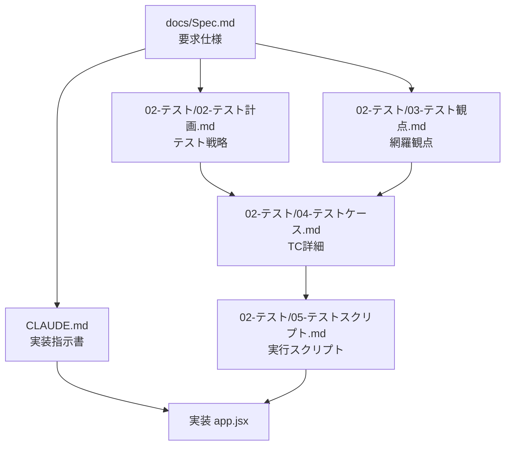
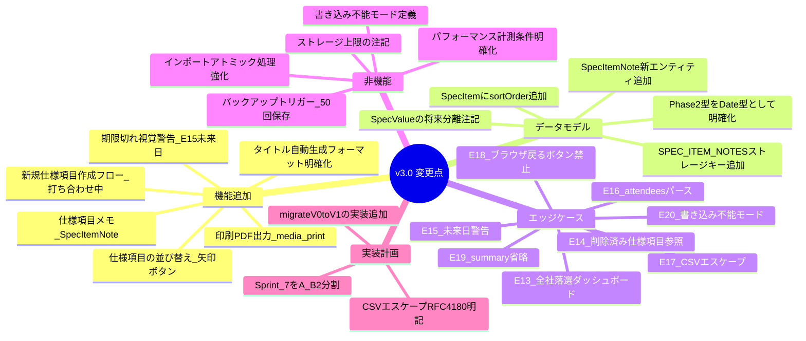

CLAUDE.md（12ルール版）
以下のルールは、明示的に上書きされない限り、このプロジェクトのすべてのタスクに適用する。
基本方針：非自明な作業では速度より慎重さを優先する。

ルール1 — コーディング前に考える
仮定は明示的に述べる。不明な場合は推測せず確認する。
曖昧さがある場合は複数の解釈を提示する。
より単純なアプローチが存在する場合は指摘する。
混乱した場合は停止し、不明点を明示する。

ルール2 — シンプルさを優先する
問題を解決する最小限のコードのみ実装する。投機的な実装は行わない。
求められた以外の機能は追加しない。単一用途のコードに抽象化を持ち込まない。
「シニアエンジニアが過剰と判断するか？」——Yes なら簡略化する。

ルール3 — 外科的な変更のみ行う
必要な箇所だけを変更する。自分が作ったもの以外の整理は行わない。
隣接するコード・コメント・フォーマットを「改善」しない。
壊れていないものをリファクタリングしない。既存のスタイルに合わせる。

ルール4 — 目標駆動で実行する
成功基準を定義し、検証できるまでループする。
手順ではなく「成功の定義」を示し、それに向けて反復する。

ルール5 — モデルは判断が必要な処理にのみ使用する
モデルを使う処理：分類・草稿作成・要約・非構造化テキストからの抽出。
モデルを使わない処理：ルーティング・リトライ・決定論的な変換。
コードで答えられる場合はコードで答える。

ルール6 — トークン予算は厳守する
タスクごと：4,000トークン。セッションごと：30,000トークン。
予算上限に近づいた場合は要約して再スタートする。
超過は黙って進まず、明示的に報告する。

ルール7 — 矛盾は表面化させる。平均化しない
2つのパターンが矛盾する場合、どちらか一方（より新しい／よりテスト済みのもの）を選ぶ。
選択理由を説明し、もう一方はクリーンアップ対象として明示する。
矛盾するパターンを混合しない。

ルール8 — 書く前に読む
コードを追加する前に、該当ファイルのエクスポート・直近の呼び出し元・共有ユーティリティを読む。
既存コードの構造の意図が不明な場合は、追加前に確認する。
「直交して見える」は危険なフレーズである。

ルール9 — テストは意図を検証するものである
テストは「何をするか」だけでなく「なぜその振る舞いが重要か」を表現する。
ビジネスロジックが変わっても失敗しないテストは誤りである。

ルール10 — 重要なステップごとにチェックポイントを設ける
各ステップ完了後：完了内容・検証済み内容・残タスクを要約する。
自分が説明できない状態から次のステップに進まない。
追跡を失った場合は停止して現状を再確認する。

ルール11 — コードベースの規約に従う（異論があっても）
コードベース内では「個人の好み < 規約への準拠」である。
規約に問題があると判断した場合は明示する。黙って別方式を持ち込まない。

ルール12 — 失敗は明示的に報告する
何かをスキップした場合、「完了した」と報告しない。
テストをスキップした場合、「テストがパスした」と報告しない。
不確実性はデフォルトで表面化させる。隠さない。

# 📋 CLAUDE.md

```markdown
# CLAUDE.md — 注文住宅管理ツール 実装指示書 v3.0

## プロジェクト概要

注文住宅の建築検討を支援するブラウザアプリ。
打ち合わせ記録と仕様比較を一体管理し、
決定事項から仕様への反映フローを提供する。

**スコープ：** 1アプリ＝1建築プロジェクト固定。
複数プロジェクト管理・マルチデバイスリアルタイム同期はスコープ外。

---

## 技術スタック

| 項目 | 内容 |
|------|------|
| フレームワーク | React 18（JSX） |
| スタイリング | Tailwind CSS |
| アイコン | lucide-react |
| データ永続化 | window.storage（Artifact Storage API） |
| 動作環境 | Claude.ai Artifact（ブラウザ内） |
| ファイル構成 | 単一JSXファイル（app.jsx） |

---

## 絶対に守るルール

1. **localStorage / sessionStorage は使用禁止**（Artifact環境で動作しない）
2. **window.storage の読み書きは必ず await を使用する**
3. **外部APIへの通信は行わない**（完全クライアントサイド）
4. **import文は使用しない**（CDN経由で読み込む）
5. **単一JSXファイルとして完結させる**
6. **ChangeLog は削除UIを提供しない**（改ざん防止）
7. **全削除操作は必ず確認ダイアログを表示する**
8. **window.history API は使用しない**（Artifact環境ではブラウザ戻るボタン操作禁止）
9. **作業開始前に必ず以下のドキュメントを読み込むこと（順序厳守）**
   1. `docs/Spec.md`（要求仕様）
   2. `02-テスト/02-テスト計画.md`（テスト戦略・自動化方針）
   3. `02-テスト/03-テスト観点.md`（網羅的テスト観点 238観点）
   4. `02-テスト/04-テストケース.md`（テストケース詳細 TC_001〜TC_142）
   5. `02-テスト/05-テストスクリプト.md`（実行可能テストスクリプト）

   読まずに実装・修正・テスト変更を行ってはならない。
   仕様・観点・ケース・スクリプトの間で矛盾を発見した場合は、
   推測で進めずに必ずユーザーに確認すること。

10. **修正発生時は関連する全ファイルを同時に更新すること**
    仕様・実装・テストのいずれかに変更が入ったら、
    末尾「ドキュメント更新ルール」に従い、対応する全ファイルを
    1コミット相当のスコープで揃えて修正する。
    一方のみを更新して整合を崩した状態で放置することを禁止する。

---

## 必読ドキュメント体系



各ドキュメントの責務：

| ファイル | 役割 | 主な内容 |
|---------|------|---------|
| `docs/Spec.md` | 要求仕様の正本 | 機能要件・非機能要件・エッジケース定義 |
| `CLAUDE.md` | 実装指示書 | 技術スタック・絶対ルール・データモデル・実装パターン |
| `02-テスト/02-テスト計画.md` | テスト戦略 | 自動化方針・テストレベル・ツール選定・CI/CD |
| `02-テスト/03-テスト観点.md` | 観点一覧 | F-CM/F-VL/F-BR/NF-PF/NF-SC/DT-BV 等 238観点 |
| `02-テスト/04-テストケース.md` | TC詳細 | TC_001〜TC_142 のステップ・入力・期待結果 |
| `02-テスト/05-テストスクリプト.md` | 実装可能スクリプト | Vitest/Playwright 実行コード雛形 |

---

## Sprint 0 最優先タスク：API動作確認

実装開始前に必ず以下を実行し、window.storage の動作を確認すること。

```javascript
async function verifyStorageAPI() {
  try {
    await window.storage.setItem("__test__", JSON.stringify({ ok: true }));
    const result = await window.storage.getItem("__test__");
    const parsed = JSON.parse(result);
    await window.storage.removeItem("__test__");
    if (parsed.ok) console.log("✅ window.storage API 正常動作確認");

    const dummy = "x".repeat(100_000);
    await window.storage.setItem("__capacity_test__", dummy);
    await window.storage.removeItem("__capacity_test__");
    console.log("✅ 100KB書き込み成功");

    return "window.storage";
  } catch (e) {
    console.warn("⚠️ window.storage 利用不可。localStorage にフォールバック:", e);
    try {
      localStorage.setItem("__fb_test__", "1");
      localStorage.removeItem("__fb_test__");
      return "localStorage";
    } catch (e2) {
      console.error("❌ localStorage も利用不可:", e2);
      return "none"; // 書き込み不能モード
    }
  }
}

// フォールバック実装（アプリ起動時に storageMode を決定）
let storageMode = "window.storage"; // "window.storage" | "localStorage" | "none"

const storage = {
  getItem:    async (key) => {
    if (storageMode === "window.storage") return window.storage.getItem(key);
    if (storageMode === "localStorage")   return localStorage.getItem(key);
    return null;
  },
  setItem:    async (key, value) => {
    if (storageMode === "window.storage") return window.storage.setItem(key, value);
    if (storageMode === "localStorage")   return localStorage.setItem(key, value);
    throw new Error("Storage unavailable");
  },
  removeItem: async (key) => {
    if (storageMode === "window.storage") return window.storage.removeItem(key);
    if (storageMode === "localStorage")   return localStorage.removeItem(key);
  },
};
```

**書き込み不能モード（storageMode === "none"）の場合：**
1. ヘッダーに赤色バナー「データを保存できません。ブラウザの設定を確認してください」を表示
2. CRUD の保存ボタンを `disabled` に設定
3. 操作継続は可能だが「セッション終了でデータが失われる」旨を表示

---

## ストレージキー一覧

```javascript
const STORAGE_KEYS = {
  META:             "meta",
  COMPANIES:        "companies",
  CATEGORIES:       "categories",
  SPEC_ITEMS:       "spec_items",
  SPEC_ITEM_NOTES:  "spec_item_notes",  // 仕様項目評価メモ
  MEETINGS:         "meetings",
  DECISIONS:        "decisions",
  CHANGE_LOGS:      "change_logs",
};
```

---

## 容量管理

```javascript
const STORAGE_WARNING_BYTES  = 400_000; // 400KB（警告閾値）
const STORAGE_BACKUP_SAVE_COUNT = 50;   // 50回保存ごとにバックアップ推奨通知

// META に saveCount を保持し、50回ごとに info Toast を表示する
```

---

## 単一ファイル構成戦略

各Sprintはセクション単位で独立生成し、Sprint 7-A / 7-B で統合する。
セクションは以下のコメントで区切ること：

```javascript
// ===== 1. 型定義・定数 =====
// ===== 2. ストレージユーティリティ =====
// ===== 3. 共通UIコンポーネント =====
// ===== 4. 会社管理コンポーネント =====
// ===== 5. 仕様比較コンポーネント =====
// ===== 6. 打ち合わせコンポーネント =====
// ===== 7. 変更ログコンポーネント =====
// ===== 8. ダッシュボード =====
// ===== 9. 設定・Import/Export =====
// ===== 10. メインApp・ルーティング =====
```

1コンポーネント200行を超えないよう論理的に分割すること。

**Sprint 7 の分割方針：**
- Sprint 7-A: セクション1〜5 の統合
- Sprint 7-B: セクション6〜10 の統合 + エッジケーステスト

---

## データモデル（完全版）

```typescript
interface Entity {
  id: string;         // crypto.randomUUID()
  createdAt: string;  // new Date().toISOString()
  deletedAt?: string; // 論理削除
}

interface Company extends Entity {
  name: string;
  type: "maker" | "builder" | "other";
  contact: string;
  phone?: string;
  email?: string;
  status: "considering" | "candidate" | "rejected" | "contracted";
  note?: string;
  rejectionNote?: string;
  // Phase2予約（実装しないが型定義に含める）
  quoteAmount?: number;       // 円・税込
  quoteUpdatedAt?: string;    // ISO文字列
  attachmentUrls?: string[];  // 外部URL（バリデーション不要）
}

interface Category extends Entity {
  name: string;
  normalizedName: string; // name.trim().toLowerCase()
  sortOrder: number;
  isDefault: boolean;
}

interface SpecItem extends Entity {
  categoryId: string;
  name: string;             // 変更可。変更後の名称でChangeLog表示。旧名称不保持
  sortOrder: number;        // 矢印ボタンで変更可
  values: SpecValue[];
}

// Phase2でSpecValueを独立エンティティに分離予定
interface SpecValue {
  companyId: string;
  value: string;
  meetingId?: string;
  updatedAt: string;        // ISO文字列
}

interface SpecItemNote extends Entity {
  specItemId: string;
  companyId: string;
  note: string;             // maxLength: 200
  updatedAt: string;        // ISO文字列
}

interface Meeting extends Entity {
  companyId: string;
  date: string;             // YYYY-MM-DD
  title?: string;           // 省略時: `${date} ${会社名}` 同日2件目以降: `${date} ${会社名} (2)`
  location?: string;
  attendees: string[];      // カンマ区切り入力後: .map(a => a.trim()).filter(Boolean)
  agenda: string;
  summary?: string;
  // Phase2予約（実装しない）
  nextMeetingDate?: string; // ISO文字列（Date型として扱う）
}

interface Decision extends Entity {
  meetingId: string;
  content: string;
  specItemId?: string;
  specCompanyId?: string;
  specValue?: string;
  status: "confirmed" | "pending" | "cancelled";
  note?: string;
  // Phase2予約（実装しない）
  deadline?: string;        // ISO文字列（Date型として扱う）
  priority?: "high" | "medium" | "low";
}

interface ChangeLog {
  id: string;
  specItemId: string;
  companyId: string;
  previousValue: string;
  newValue: string;
  meetingId?: string;
  reason?: string;
  changedAt: string;        // ISO文字列
  createdAt: string;        // ISO文字列
  // deletedAt は存在しない（削除不可）
}
```

---

## ステータス定数

```javascript
const COMPANY_STATUS = {
  CONSIDERING: "considering",
  CANDIDATE:   "candidate",
  REJECTED:    "rejected",
  CONTRACTED:  "contracted",
};

const DECISION_STATUS = {
  CONFIRMED:  "confirmed",
  PENDING:    "pending",
  CANCELLED:  "cancelled",
};

const COMPANY_STATUS_LABEL = {
  considering: "検討中",
  candidate:   "候補",
  rejected:    "落選",
  contracted:  "契約済",
};

const DECISION_STATUS_LABEL = {
  confirmed:  "確定",
  pending:    "保留",
  cancelled:  "キャンセル",
};
```

---

## 削除ポリシー

| Entity | ポリシー | 補足 |
|--------|---------|------|
| Company | 論理削除 | 表示時に「[削除済み会社]」ラベル |
| Category | 論理削除 | SpecItemのcategoryIdは保持 |
| SpecItem | 論理削除 | 表示時に「[削除済み仕様項目]」ラベル |
| Meeting | 論理削除 | 関連Decisionに追従 |
| Decision | 物理削除 | 確認ダイアログ必須 |
| SpecItemNote | 物理削除 | 確認ダイアログ必須 |
| ChangeLog | **削除不可** | UIから削除操作を提供しない |

---

## バリデーションルール

```javascript
const VALIDATION = {
  Company: {
    name:          { required: true,  maxLength: 50 },
    contact:       { required: true,  maxLength: 30 },
    phone:         { required: false, maxLength: 15,
                     pattern: /^[\d\-\+\(\)\s]*$/ },
    email:         { required: false, maxLength: 100,
                     pattern: /^[^\s@]+@[^\s@]+\.[^\s@]+$/ },
    note:          { required: false, maxLength: 500 },
    rejectionNote: { required: false, maxLength: 500 },
  },
  Meeting: {
    date:      { required: true,  format: "YYYY-MM-DD" },
    agenda:    { required: true,  maxLength: 1000 },
    summary:   { required: false, maxLength: 2000 },
    attendees: { required: false, maxItems: 20, itemMaxLength: 30 },
    location:  { required: false, maxLength: 100 },
  },
  Decision: {
    content:   { required: true,  maxLength: 1000 },
    specValue: { required: false, maxLength: 200 },
    note:      { required: false, maxLength: 500 },
  },
  SpecItem: {
    name:  { required: true,  maxLength: 50 },
    value: { required: false, maxLength: 200 },
  },
  Category: {
    name: { required: true, maxLength: 30,
            unique: true, normalize: "trim+toLowerCase" },
  },
  SpecItemNote: {
    note: { required: true, maxLength: 200 },
  },
};
```

---

## エッジケース実装ガイド

```javascript
// E2: 後勝ちルール（ChangeLogは2件記録）
// previousValue = 1回目の値、newValue = 2回目の値

// E4: ImportでIDが衝突する場合
function resolveIdConflict(importedItem, existingIds) {
  if (existingIds.has(importedItem.id)) {
    return { ...importedItem, id: crypto.randomUUID() };
  }
  return importedItem;
}

// E6: カテゴリ名の重複チェック
function isDuplicateCategory(name, categories) {
  const normalized = name.trim().toLowerCase();
  return categories.some(c =>
    c.normalizedName === normalized && !c.deletedAt
  );
}

// E11: 同一会社名の重複警告（ブロックしない）
function isDuplicateCompany(name, companies) {
  return companies.some(
    c => c.name.trim() === name.trim() && !c.deletedAt
  );
  // → 重複時は警告Toast「同じ名前の会社が既に登録されています」を表示。登録は続行。
}

// E12: 仕様反映フローのアトミック処理
async function reflectToSpec(decision, reason) {
  const specItemBackup = deepClone(await loadSpecItem(decision.specItemId));
  const newSpecItem    = computeNewSpecItem(specItemBackup, decision);
  const newChangeLog   = buildChangeLog(specItemBackup, decision, reason);
  let changeLogSaved   = false;
  try {
    await Promise.all([
      saveSpecItem(newSpecItem),
      (async () => { await saveChangeLog(newChangeLog); changeLogSaved = true; })(),
    ]);
  } catch (e) {
    await saveSpecItem(specItemBackup);
    if (changeLogSaved) await deleteChangeLog(newChangeLog.id);
    showToast("error", "仕様の反映に失敗しました。元の状態に戻しました。");
    throw e;
  }
}

// E13: 全社落選/キャンセル時のダッシュボード
// activeCompanies.length === 0 → Empty State「現在候補会社がありません」を表示

// E15: 打ち合わせ日付が未来日
function checkFutureDate(date) {
  if (new Date(date) > new Date()) {
    showToast("warning", "未来の日付が設定されています。予定として登録しますか？");
    // 続行可（ブロックしない）
  }
}

// E16: attendees のパース
const attendees = raw.split(",").map(a => a.trim()).filter(Boolean);

// E17: CSVエスケープ（RFC 4180準拠）
function escapeCsvValue(value) {
  if (/[,"\n\r]/.test(value)) {
    return `"${String(value).replace(/"/g, '""')}"`;
  }
  return String(value);
}
```

---

## 共通UIコンポーネント

```javascript
// Toast通知
showToast("success", "保存しました");
showToast("error",   "保存に失敗しました");
showToast("warning", "警告メッセージ");
showToast("info",    "お知らせ");
// 右上固定・3秒自動消去

// 確認ダイアログ
const confirmed = await showConfirm(
  "この会社を削除しますか？",
  "削除すると関連データが非表示になります。"
);

// Empty State
<EmptyState
  icon={<Building2 />}
  title="会社が登録されていません"
  description="検討中の会社を登録してはじめましょう"
  action={{ label: "+ 会社を追加", onClick: handleAddCompany }}
/>
```

---

## 特定機能の実装ガイド

### 仕様項目の並び替え

```javascript
function moveSpecItem(items, id, direction) {
  const sorted = [...items].sort((a, b) => a.sortOrder - b.sortOrder);
  const idx = sorted.findIndex(i => i.id === id);
  const swapIdx = direction === "up" ? idx - 1 : idx + 1;
  if (swapIdx < 0 || swapIdx >= sorted.length) return sorted;
  const tmp = sorted[idx].sortOrder;
  sorted[idx].sortOrder    = sorted[swapIdx].sortOrder;
  sorted[swapIdx].sortOrder = tmp;
  return sorted.sort((a, b) => a.sortOrder - b.sortOrder);
}
```

### 打ち合わせタイトル自動生成

```javascript
function generateMeetingTitle(date, companyName, existingMeetings) {
  const base = `${date} ${companyName}`;
  const count = existingMeetings.filter(
    m => m.date === date && m.companyId === companyId && !m.deletedAt
  ).length;
  return count === 0 ? base : `${base} (${count + 1})`;
}
```

### 決定事項から仕様項目新規作成フロー

```javascript
// 仕様反映設定の specItemId セレクトボックスに
// value="__create_new__" のオプションを追加する。
// 選択時に以下のフィールドを展開する:
// - 仕様項目名の入力フィールド
// - カテゴリ選択（"__create_category__" で新規カテゴリ作成も可）
// 確定後に SpecItem を新規作成し、そのまま仕様反映フローへ進む
```

### アトミックインポート

```javascript
async function importAll(json, mode) {
  const error = validateImportFile(json);
  if (error) { showToast("error", error); return; }

  const existing = await loadAllEntities();
  // 全件をメモリ上で変換・バリデーション（ここでは保存しない）
  const resolved = resolveAllIdConflicts(json, existing, mode);

  try {
    // バリデーション完了後に一括保存
    await Promise.all(
      Object.entries(resolved).map(([key, val]) =>
        storage.setItem(key, JSON.stringify(val))
      )
    );
    showToast("success", "インポートが完了しました");
  } catch (e) {
    // ここで失敗しても既存データは変更されていない（別キーへの書き込みが成功/失敗混在する
    // リスクがあるため、本番では DB トランザクション相当の仕組みが望ましいが
    // ストレージ制約上、エラーメッセージと手動確認を促す）
    showToast("error", "インポートに失敗しました。データを確認してください");
    throw e;
  }
}
```

---

## アクセシビリティ要件（WCAG AA）

- 全インタラクティブ要素に `focus-visible` リングを適用
- アイコンのみのボタンには `aria-label` を必ず設定
- モーダルには `role="dialog" aria-modal="true" aria-labelledby` を設定
- エラーメッセージは `aria-live="polite"` で通知
- フォームの `<input>` は必ず `<label>` と `htmlFor` で紐付ける
- カラーコントラスト比: テキスト4.5:1以上、大テキスト3:1以上

---

## 印刷対応（@media print）

```css
@media print {
  header, nav, .no-print { display: none !important; }
  table { page-break-inside: auto; }
  tr    { page-break-inside: avoid; page-break-after: auto; }
}
```

設定画面に「印刷プレビューを開く」ボタン（`window.print()` 呼び出し）を配置する。

---

## パフォーマンス目標

計測条件: 会社10社・打ち合わせ100件・仕様項目50件・ChangeLog 500件

| 操作 | 目標 |
|------|------|
| 初回ロード | 3秒以内 |
| タブ切り替え | 500ms以内 |
| CRUD保存 | 1秒以内 |
| 仕様反映フロー | 2秒以内 |

---

## Sprint別実装順序

### Sprint 0（基盤）— 最初に実装すること

1. verifyStorageAPI() + storageMode 決定 + storage オブジェクト定義
2. 書き込み不能モード（赤バナー + Saveボタン無効化）
3. ストレージユーティリティ（loadXxx / saveXxx / saveWithCapacityCheck）
4. 保存回数カウンター（META.saveCount）
5. 共通UIコンポーネント（Toast, ConfirmDialog, Spinner, EmptyState）
6. アプリシェル（ヘッダー + タブナビ + ボトムナビ + オフラインバナー）
7. 標準仕様テンプレートの初期データ投入ロジック
8. スキーママイグレーション基盤（migrateV0toV1 含む）
9. @media print 基本スタイル

### Sprint 1（会社管理）

CompanyList → CompanyCard → CompanyFormModal → CompanyDetailPage（summary 100文字省略）

### Sprint 2（仕様比較）

CategoryManager → SpecTable → SpecCellEditor（▲▼ソート含む）
→ SpecItemNotePopover → ItemAddModal（新規仕様項目 + カテゴリ作成）

### Sprint 3（打ち合わせ）

MeetingList → MeetingFormModal（タイトル自動生成・未来日警告含む）
→ DecisionForm（新規仕様項目作成フロー含む）
→ MeetingDetailPage → PrevMeetingPanel

### Sprint 4（仕様反映・変更ログ）

SpecReflectionDialog → reflectToSpec（アトミック処理）
→ ChangeLogService → ChangeLogTimeline（無限スクロール）

### Sprint 5（ダッシュボード・検索）

DashboardSummary（全社落選Empty State含む）
→ PendingActions → GlobalSearchBar（300ms debounce + ハイライト）

### Sprint 6（設定・Import/Export）

ExportService（JSON全件 + CSV RFC4180）
→ ImportService（アトミックインポート）
→ StorageUsageIndicator（保存回数表示）
→ SettingsPage（印刷ボタン含む）

### Sprint 7-A（前半統合）

セクション1〜5 統合 → Sprint 0〜3 動作確認チェックリスト全件

### Sprint 7-B（後半統合・最終QA）

セクション6〜10 統合 → Sprint 4〜6 動作確認 → E1〜E20 全件テスト

---

## 動作確認チェックリスト

### 全Sprint共通

- [ ] ストレージ書き込み後、リロードしてもデータが残る
- [ ] 論理削除したデータが一覧に表示されない
- [ ] 削除済みデータへの参照箇所に「[削除済み]」ラベルが表示される
- [ ] エラー発生時にToastが表示される
- [ ] 削除操作に確認ダイアログが表示される

### Sprint 4 固有

- [ ] 同一仕様項目を2回更新するとChangeLogが2件記録される
- [ ] 仕様反映後、仕様比較テーブルに新しい値が反映される
- [ ] 反映フロー途中失敗時にロールバックされToastが出る
- [ ] ChangeLogにUIからの削除操作が存在しない

### Sprint 6 固有

- [ ] JSON エクスポート → インポートで同一データが復元される（specItemNotes含む）
- [ ] ID衝突したデータが新IDで取り込まれ参照整合性が保たれる
- [ ] インポート中断時に既存データが変更されていない
- [ ] CSVでカンマ・改行含む値が正しくエスケープされる

### Sprint 7-B 固有（全件確認）

- [ ] E1〜E20 全エッジケースが仕様通りに動作する
- [ ] キーボードのみで全操作が完結する
- [ ] 初回ロードが3秒以内（計測条件: 会社10社・打ち合わせ100件・仕様項目50件・ChangeLog500件）
- [ ] @media print で印刷レイアウトが崩れない
- [ ] 50回保存時にバックアップ推奨Toastが出る
- [ ] 書き込み不能モードでSaveボタンが無効化される

---

## デザインガイドライン（参考: https://inumaru-kazuya.github.io/takomaruHP/ ）

参考サイトから抽出した「和モダン・暖色アースカラー」のデザイン言語を適用する。
全画面・全コンポーネントは以下のトークンを基準にスタイリングすること。

### カラーパレット（CSS変数として定義）

```css
:root {
  /* 背景・面 */
  --bg:        #faf8f3;  /* アイボリー（メイン背景） */
  --paper:     #f0eadb;  /* 紙色サンド（カード・サブ面） */
  --rule:      #d8cfbe;  /* トープ（罫線・区切り） */

  /* テキスト */
  --ink:       #1a1816;  /* 主要テキスト（暖色寄りニアブラック） */
  --ink-soft:  #4a4640;  /* 補助テキスト（ウォームグレー） */

  /* 木質（落ち着いた強調） */
  --wood:      #c69e6c;  /* ハニータン */
  --wood-deep: #8a6740;  /* ココア */

  /* 強調・状態 */
  --rust:      #b35a3a;  /* ラスト（プライマリアクション・エラー強調） */
  --sage:      #5b6b4a;  /* セージ（success・確定状態） */
  --sage-deep: #3d4a32;  /* ダークオリーブ */
}
```

### 用途マッピング（注文住宅管理ツール固有）

| 用途 | カラー |
|------|--------|
| 全体背景 | `--bg` |
| カード・モーダル背面 | `--paper` |
| 区切り線・テーブル罫線 | `--rule` |
| 本文・見出し | `--ink` |
| キャプション・補助情報 | `--ink-soft` |
| プライマリボタン（保存・追加・確定） | `--rust` 背景＋白文字 |
| セカンダリボタン（編集・詳細表示） | `--wood` 背景＋`--ink` 文字 |
| キャンセル・破壊的操作以外のサブ操作 | 透明背景＋`--rule` ボーダー＋`--ink-soft` 文字 |
| 削除ボタン | `--rust` 背景（既存と統合）または濃い赤系を別途許容 |
| ステータス「確定」「契約済」 | `--sage` バッジ |
| ステータス「検討中」「候補」 | `--wood` バッジ |
| ステータス「保留」 | `--wood-deep` バッジ |
| ステータス「落選」「キャンセル」 | `--ink-soft` バッジ |
| Toast success | `--sage-deep` 背景＋白文字 |
| Toast error | `--rust` 背景＋白文字 |
| Toast warning | `--wood-deep` 背景＋白文字 |
| Toast info | `--ink` 背景＋白文字 |
| ヘッダー背景 | `--bg` ＋ `--rule` ボーダー |
| バナー（オフライン） | `--paper` 背景＋`--wood-deep` 文字 |
| バナー（書き込み不能） | `--rust` 背景＋白文字 |

### タイポグラフィ

```css
:root {
  --sans:     "Noto Sans JP", system-ui, sans-serif;
  --serif:    "Cormorant Garamond", "Noto Serif JP", serif;
  --jp-serif: "Noto Serif JP", serif;
  --mono:     "JetBrains Mono", ui-monospace, monospace;
}
```

| 要素 | フォント | 補足 |
|------|---------|------|
| 本文・UI標準 | `--sans` | font-weight: 400-500 |
| 大見出し（タブ見出し・モーダルタイトル） | `--jp-serif` | font-weight: 600-700, line-height: 1.2 |
| 英語の装飾見出し（バージョン番号・「Sprint 0」など） | `--serif` | letter-spacing: 0.12em, uppercase可 |
| 等幅（saveCount・schemaVersion等の数値表示） | `--mono` | font-size: 0.875em |
| 補助ラベル（タブのカテゴリ名等） | `--sans` | letter-spacing: 0.08-0.1em（やや広め） |

**letter-spacing ガイド：**
- 通常本文: `0.02em`
- セクション小見出し: `0.08em-0.12em`
- バッジ・タグ・英文ラベル: `0.12em-0.18em`（uppercase と併用）

**Webフォントの読み込み（Google Fonts CDN）：**

```html
<link rel="preconnect" href="https://fonts.googleapis.com">
<link rel="preconnect" href="https://fonts.gstatic.com" crossorigin>
<link rel="stylesheet" href="https://fonts.googleapis.com/css2?family=Cormorant+Garamond:wght@400;500;600;700&family=JetBrains+Mono:wght@400;500&family=Noto+Sans+JP:wght@400;500;600;700&family=Noto+Serif+JP:wght@500;600;700&display=swap">
```

### 形状・装飾

| 要素 | スタイル |
|------|--------|
| ボタン | `border-radius: 999px`（ピル型）。padding: `8px 18px`〜`12px 24px` |
| カード | `border-radius: 12px`、`background: var(--paper)`、`border: 1px solid var(--rule)` |
| モーダル | `border-radius: 16px`、`background: var(--bg)`、`box-shadow: 0 12px 40px rgba(26,24,22,0.18)` |
| 入力フィールド | `border-radius: 8px`、`border: 1px solid var(--rule)`、focus 時 `border-color: var(--rust)` |
| バッジ・タグ | `border-radius: 999px`、padding: `2px 10px`、`letter-spacing: 0.12em` |
| 区切り線 | `border-color: var(--rule)`、装飾的に hairline (0.5px) も許容 |
| 影 | 控えめに。`box-shadow: 0 1px 3px rgba(26,24,22,0.06)` を基本に、モーダルのみ濃い影 |

### レイアウト原則

| 原則 | 内容 |
|------|------|
| コンテナ幅 | デスクトップ 1100-1280px (Tailwind `max-w-7xl`)。中央寄せ |
| 余白 | 上下のリズム重視。セクション間は `48-64px`、要素間は `16-24px` |
| 行間 | 本文 1.6-1.7、見出し 1.2-1.3 |
| 余白 vs コンテンツ | 余白多め。「呼吸」させる配置を意識（紙の余白感） |
| グリッド | カード列は `grid grid-cols-1 md:grid-cols-2 xl:grid-cols-3 gap-6` を基本 |

### トーン・キーワード

- **和モダン**（Japanese modern）— 暖色の自然素材感、白すぎない背景、ニアブラック文字
- **静謐・上品**（calm, refined）— 派手な彩度を使わず、紙・木・苔・錆びた金属の質感
- **可読性最優先** — 本文は `--ink` × `--bg` で十分なコントラスト（4.5:1以上）

### Tailwind との対応関係

```javascript
// tailwind.config.js（CDN利用時は preview.html / app.jsx の <script> 内で設定）
{
  theme: {
    extend: {
      colors: {
        bg:       "#faf8f3",
        paper:    "#f0eadb",
        rule:     "#d8cfbe",
        ink:      { DEFAULT: "#1a1816", soft: "#4a4640" },
        wood:     { DEFAULT: "#c69e6c", deep: "#8a6740" },
        rust:     "#b35a3a",
        sage:     { DEFAULT: "#5b6b4a", deep: "#3d4a32" },
      },
      fontFamily: {
        sans:  ['"Noto Sans JP"', "system-ui", "sans-serif"],
        serif: ['"Cormorant Garamond"', '"Noto Serif JP"', "serif"],
        jp:    ['"Noto Serif JP"', "serif"],
        mono:  ['"JetBrains Mono"', "ui-monospace", "monospace"],
      },
      borderRadius: { pill: "999px" },
      letterSpacing: { wide2: "0.12em", wider2: "0.16em" },
    },
  },
}
```

### 守るべきルール

- ❌ 純白（`#ffffff`）の背景・面色は使わない。必ず `--bg` または `--paper` を使う
- ❌ 純黒（`#000000`）の文字は使わない。`--ink` または `--ink-soft` を使う
- ❌ 角丸0px（鋭角）の主要UI要素は使わない（最低 `rounded-md` 相当）
- ❌ 蛍光的・原色寄りの彩度（青蛍光・赤蛍光）を使わない
- ✅ ボタンはピル型を基本とし、長方形が必要な場合は `rounded-lg` 以上
- ✅ 英語ラベル（バージョン・カウンタ）はサンセリフよりも Cormorant Garamond の serif を選好
- ✅ 日本語見出しは Noto Serif JP（jp-serif）を装飾的に使う

---

## テスト設計（02-テスト 配下の設計を反映）

### テスト戦略・自動化方針

| 項目 | 内容 |
|------|------|
| 自動化率目標 | **87.3%**（最低基準 70%以上） |
| 自動化判断軸 | 実行頻度・安定性・ビジネスリスク・再現性・コスト対効果 |
| 自動化対象 | ロジック確定済み・データ整合性影響あり・手順が決定論的なもの |
| 手動対象 | 印刷レイアウト・スクリーンリーダー・モバイルUX・探索的テスト |

### テストレベル定義

| レベル | 総ケース数 | 自動化数 | 自動化率 | ツール |
|--------|----------|---------|---------|--------|
| 単体テスト（UT） | 120 | 120 | 100% | Vitest + jsdom + React Testing Library |
| 結合テスト（IT） | 60 | 50 | 83% | Vitest + MSW |
| E2Eテスト | 40 | 22 | 55% | Playwright（Chromium） |
| **合計** | **220** | **192** | **87.3%** |

### テストツールスタック

| 用途 | ツール | 選定理由 |
|------|--------|---------|
| 単体/結合ランナー | Vitest | React 18 + Vite と親和性が高い・CI起動が速い |
| DOM環境 | jsdom | Node.js 上で DOM/イベントをシミュレート |
| コンポーネントテスト | React Testing Library | ユーザー視点・実装詳細に依存しない |
| APIモック | MSW | ストレージAPIのモック宣言定義 |
| E2E | Playwright | Artifact（Chromium）環境を再現・`page.evaluate()` で `window.storage` 制御可能 |
| カバレッジ | c8 / Istanbul | ライン・ブランチカバレッジ計測 |
| 静的解析 | ESLint | コード品質維持 |

### テストファイル構成

```
__tests__/
├── unit/
│   ├── storage.test.js          # UT-01: ストレージユーティリティ
│   ├── migration.test.js        # UT-02: スキーママイグレーション
│   ├── business-logic.test.js   # UT-03: moveSpecItem / generateMeetingTitle 等
│   ├── validation.test.js       # UT-04: バリデーション全般
│   └── export-import.test.js    # UT-05: CSVエスケープ / IDコンフリクト
├── integration/
│   ├── storage-integration.test.js  # IT-01: ストレージ読み書き統合
│   ├── spec-reflection.test.js      # IT-02: 仕様反映アトミック処理
│   ├── import.test.js               # IT-03: インポート整合性
│   ├── delete-policy.test.js        # IT-04: 削除ポリシー連鎖
│   ├── search.test.js               # IT-05: 検索インデックス
│   ├── changelog.test.js            # IT-06: ChangeLog生成
│   └── pagination.test.js           # IT-07: ページネーション
├── e2e/
│   ├── pages/                       # Page Objectパターン
│   ├── main-flow.test.js            # E2E-02: メインフロー
│   ├── export-import.test.js        # E2E-03: Export/Import
│   └── edge-cases.test.js           # E2E: エッジケース E1〜E20
├── fixtures/
│   ├── factories.js                 # buildCompany / buildMeeting 等ファクトリ
│   ├── mock-storage.js              # window.storage モック
│   └── test-cases-*.json            # Sprint別テストケースJSON
└── helpers/
    ├── setup.js                     # 共通セットアップ
    └── performance-helpers.js       # パフォーマンス計測
```

### data-testid 命名規則（テスト自動化用・全インタラクティブ要素に必須）

| 種別 | 規則 | 例 |
|------|------|----|
| タブ | `tab-{name}` | `tab-companies`, `tab-spec-comparison` |
| ボタン | `{action}-{entity}-button` | `add-company-button`, `save-company-button` |
| 入力 | `{entity}-{field}-input` | `company-name-input`, `meeting-date-input` |
| セレクト | `{entity}-{field}-select` | `company-type-select`, `decision-spec-item-select-0` |
| カード | `{entity}-card` | `company-card`, `meeting-card` |
| モーダル | `{entity}-{action}-modal` | `company-form-modal` |
| ダイアログ | `{name}-dialog` | `spec-reflection-dialog` |
| Toast | `toast-{type}` | `toast-success`, `toast-error`, `toast-warning`, `toast-info` |
| バナー | `{name}-banner` | `offline-banner`, `storage-unavailable-banner` |
| エラー | `{entity}-{field}-error` | `company-name-error` |

### 品質基準（Exit Criteria）

| 指標 | 最低基準 | 目標値 |
|------|---------|-------|
| ラインカバレッジ | 80% | 90% |
| ブランチカバレッジ | 70% | 85% |
| 自動化率 | 70% | 87% |
| 単体テスト成功率 | 100% | 100% |
| 結合テスト成功率 | 100% | 100% |
| E2Eテスト成功率 | 95% | 100% |
| 単体テスト実行時間 | 30秒以内 | 15秒以内 |
| E2Eテスト実行時間 | 5分以内 | 3分以内 |

### Sprint別テスト完了条件

| Sprint | 主要な完了条件 |
|--------|--------------|
| Sprint 0 | `verifyStorageAPI` UT全件PASS / Toast4種表示確認 / タブナビ動作 / 書き込み不能モードバナー |
| Sprint 1 | 会社CRUD UT/IT全件PASS / 論理削除UT PASS / 同一会社名警告E2E PASS |
| Sprint 2 | 仕様比較UT/IT全件PASS / カテゴリ重複防止UT PASS / SpecItemNote CRUD PASS |
| Sprint 3 | 打ち合わせCRUD UT/IT PASS / タイトル自動生成UT PASS / attendees パースUT PASS |
| Sprint 4 | アトミック処理IT全件PASS / ロールバックIT PASS / ChangeLog削除不可確認 |
| Sprint 5 | 検索UT PASS / ダッシュボードIT PASS / Empty State確認 |
| Sprint 6 | CSVエスケープUT PASS / インポートIT PASS / ID衝突解決IT PASS |
| Sprint 7-A | セクション1〜5統合 / Sprint 0〜3 動作確認チェックリスト全件 |
| Sprint 7-B | 全テストスイート PASS / カバレッジ80%以上 / 手動テスト全項目PASS / パフォーマンス基準達成 |

### 最終リリース判定基準（Release Criteria）

以下の **すべて** を満たした場合にリリース可とする：

| # | 判定基準 | 確認方法 |
|---|---------|---------|
| RC-01 | 全単体テスト100%PASS | `npm run test:unit` |
| RC-02 | 全結合テスト100%PASS | `npm run test:integration` |
| RC-03 | E2Eテスト95%以上PASS | `npm run test:e2e` |
| RC-04 | ラインカバレッジ80%以上 | `npm run test:coverage` |
| RC-05 | エッジケース E1〜E20 全件確認済み | テスト結果レポート |
| RC-06 | パフォーマンス基準全項目達成 | `npm run test:perf` |
| RC-07 | 手動テスト全項目PASS | 手動テスト記録票 |
| RC-08 | ChangeLog削除不可確認 | E2E + コードレビュー |
| RC-09 | 書き込み不能モード動作確認 | E2E |
| RC-10 | JSONエクスポート→インポート往復確認 | E2E-03-01 |

### エッジケース E1〜E20 とテストケース対応マッピング

| エッジケース | 主TC ID | 自動化 | テストレベル |
|------------|--------|--------|------------|
| E1: 会社0件で仕様比較 | TC_049 | ✅ | E2E |
| E2: 同一打ち合わせで同一仕様2回更新 | TC_082 | ✅ | IT |
| E3: 会社削除後のSpecValue表示 | TC_027, TC_031 | ✅ | IT |
| E4: ImportでID衝突 | TC_113 | ✅ | UT + IT |
| E5: 仕様値が長い文字列 | TC_047相当 | ✅ | E2E |
| E6: カテゴリ名の大文字小文字 | TC_040 | ✅ | UT |
| E7: スキーマ変更マイグレーション | TC_011〜TC_017 | ✅ | UT |
| E8: window.storage不存在 | TC_002 | ✅ | UT |
| E9: インポートバージョン不一致 | TC_119 | ✅ | UT |
| E10: 仕様項目0件で反映フロー | TC_084相当 | ✅ | E2E |
| E11: 同一会社名重複登録 | TC_028 | ✅ | E2E |
| E12: 仕様反映途中失敗 | TC_081 | ✅ | IT |
| E13: 全社落選でダッシュボード | TC_102 | ✅ | E2E |
| E14: 削除済み仕様項目への参照 | TC_086 | ✅ | IT |
| E15: 打ち合わせ未来日付 | TC_066 | ✅ | E2E |
| E16: attendees カンマ区切りパース | TC_063 | ✅ | UT |
| E17: CSVエスケープ | TC_115〜TC_117 | ✅ | UT |
| E18: ブラウザ戻るボタン | — | 🖐️ | 手動 |
| E19: 長大なsummary省略 | TC_030 | ✅ | E2E |
| E20: 両ストレージ不可 | TC_003, TC_136 | ✅ | E2E |

### 手動テスト対象（自動化困難なもの）

| 項目 | 実施タイミング | 理由 |
|------|-------------|------|
| 印刷レイアウト（@media print） | Sprint 7-B | 目視確認必須 |
| モバイルボトムナビUX | Sprint 7-A | 定性評価 |
| スクリーンリーダー（VoiceOver/NVDA） | Sprint 7-B | 自動化ツールの限界 |
| キーボードのみ操作（Tab順序確認） | Sprint 7-B | 体感確認 |
| オフライン → オンライン切り替え | Sprint 7-B | 実機ネットワーク確認 |
| 実際のブラウザ印刷PDF確認 | Sprint 7-B | 出力結果の目視確認 |
| 長大データでの視覚的レイアウト崩れ | Sprint 7-B | 視覚評価 |
| 探索的テスト（自由操作30分） | Sprint 7-B | 仕様外バグ発見が目的 |
| ブラウザ戻るボタン（E18） | Sprint 7-B | Artifact環境固有制約 |
| Safari/iOSの実機確認 | Sprint 7-B | クロスブラウザ確認 |

---

## ドキュメント更新ルール（修正発生時の必須プロセス）

仕様・実装・テストのいずれかに修正が発生した場合、
以下のフローに従って **関連する全ファイルを同時に更新** すること。

### 修正種別ごとの更新対象

| 修正の起点 | 必ず更新するファイル | 確認すべきファイル |
|-----------|------------------|-----------------|
| 要求変更（機能追加/削除/仕様変更） | `docs/Spec.md` + `CLAUDE.md` + テスト4ファイル全て + `app.jsx` | 全ドキュメント |
| 実装の変更（バグ修正・リファクタ含む） | `app.jsx` + `CLAUDE.md`（パターン更新時） | 影響テストケース・テストスクリプト |
| テスト観点の追加・削除 | `02-テスト/03-テスト観点.md` + `04-テストケース.md` + `05-テストスクリプト.md` | `CLAUDE.md` のテスト設計セクション |
| テストケースの追加・修正 | `02-テスト/04-テストケース.md` + `05-テストスクリプト.md` | `03-テスト観点.md` の自動化可否 |
| バリデーション・データモデル変更 | `docs/Spec.md` + `CLAUDE.md` + UTテスト全般 | 関連IT・E2E |
| エッジケース（E*）追加 | `docs/Spec.md` + `CLAUDE.md`（エッジケース一覧）+ `04-テストケース.md`（TC対応）+ `05-テストスクリプト.md` | E2E実装 |
| バリデーションルール変更 | `CLAUDE.md`（VALIDATION定数）+ `03-テスト観点.md`（境界値）+ `04-テストケース.md`（境界値TC） | UTテスト |
| ストレージキー追加・変更 | `CLAUDE.md`（STORAGE_KEYS）+ マイグレーション処理 + `03/04/05` のIF観点 | E2Eのリロード確認 |
| data-testid 規約変更 | `CLAUDE.md`（命名規則表）+ `04-テストケース.md` + `05-テストスクリプト.md` + `app.jsx` | E2E全般 |

### 修正フロー（手順厳守）

1. **影響範囲の特定**：修正対象に関連する全ファイルを上表で洗い出す
2. **正本の更新**：要求変更なら `docs/Spec.md`、実装変更なら `app.jsx` を起点に修正
3. **CLAUDE.md の同期**：実装パターン・データモデル・ルールに影響があれば更新
4. **テスト観点の更新**：`03-テスト観点.md` に観点の追加・削除・優先度変更を反映
5. **テストケースの更新**：`04-テストケース.md` に TC を追加・修正
6. **テストスクリプトの更新**：`05-テストスクリプト.md` に実行コードを追加・修正
7. **整合性確認**：全ファイルで以下が一致しているかチェック
   - エッジケース番号（E1〜E20）と TC ID の対応
   - バリデーション値（文字数上限など）
   - ストレージキー名
   - data-testid 名
   - エンティティの型定義（フィールド名・型・必須属性）

### 禁止事項

- ❌ 実装だけ変えてテストを更新しないこと
- ❌ `docs/Spec.md` の更新なしに新機能を追加すること
- ❌ テスト観点・ケース・スクリプトのいずれか一つだけを更新すること
- ❌ `CLAUDE.md` の絶対ルール・データモデル・命名規則を独断で変更すること
- ❌ 関連ファイルを未読のまま修正を提案すること

### 完了条件

修正タスクは、上記「修正フロー」7ステップを全て完了し、
**整合性確認チェックリストが全てパスした時点** で完了とする。
一部ファイルのみ修正してタスクをクローズすることを禁止する。

---

## 注意事項

- Sprint間でストレージスキーマを変更する場合は必ずマイグレーション処理を追加すること
- 全ストレージ操作は try-catch で囲み、エラー種別に応じたToastで通知すること
- Phase2予約フィールド（quoteAmount・deadline・nextMeetingDate等）は実装しないが型定義には含めること
- `deadline` と `nextMeetingDate` は ISO 文字列（Date型）として定義する
- `quoteAmount` は円・税込固定。`attachmentUrls` はURLバリデーション不要
- 添付ファイルはPhase2で外部URLリンク管理方式を採用（base64埋め込み不可）
- SpecValue は Phase 1 では SpecItem.values 配列として格納する（Phase2でリファクタリング予定）
- マルチデバイス共有はJSONエクスポート/インポートによる手動同期で対応
- SpecItem名称変更後のChangeLogは現在の名称で表示（旧名称不保持）
```

---

## 変更差分サマリー（v2.0 → v3.0）

